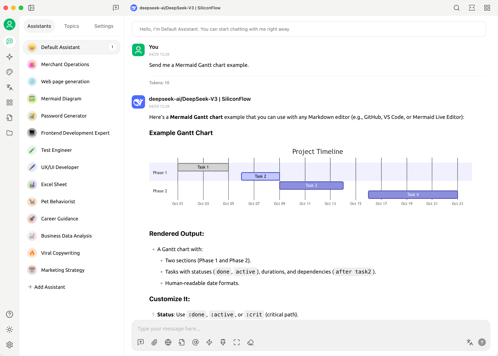

# 服务商设置

当前页面仅做界面功能的介绍，配置教程可以参考基础教程中的[服务商配置](../../../pre-basic/providers/)教程。


* 在使用内置服务商时只需要填写对应的秘钥即可；
* 不同服务商对秘钥的叫法可能有所不同，秘钥、Key、API Key、令牌等都指的是同一个东西。



### API 秘钥

在CherryStudio当中，单个服务商支持多Key轮询使用，轮询方式为从前到后列表循环的方式。

* 多Key用<mark style="color:red;">英文</mark>逗号隔开添加。如以下示例方式：

```
sk-xxxx1,sk-xxxx2,sk-xxxx3,sk-xxxx4
```


### API 地址

在使用内置服务商时一般不需要填写API地址，如果需要修改请严格按照对应的官方文档给的地址填写。

> 如果服务商给的地址为<mark style="background-color:red;">https://xxx.xxx.com</mark><mark style="background-color:green;">/v1/chat/completions</mark>这种格式，只需要填写根地址部分（<mark style="background-color:red;">https://xxx.xxx.com</mark>）即可。
>
> CherryStudio客户端会自动拼接剩余的路径（<mark style="background-color:green;">/v1/chat/completions</mark>），未按要求填写可能会导致无法正常使用。


说明：大多数服务商的大语言模型路由是统一的，一般情况下不需要进行如下操作。如果服务商的API路径是v2、v3/chat/completions或者其他版本时,可在地址栏手动输入对应版本以"`/`"结尾；当服务商请求路由不是常规的<mark style="background-color:green;">/v1/chat/completions</mark>时使用服务商提供的完整的地址以“`#`”结尾，

即：

* API地址使用"`/`"结尾时只拼接"<mark style="background-color:green;">chat/completions</mark>"
* API地址使用"`#`"结尾时不执行拼接操作，只使用填入的地址。

.png>)



### 添加模型

一般情况下点击服务商配置页面最左下角的<mark style="background-color:green;">管理</mark>按钮会自动获取该服务商所有支持调用的模型，从获取列表中点击“+”号添加到模型列表即可。

> 注意：点击管理按钮时弹窗列表里的模型需要点击模型后的“+”号添加到服务商配置页面的模型列表才可以在模型选择列表当中出现。


### 连通性检查

点击API 秘钥输入框后的检查按钮即可测试是否成功配置。


模型检查时默认使用模型列表已添加模型的最后一个对话模型，如果检查时有失败的情况请检查模型列表是否有错误的或不被支持的模型。



配置成功后务必打开右上角的开关，否则该服务商仍处于未启用状态，无法在模型列表中找到对应模型。


