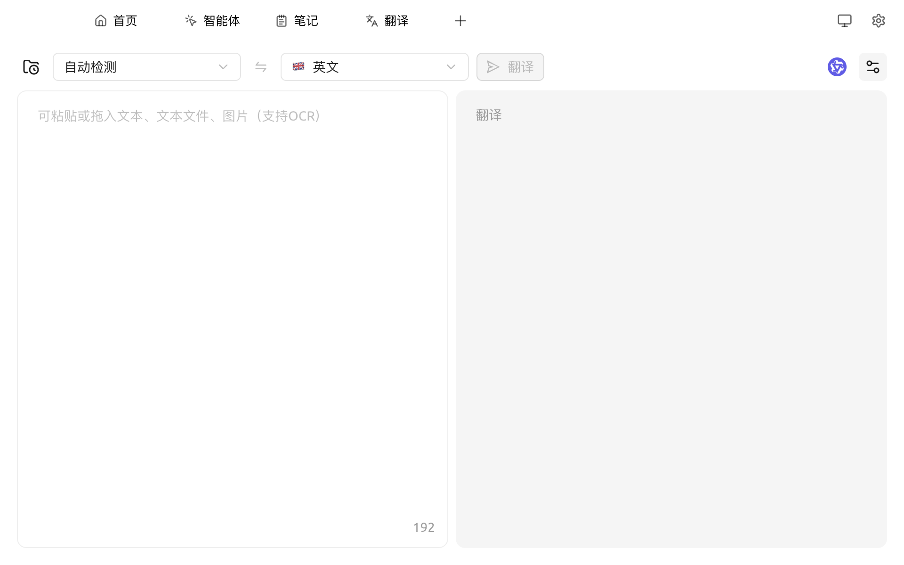
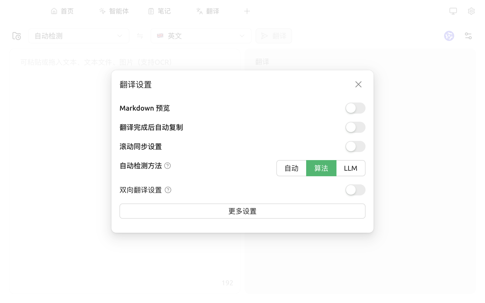

# 翻译

Cherry Studio 的翻译功能为您提供快速、准确的文本翻译服务，支持多种语言之间的互译。

### 界面概览

<figure><figcaption>
翻译页面：左输入、右输出，顶部切换语言与模型
</figcaption></figure>

操作栏从左到右：

1. **翻译历史**（FolderClock 图标）：左侧抽屉，回看历史翻译并一键回填
2. **源语言下拉**：默认 `自动检测`，自动检测命中后会在选项里显示具体语种
3. **方向切换**（⇆）：互换源 / 目标语言
4. **目标语言下拉**
5. **翻译按钮**：输入框为空时灰色
6. **模型选择**（模型头像）：切换用于翻译的模型
7. **设置**：打开翻译设置弹窗

输入框（左）支持粘贴文本、**拖入 `.txt/.md` 文本文件**、以及 **拖入图片走 OCR** ；结果框（右）鼠标移上去出现复制按钮。

### 使用步骤

1. **选择目标语言**
2. **输入或粘贴文本** 到左侧框 —— 拖入图片可直接 OCR 识别后翻译
3. 点击 **翻译** 按钮
4. 复制或继续编辑右侧结果

### 翻译设置

点击右上角齿轮打开设置弹窗：

<figure><figcaption>
翻译设置弹窗
</figcaption></figure>

* **Markdown 预览**：开启后翻译结果按 Markdown 渲染
* **翻译完成后自动复制**：结果生成即复制到剪贴板
* **滚动同步设置**：左右两栏滚动联动
* **自动检测方法**：自动 / 算法（franc 本地）/ LLM——LLM 检测更准但消耗一次模型调用
* **双向翻译设置**：开启后会自动在两种指定语种之间互译；下方可选语种对
* **更多设置**：跳到完整的翻译偏好（默认模型 / 提示词 / 自定义语言等）

### 常见问题解答 (FAQ)

* **Q: 翻译不准确怎么办？**
  * A: AI 翻译虽然强大，但并非完美。对于专业领域或复杂语境的文本，建议进行人工校对。 您也可以尝试切换不同的模型。
* **Q: 支持哪些语言？**
  * A: Cherry Studio 翻译功能支持多种主流语言，具体支持的语言列表请参考 Cherry Studio 的官方网站或应用内说明。
* **Q: 可以翻译整个文件 / 图片吗？**
  * A: 输入框支持直接**拖入文本文件或图片**，图片会通过 OCR 识别后再翻译。对于长篇文档（PDF / Word 等）的整段翻译，建议进入对话页面，把文档作为附件发给翻译助手处理。
* **Q: 翻译速度慢怎么办？**
  * A: 翻译速度可能受网络连接、文本长度、服务器负载等因素影响。请确保您的网络连接稳定，并耐心等待。

***

### 💡 获取帮助与提交反馈

如果您在配置或使用过程中遇到任何疑问、Bug 或有功能改进建议，请参考 [反馈与建议](../../question-contact/suggestions.md) 中提供的官方渠道。
