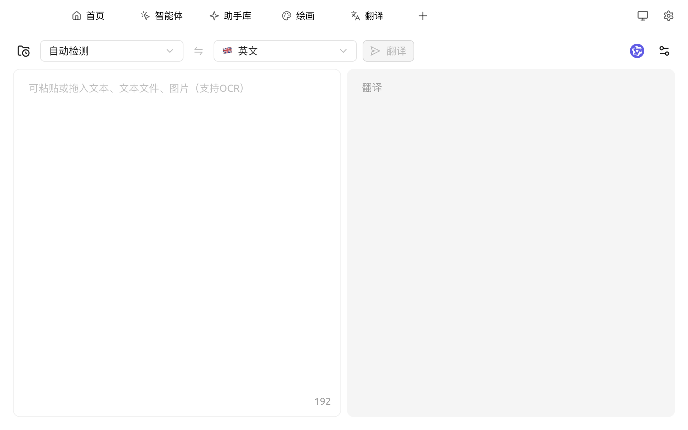

# 翻译

Cherry Studio 的翻译功能为您提供快速、准确的文本翻译服务，支持多种语言之间的互译。

### 界面概览

<figure><figcaption>
翻译页面：左输入、右输出，顶部切换语言与模型
</figcaption></figure>

界面元素从左到右、从上到下：

1. **翻译历史**（左上角文件夹+时钟图标）：查看 / 回看历史翻译记录
2. **源语言**：默认 `自动检测`，也可手动指定
3. **方向切换**（⇆）：一键互换源 / 目标语言
4. **目标语言**：从下拉菜单选择（如英文、日文等）
5. **翻译按钮**：触发翻译；输入框为空时灰色
6. **模型选择**（右上角紫色图标）：切换当前用于翻译的模型
7. **设置**（右上角控件图标）：翻译相关偏好，包括滚动同步、双向翻译等
8. **输入框（左侧）**：可粘贴文字，也可**拖入文本文件、图片**（图片支持 OCR）
9. **结果框（右侧）**：显示翻译，鼠标移上去会出现复制按钮

### 使用步骤

1. **选择目标语言**
2. **输入或粘贴文本**到左侧框 —— 拖入图片可直接 OCR 识别后翻译
3. 点击 **翻译** 按钮
4. 复制或继续编辑右侧结果

### 常见问题解答 (FAQ)

* **Q: 翻译不准确怎么办？**
  * A: AI 翻译虽然强大，但并非完美。对于专业领域或复杂语境的文本，建议进行人工校对。 您也可以尝试切换不同的模型。
* **Q: 支持哪些语言？**
  * A: Cherry Studio 翻译功能支持多种主流语言，具体支持的语言列表请参考 Cherry Studio 的官方网站或应用内说明。
* **Q: 可以翻译整个文件 / 图片吗？**
  * A: 输入框支持直接**拖入文本文件或图片**，图片会通过 OCR 识别后再翻译。对于长篇文档（PDF / Word 等）的整段翻译，建议进入对话页面，把文档作为附件发给翻译助手处理。
* **Q: 翻译速度慢怎么办？**
  * A: 翻译速度可能受网络连接、文本长度、服务器负载等因素影响。请确保您的网络连接稳定，并耐心等待。
