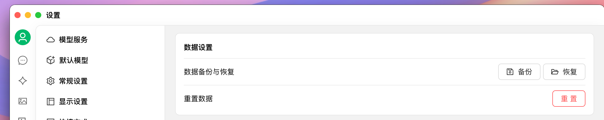
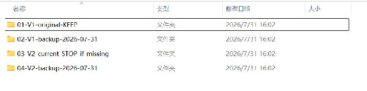
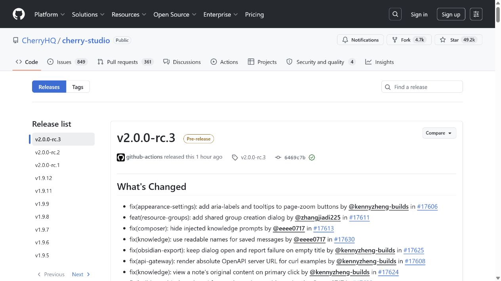
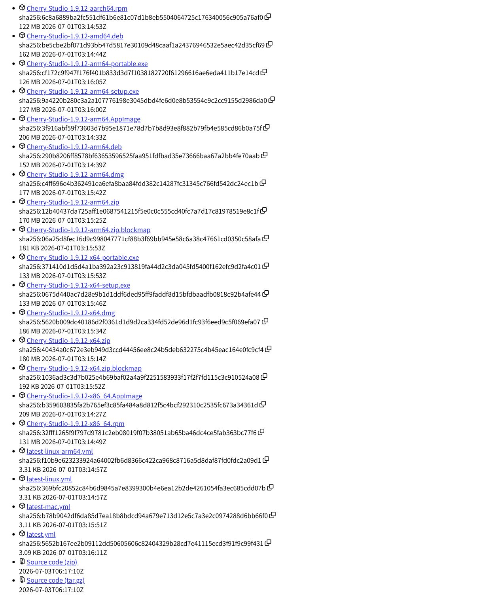
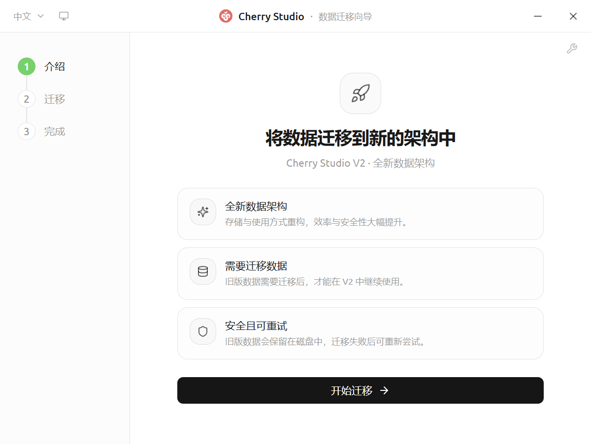

# 版本升级与降级

本页用于在 V1、V2 和历史版本之间手动切换。安装包请只从 [Cherry Studio 官方 GitHub Releases](https://github.com/CherryHQ/cherry-studio/releases) 下载；各系统的基础安装操作仍以 [Windows](../cherry-studio/installation/windows.md)、[macOS](../cherry-studio/installation/macos.md) 和 [Linux](../cherry-studio/installation/linux.md) 安装教程为准。

> **⚠️ 高风险：切换版本前必须先保护原数据**
>
> 1. **完全退出 Cherry Studio**，包括系统托盘、菜单栏和后台中的进程；
> 2. 先在当前版本中创建备份，再把**整个数据目录**复制到另一个安全位置；
> 3. **不要删除、清空、重置或覆盖原数据目录**；
> 4. **不要同时运行 V1 和 V2**，也不要让两个版本同时读写同一个目录；
> 5. 只有确认程序版本和数据目录都正确后，才进行下一步。

## 先选择你的场景

| 你的情况 | 应执行的流程 | 最重要的保护动作 |
|---|---|---|
| 从 V1 安全升级到 V2 | 按下文“从 V1 安全升级到 V2”操作 | 先运行最终受支持的 V1，再经过 V2.0.0 |
| 升级后 V2 中没有显示原数据 | 按下文“V2 中数据未显示时返回 V1”操作 | 复制当前目录，不要用 V2 数据覆盖 V1 |
| 在同一大版本内选择其他历史版本 | 按下文“同一大版本内切换”操作 | 下载同系统、同架构的安装包 |

## 本页如何验证

本页把“已经有证据支持的事实”和“防止二次损坏的保守操作”分开说明：

| 内容 | 验证依据 | 当前结论 |
|---|---|---|
| V1 最低门槛和 V2 网关 | 当前客户端的 [`versionPolicy.ts`](https://github.com/CherryHQ/cherry-studio/blob/main/src/main/data/migration/v2/core/versionPolicy.ts) 及其[单元测试](https://github.com/CherryHQ/cherry-studio/blob/main/src/main/data/migration/v2/core/__tests__/versionPolicy.test.ts) | 源码规定 V1 ≥ 1.9.12，且不能跳过 2.0.0 网关；本次实测中，无版本记录、低于 1.9.12、跳过网关等核心用例均按预期放行或阻断 |
| 旧数据是否保留 | 当前迁移向导界面、迁移文案和 [`migrationV2`](https://github.com/CherryHQ/cherry-studio/tree/main/src/main/data/migration/v2) 实现 | 客户端设计为读取旧数据并写入 V2 结构，向导明确说明旧数据保留在磁盘；仍必须额外复制原目录 |
| 安装包名称和架构 | [v1.9.12 官方 Assets](https://github.com/CherryHQ/cherry-studio/releases/expanded_assets/v1.9.12) 与 [`electron-builder.yml`](https://github.com/CherryHQ/cherry-studio/blob/main/electron-builder.yml) | Windows、macOS、Linux 的文件名和架构后缀已核对 |
| 自定义或外置数据目录 | [`MigrationPaths.ts`](https://github.com/CherryHQ/cherry-studio/blob/main/src/main/data/migration/v2/core/MigrationPaths.ts) 及[路径选择测试](https://github.com/CherryHQ/cherry-studio/blob/main/src/main/data/migration/v2/core/__tests__/MigrationPaths.test.ts) | 源码包含自动读取、重定向及路径不可访问时的阻断分支；纯路径选择用例已通过，但 Windows 集成测试夹具存在 POSIX/Windows 分隔符不兼容，不能据此宣称 Windows 自动恢复已完整验证 |
| 返回 V1 | 当前没有自动把 V2 数据反向转换成 V1 的功能 | 本页提供的是“保留目录后手动更换程序版本”的恢复流程，不承诺 V2 新数据能回到 V1 |
| 各平台卸载或替换程序 | 安装包配置和现有平台安装教程 | 操作入口成立，但不同系统、发行版和安装器提示可能变化；遇到任何“删除应用数据”选项必须取消 |

当前 V2 预发布版本的[官方发布说明](https://github.com/CherryHQ/cherry-studio/releases)仍包含数据迁移和数据库迁移修复。因此，“源码中存在迁移流程和测试”只证明兼容链路与预期行为明确，**不代表每台设备都能无故障迁移**；完整目录副本和返回 V1 的路径仍然必需。

> **验证边界：** 版本链路、界面、源码分支和发布资产已经核对；本页不把 Windows 自定义目录自动恢复、macOS、各 Linux 发行版以及所有历史安装器的逐个实机结果写成“已验证成功”。因此所有切换步骤都先要求复制目录，并以“不删除用户数据”为停止条件。

## 第一步：备份并确认数据目录

### 在 V1 中备份

1. 打开 `设置 → 数据设置`；
2. 在“数据备份与恢复”右侧点击 **备份**；
3. 等待备份完成，把备份文件复制到 Cherry Studio 数据目录之外；
4. 记录当前数据目录的完整路径，然后退出 V1。

<figure><figcaption><p>V1：设置 → 数据设置 → 点击右侧“备份”</p></figcaption></figure>

> **注意：** 应用内备份不是唯一保护措施。切换大版本前，还应在完全退出应用后复制**整个数据目录**。备份中可能包含 API 密钥等敏感信息，请勿分享给他人。

复制完成后，建议给每个目录副本写明 `版本 + 状态 + 日期`。至少保留一份只读的 V1 原目录副本；若 V2 已启动过，还要把 V2 当前目录单独复制，不能让两者互相覆盖。

<figure><figcaption><p>隔离演示：V1 原目录、升级前副本、V2 当前目录和降级前副本应分别保存；示例不含真实用户数据</p></figcaption></figure>

### 确认应用实际读取的目录

V2 中进入 `设置 → 数据 → 数据目录` 查看实际路径。开发版、便携版、自定义目录和外置磁盘的路径可能不同，不要只按系统默认路径猜测。

<figure><figcaption><p>V2：设置 → 数据 → 数据目录；核对这里显示的实际路径</p></figcaption></figure>

默认位置和自定义目录说明见[数据存储位置](../pre-basic/personalization-settings/storage.md)，备份功能说明见[数据设置](../pre-basic/data-settings/README.md)。

## 第二步：选择正确的版本和安装包

打开 [GitHub Releases](https://github.com/CherryHQ/cherry-studio/releases)，先在左侧或版本标题中选择版本，再展开该版本底部的 **Assets**。

<figure><figcaption><p>先选择目标版本；带“Pre-release”的版本是预发布版，不适合重要数据环境</p></figcaption></figure>

识别版本时注意：

* **Latest**：发布页当前标记的最新正式版；
* **Pre-release**：测试或候选版本，可能仍有迁移和兼容性问题；
* `x64` / `x86_64` / `amd64`：常见 Intel、AMD 64 位电脑；
* `arm64` / `aarch64`：Apple 芯片、Windows ARM 或 ARM Linux 设备；
* 版本号必须与准备安装的目标版本一致。

<figure><figcaption><p>展开 Assets 后，按系统、CPU 架构和安装方式选择文件；不要下载 Source code 或 latest.yml</p></figcaption></figure>

Windows 用户如果不确定 CPU 架构，可以在开始菜单中搜索并打开“系统信息”，在“系统摘要”中查看“系统类型”。显示 `x64-based PC` 时选择 `x64` 安装包；显示 ARM64/ARM-based 时选择 `arm64` 安装包。

<figure><figcaption><p>Windows：系统信息 → 系统摘要 → 系统类型；本例应选择 x64 安装包</p></figcaption></figure>

| 系统 | 常用安装包 | 说明 |
|---|---|---|
| Windows | `x64-setup.exe` / `arm64-setup.exe` | 普通安装版 |
| Windows | `x64-portable.exe` / `arm64-portable.exe` | 便携版；数据位置和更新行为可能不同 |
| macOS | `arm64.dmg` / `x64.dmg` | Apple 芯片选 arm64，Intel 选 x64 |
| Linux | `x86_64.AppImage` / `arm64.AppImage` | 通用单文件版本 |
| Linux | `amd64.deb` / `arm64.deb` | Debian、Ubuntu 等 |
| Linux | `x86_64.rpm` / `aarch64.rpm` | Fedora、RHEL 系等 |

更多下载和安装包选择说明见[客户端下载](download.md)。

## 从 V1 安全升级到 V2

当前客户端的迁移兼容链路是：

```text
V1 1.9.12 或更高的受支持最终 V1
        ↓ 先运行一次并正常退出
官方提供且客户端允许的 V2.0.0 网关构建
        ↓ 确认迁移完成并重启
后续 V2 版本
```

> **注意：** 不要从早于 V1.9.12 的版本直接升级到 V2，也不要首次迁移时跳到高于 V2.0.0 的版本。当前源码会把 `2.0.0-alpha`、`2.0.0-beta`、`2.0.0-rc` 等官方预发布构建按 V2.0.0 网关判断；实际应选择 GitHub Releases 当时提供且迁移提示允许的官方构建，不要根据旧截图猜版本。

<figure><figcaption><p>确认已经备份、程序版本和数据目录正确后，再点击底部“开始迁移”</p></figcaption></figure>

1. 在 V1 中完成备份并复制整个数据目录；
2. 如果当前 V1 低于 `1.9.12`，下载并安装 `v1.9.12`，至少完整启动一次，确认数据可见后正常退出；
3. 从官方 Releases 下载当时可用的 **V2.0.0 网关构建**；首次迁移不要直接安装 `2.0.1`、`2.1.0` 等更高版本。若“数据迁移向导”显示数据目录，必须与第一步记录的 V1 路径核对；路径不同、没有显示预期的自定义目录或原磁盘尚未连接时，立即退出，不要点击 **开始迁移**；
4. 迁移期间不要关闭窗口、终止进程、断开外置磁盘或让设备休眠；
5. 按提示重启后，逐项检查：
   * 对话和消息；
   * 模型服务、默认模型及其他设置；
   * 知识库及其文件；
   * 文件、笔记等本地内容；
6. 检查无误后再升级到后续 V2，并继续保留 V1 原目录和迁移前备份。

迁移会保留磁盘上的 V1 原始数据，因此失败后通常可以重试或返回 V1 检查。**迁移后在 V2 中新建或修改的数据不会自动反向同步到 V1。**

> **⚠️ 迁移异常时停止：** 如果迁移向导白屏、长时间无响应、反复失败，或迁移后 V2 中没有原数据，请立即退出 V2。不要连续重试写入、不要点击“跳过迁移”后继续使用空数据、不要重置数据。先保留 V1/V2 两套目录副本，再按下一节返回 V1。

## V2 中数据未显示时返回 V1

返回 V1 是使用历史安装包手动切换程序版本，不是把 V2 数据库“转换”成 V1。

1. 完全退出 V2；
2. 分别复制当前 V2 数据目录和仍保留的 V1 数据目录，副本名称中写明版本和日期；
3. 从 GitHub Releases 下载与原设备**相同系统、相同 CPU 架构**的 V1 安装包；
4. 只替换或卸载**程序文件**，不要勾选删除用户数据，也不要删除数据目录：
   * **Windows**：先尝试运行对应 V1 安装包；若安装器拒绝降级，确认目录副本可读后再卸载应用本体。卸载界面只要出现“删除用户数据”“清除配置”等选项，就取消操作并重新核对；
   * **macOS**：退出应用后只替换“应用程序”中的 Cherry Studio 应用本体，不要处理第一步记录的数据目录；
   * **Linux**：AppImage 可直接使用对应历史文件；`deb` / `rpm` 应按发行版的指定版本安装方式处理，不要把删除配置目录作为降级步骤；
5. 启动 V1，确认它读取的是原 V1 数据目录，并检查迁移前的对话、设置、知识库和文件；
6. 只有 V1 中仍然缺少数据时，才在 V1 中恢复**由 V1 创建的备份**。

> **⚠️ 禁止跨版本覆盖：** 禁止把 V2 数据库、V2 整目录副本或 V2 创建的备份直接恢复进 V1。两个大版本的数据结构不同，这样做可能覆盖仍可恢复的 V1 数据。

如果只在 V2 中创建了新数据，需要在 V2 中通过当前可用的导出功能单独导出，再决定如何保存；这些数据不会自动出现在 V1 中。

## 同一大版本内切换

在 V1 内或 V2 内选择其他历史版本时：

1. 先阅读目标版本与当前版本之间的发布说明；
2. 备份并复制当前数据目录；
3. 在 Releases 中选择同系统、同架构的目标安装包；
4. 手动安装目标版本。内置更新器通常只负责升级，不负责降级；
5. 首次启动后立即检查数据。发现格式不兼容、反复崩溃或数据缺失时，退出应用并恢复程序版本，不要继续写入。

即使主版本号相同，较新版本写入的数据也可能无法被较旧版本完整识别，因此仍应把降级当作有风险的操作。

## 故障处理

### 提示版本链路不兼容

退出当前版本，按提示安装缺少的中间版本。当前门槛为先运行 V1 `1.9.12`，首次迁移再经过 V2 `2.0.0`。不要通过“跳过迁移”“重置数据”绕过版本门槛。

### 迁移失败或卡住

1. 停止继续尝试会写入数据的操作；
2. 保留 V1 原目录、V2 当前目录和迁移前备份；
3. 记录错误提示并打开应用日志；
4. 确认磁盘空间充足、目录可写、外置磁盘连接稳定；
5. 重新从正确的 V1 → V2.0.0 链路尝试。

### 使用自定义或外置数据目录

自动识别不能作为唯一保障。先重新连接原磁盘，并确认盘符、挂载点、目录名称和读写权限没有变化；再用 V1“设置 → 数据设置”中记录的完整路径逐字核对。

如果 V2 没有显示预期路径、提示目录不可访问，或打开后像一个全新的空白环境：

1. 不要创建新对话、导入备份或继续迁移；
2. 立即退出 V2，并保留当前空目录和原数据目录的独立副本；
3. 重新连接或挂载原磁盘，确认原目录仍包含迁移前文件；
4. 返回 V1，确认 V1 仍能从原路径读取数据；
5. 在路径问题解决前，不要让 V2 对空目录继续初始化，也不要用空目录覆盖原目录。

### 没有备份，也不知道数据在哪

立即退出 Cherry Studio，停止安装、重置和清理操作。先按[数据存储位置](../pre-basic/personalization-settings/storage.md)查找默认目录，并检查 V1、V2、便携版或自定义目录是否并存。找到后先复制整个目录，再尝试打开。

> **⚠️ 最后确认：** 以上所有故障场景都应先保护原目录。排查期间不要点击“重置数据”，不要删除或清空目录，也不要用一个看似较新的空目录覆盖旧目录。
