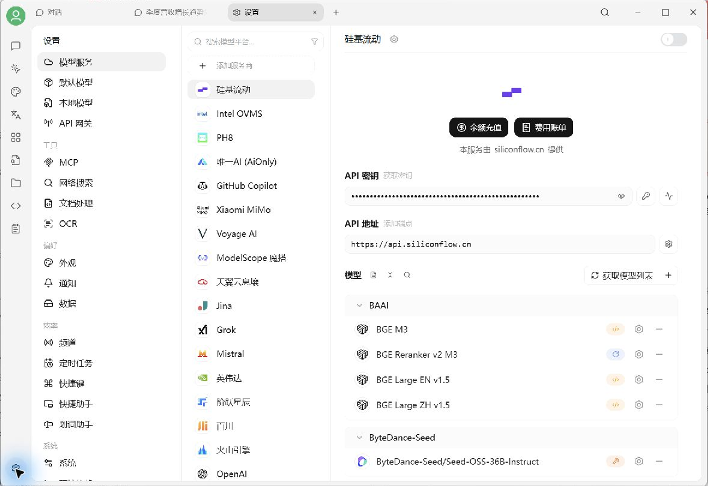
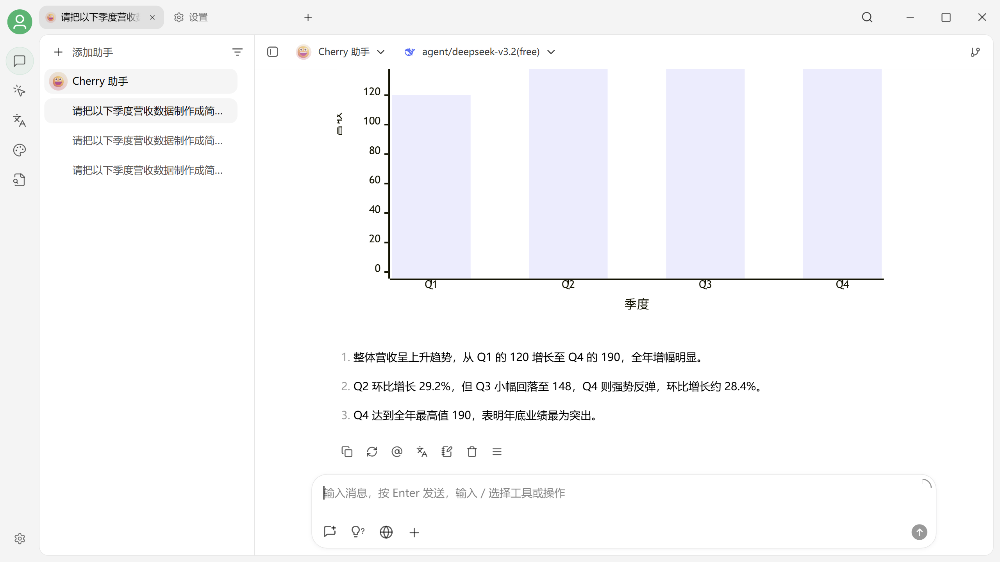

# 快速开始与第一次对话

本页用于完成第一次 AI 对话。成功标准是：**在 Cherry Studio 中选择一个模型，发送消息，并收到正常回答。**

## 开始前需要什么？

* Windows、macOS 或 Linux 电脑；
* 可访问模型服务的网络，或者已经在本机运行 Ollama / LM Studio；
* 一个可用的模型来源。

模型来源有三种，选择一种即可：

| 我是哪类用户？ | 推荐方式 | 需要准备 |
|---|---|---|
| 第一次使用，不想研究 API | **CherryIN 模型服务** | 按客户端提示登录或填写授权信息，以界面实际要求为准 |
| 已有或可以获取 DeepSeek、OpenAI、Gemini 等服务商的 API Key | **对应模型服务商** | 服务商创建的 API Key |
| 希望模型推理主要在本机完成 | **Ollama / LM Studio** | 已安装并启动本地推理服务 |


Cherry Studio 和 CherryIN 都不是具体模型：Cherry Studio 是桌面客户端，CherryIN 是模型服务商（Provider）。使用云端模型时，模型费用、额度、内容处理和隐私政策由对应服务商决定。


## 第 1 步：下载并安装

前往[客户端下载](../cherrystudio/download.md)，选择适合当前操作系统和芯片架构的安装包。无法安装或启动时，请查看 [Windows](../cherry-studio/installation/windows.md)、[macOS](../cherry-studio/installation/macos.md) 或 [Linux](../cherry-studio/installation/linux.md) 安装说明。

## 第 2 步：添加模型服务

1. 打开 `设置 → 模型服务`；
2. 选择 CherryIN、DeepSeek、OpenAI、Gemini、Ollama 或你正在使用的服务商；
3. 按页面要求填写 API Key；使用自定义、兼容接口或本地服务时，再填写对应的 API 地址；
4. 点击 **获取模型列表**；
5. 添加并启用至少一个**对话模型**。

<figure><figcaption>
设置 → 模型服务：选择服务商并启用对话模型
</figcaption></figure>


嵌入模型用于知识库，重排模型用于优化检索，图像模型用于绘画。第一次对话需要选择“对话模型”。


**成功标志**：模型列表中出现至少一个已启用的对话模型，并且“检测”能够正常返回结果。

如果获取不到模型：

* 检查 API Key 是否复制完整，前后不要带空格；
* 检查 API 地址是否被手动修改；
* 检查服务商账户是否有额度；
* 使用本地模型时，确认 Ollama / LM Studio 服务正在运行；
* 查看[模型服务配置](../pre-basic/providers/README.md)中的对应服务商教程。

## 第 3 步：发送第一条消息

进入 **对话** 页面，在模型选择器中选择刚才启用的对话模型，然后发送一条测试消息：

> 请用三句话介绍 Cherry Studio，并说明你当前可以帮助我完成什么。

<figure><figcaption>
对话页面：模型可以把数据整理为表格、图表和分析建议
</figcaption></figure>

**成功标志**：页面开始显示模型回复，且不是空白消息或连接错误。

如果发送失败，先展开错误详情，再依次检查模型是否启用、API Key、账户额度和网络连接。使用本地模型时还要确认本地服务没有退出。

## 接下来可以做什么

| 接下来想做什么？ | 下一步 |
|---|---|
| 学会上传文件、切换模型和管理话题 | [对话界面](../cherrystudio/preview/chat.md) |
| 保存一个固定角色和提示词 | [对话页面中的助手库](../cherrystudio/preview/chat.md#zhu-shou-ku) |
| 用自己的 PDF、Word、网页或笔记问答 | [知识库教程](../knowledge-base/knowledge-base.md) |
| 让 AI 读取文件、调用工具并执行多步骤任务 | [工作（Agent）](../advanced-basic/agent.md) |
| 了解助手、Agent、Skill 和 MCP 的关系 | [核心概念](../advanced-basic/concepts-101.md) |


完成第一次对话就已经具备日常使用条件。API 网关、MCP、频道和定时任务都属于按需启用的进阶能力，不需要一次配置完成。

