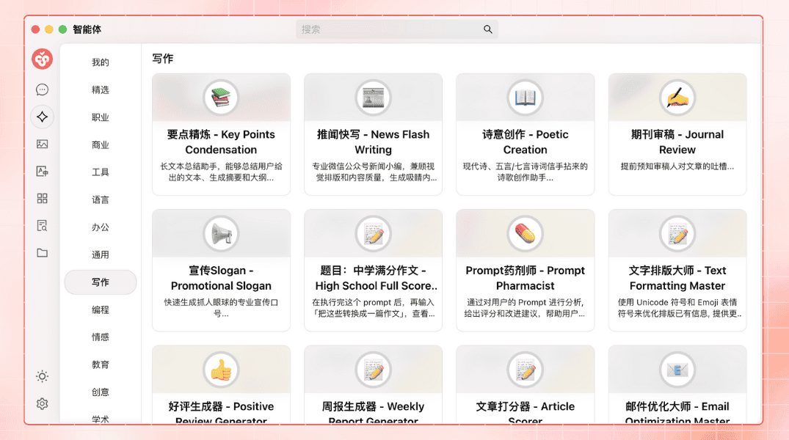
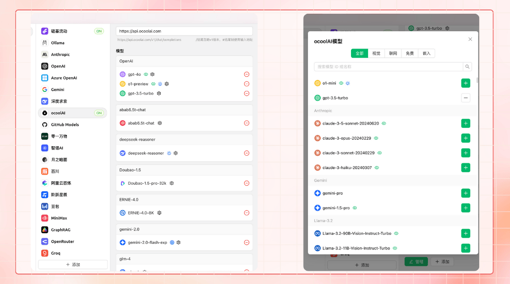


تمت ترجمة هذا المستند من الصينية بواسطة الذكاء الاصطناعي ولم تتم مراجعته بعد.


# مقدمة المشروع

<figure><figcaption></figcaption></figure>

تابعنا على حساباتنا الاجتماعية: [تويتر(X)](https://x.com/CherryStudioAPP), [شياوهونغشو](https://www.xiaohongshu.com/user/profile/662b6853000000000b031d9a), [ويبو](https://weibo.com/u/7975656228), [بيلي بيلي](https://space.bilibili.com/3546657515898892), [دويين](https://www.douyin.com/user/MS4wLjABAAAAmw9A54m5J0hHVMQY5eGrVJ-EHDoOS0hgJ6M1F9MN2Tn2V163A0xrC4_KVzfmQSxC)

انضم لمجتمعاتنا: [مجموعة QQ (575014769)](https://qm.qq.com/q/lo0D4qVZKi), [تليجرام](https://t.me/CherryStudioAI), [ديسكورد](https://discord.gg/wez8HtpxqQ), مجموعة وي شات (انقر للعرض)[^1]

***

Cherry Studio هي منصة شاملة لمساعد الذكاء الاصطناعي تجمع بين وظائف متعددة مثل الحوار متعدد النماذج، وإدارة قاعدة المعرفة، ورسم الذكاء الاصطناعي، والترجمة وغيرها.  
يتميز Cherry Studio بتصميم عالي التخصيص وإمكانيات تمديد قوية وتجربة مستخدم ودية، مما يجعله الخيار الأمثل للمستخدمين المحترفين وهواة الذكاء الاصطناعي. سواء كنت مستخدمًا مبتدئًا أو مطورًا، ستجد في Cherry Studio وظائف الذكاء الاصطناعي المناسبة لك لتعزيز إنتاجيتك وإبداعك.

***

### **الميزات والخصائص الأساسية**

#### **1. وظائف الحوار الأساسية**

* **إجابة متعددة لسؤال واحد**: دعم توليد ردود متزامنة من عدة نماذج لنفس السؤال، لتسهيل مقارنة أداء النماذج المختلفة. شاهد التفاصيل في [واجهة المحادثة](cherrystudio/preview/chat.md).

<figure><figcaption></figcaption></figure>

* **التجميع التلقائي**: يتم إدارة سجلات المحادثة لكل مساعد في مجموعات تلقائيًا لتسهيل البحث السريع.
* **تصدير المحادثات**: دعم تصدير المحادثات الكاملة أو الجزئية بتنسيقات متعددة (مثل Markdown، Word) لتخزينها ومشاركتها.
* **معلمات قابلة للتخصيص بشدة**: بالإضافة إلى ضبط المعلمات الأساسية، يدعم إدخال معلمات مخصصة لتلبية الاحتياجات الشخصية.

<figure><figcaption></figcaption></figure>

* **سوق المساعدين**: يتضمن آلاف المساعدين المتخصصين في قطاعات مثل الترجمة والبرمجة والكتابة، مع دعم إنشاء مساعدين مخصصين.

<figure><figcaption></figcaption></figure>

* **عرض تنسيقات متعددة**: دعم عرض Markdown وصيغ الرياضيات ومعاينة HTML فورية لتحسين عرض المحتوى.

<figure><figcaption></figcaption></figure>

#### **2. وظائف متكاملة مميزة**

* **رسم الذكاء الاصطناعي**: لوحة رسم مخصصة لتوليد صور عالية الجودة عن طريق الوصف النصي.

<figure><figcaption></figcaption></figure>

* **تطبيقات الذكاء الاصطناعي الصغيرة**: أدوات ويب مجانية متكاملة يمكن استخدامها مباشرة دون تغيير المتصفح.
* **وظيفة الترجمة**: دعم لوحة ترجمة مخصصة، وترجمة المحادثات، وترجمة نصوص التوجيه.
* **إدارة الملفات**: تصنيف موحد لملفات المحادثات والرسومات وقواعد المعرفة لتجنب البحث المرهق.

<figure><figcaption></figcaption></figure>

* **بحث شامل**: دعم البحث السريع في السجلات التاريخية ومحتويات قواعد المعرفة لزيادة الإنتاجية.

<figure><figcaption></figcaption></figure>

#### **3. آلية موحدة لإدارة مزودي الخدمة**

* **تجميع نماذج المزودين**: دعم نماذج مزودين رئيسيين مثل OpenAI، Gemini، Anthropic، Azure.
* **الحصول التلقائي على النماذج**: الحصول على قائمة نماذج كاملة بنقرة واحدة دون تكوين يدوي.
* **استخدام مفاتيح API متعددة**: تناوب بين مفاتيح API متعددة لتجنب قيود المعدل.
* **تطابق الصور الشخصية**: تطابق تلقائي لصورة شخصية لكل نموذج لزيادة التمييز.
* **تخصيص مزودي الخدمة**: دعم مزودي خدمة تابعين متوافقين مع OpenAI، Gemini، Anthropic.

<figure><figcaption></figcaption></figure>

#### **4. واجهة وتخطيط قابلان للتخصيص بشدة**

* **تخصيص CSS**: دعم تصميم أنماط عالمية لتشكيل واجهة فريدة.
* **تخطيط المحادثات المخصص**: دعم تخطيط قائمة أو فقاعي مع خيارات تخصيص مثل أنماط التعليمة البرمجية.
* **الصور الشخصية المخصصة**: إعداد صور شخصية للبرنامج والمساعدين.
* **تخصيص قائمة الجانب**: إخفاء أو فرز وظائف الجانب لتحسين التجربة.

<figure><figcaption></figcaption></figure>

#### **5. نظام قاعدة المعرفة المحلية**

* **دعم تنسيقات متعددة**: استيراد PDF، DOCX، PPTX، XLSX، TXT، MD وغيرها.
* **مصادر بيانات متنوعة**: دعم ملفات محلية، مواقع ويب، خرائط مواقع وإدخال يدوي كمصادر للمعرفة.
* **تصدير قاعدة المعرفة**: تصدير قواعد المعرفة المعالجة ومشاركتها.
* **دعم التحقق بالبحث**: اختبار فوري لنتائج المعالجة والتجزئة بعد الاستيراد.

<figure><figcaption></figcaption></figure>

#### **6. ميزات التركيز المميزة**

* **أسئلة سريعة**: استدعاء مساعد سريع من أي سياق (مثل WeChat، المتصفح) للحصول على إجابات فورية.
* **ترجمة فورية**: ترجمة كلمات أو نصوص في سياقات أخرى بسرعة.
* **تلخيص المحتوى**: تلخيص النصوص الطويلة لزيادة كفاءة استخراج المعلومات.
* **شرح سهل**: شرح المشاكل المعقدة بنقرة واحدة دون صيغ توجيه معقدة.

<figure><figcaption></figcaption></figure>

#### **7. ضمان البيانات**

* **خطط نسخ احتياطي متعددة**: دعم النسخ الاحتياطي المحلي، WebDAV والنسخ المجدولة.
* **أمن البيانات**: دعم الاستخدام المحلي بالكامل مع نماذج لغة كبيرة محلية لتجنب مخاطر تسرب البيانات.

***

### **مزايا المشروع**

1. **ودود للمبتدئين**: يهدف Cherry Studio لخفض الحواجز التقنية، يمكن للمستخدمين المبتدئين البدء بسرعة والتركيز على العمل أو الدراسة أو الإبداع.
2. **توثيق متكامل**: توفر وثائق استخدام مفصلة وأدلة معالجة مشكلات شائعة لحل المشكلات بسرعة.
3. **تطوير مستمر**: يستجيب الفريق بشكل فعال لملاحظات المستخدمين ويحسن الوظائف باستمرار لضمان تطور صحي للمشروع.
4. **مفتوح المصدر وقابل للتمديد**: دعم التخصيص والتمديد عبر التعليمات البرمجية المفتوحة لتلبية الاحتياجات الفردية.

***

### **سيناريوهات التطبيق**

* **إدارة المعرفة والاستعلام**: بناء واستعلام قواعد معرفية مخصصة عبر وظيفة قاعدة المعرفة المحلية للبحث والتعليم.
* **حوار متعدد النماذج وإبداع**: دعم محادثات متعددة النماذج للحصول على المعلومات أو توليد المحتوى.
3. **الترجمة وأتمتة المكاتب**: مساعدي ترجمة مدمجين ومعالجة ملفات لمستخدمي التواصل اللغوي ومعالجة المستندات.
4. **رسم الذكاء الاصطناعي والتصميم**: توليد صور عن طريق الوصف النصي لتلبية احتياجات التصميم الإبداعي.

### Star History

## تابعنا على حساباتنا الاجتماعية

<table data-view="cards"><thead><tr><th></th><th data-hidden data-card-cover data-type="files"></th><th data-hidden data-card-target data-type="content-ref"></th></tr></thead><tbody><tr><td><a href="https://www.xiaohongshu.com/user/profile/662b6853000000000b031d9a?xsec_token=YB_1nKvlH4r5hPYVVbbsNHF8Y6n6AKlm5-DaggPCtd2DQ%3D&#x26;xsec_source=app_share&#x26;xhsshare=CopyLink&#x26;appuid=662b6853000000000b031d9a&#x26;apptime=1738627324&#x26;share_id=ace5db41b5954fab8d98a2a7865a62bc&#x26;share_channel=copy_link">شياوهونغشو</a></td><td><a href=".gitbook/assets/1.png">1.png</a></td><td><a href="https://www.xiaohongshu.com/user/profile/662b6853000000000b031d9a?xsec_token=YB_1nKvlH4r5hPYVVbbsNHF8Y6n6AKlm5-DaggPCtd2DQ%3D&#x26;xsec_source=app_share&#x26;xhsshare=CopyLink&#x26;appuid=662b6853000000000b031d9a&#x26;apptime=1738627324&#x26;share_id=ace5db41b5954fab8d98a2a7865a62bc&#x26;share_channel=copy_link">https://www.xiaohongshu.com/user/profile/662b6853000000000b031d9a?xsec_token=YB_1nKvlH4r5hPYVVbbsNHF8Y6n6AKlm5-DaggPCtd2DQ%3D&#x26;xsec_source=app_share&#x26;xhsshare=CopyLink&#x26;appuid=662b6853000000000b031d9a&#x26;apptime=1738627324&#x26;share_id=ace5db41b5954fab8d98a2a7865a62bc&#x26;share_channel=copy_link</a></td></tr><tr><td><a href="https://b23.tv/hIfGgDW">بيلي بيلي</a></td><td><a href=".gitbook/assets/3.png">3.png</a></td><td><a href="https://b23.tv/hIfGgDW">https://b23.tv/hIfGgDW</a></td></tr><tr><td><a href="https://weibo.com/u/7975656228">ويبو</a></td><td><a href=".gitbook/assets/2.png">2.png</a></td><td><a href="https://weibo.com/u/7975656228">https://weibo.com/u/7975656228</a></td></tr><tr><td><a href="https://v.douyin.com/ifTpX4X7">دويين</a></td><td><a href=".gitbook/assets/4.png">4.png</a></td><td><a href="https://v.douyin.com/ifTpX4X7">https://v.douyin.com/ifTpX4X7</a></td></tr><tr><td><a href="https://x.com/CherryStudioAPP?t=DYR0ulaLur-bO4Us3bG79A&#x26;s=05">تويتر(X)</a></td><td><a href=".gitbook/assets/5.png">5.png</a></td><td><a href="https://x.com/CherryStudioAPP?t=DYR0ulaLur-bO4Us3bG79A&#x26;s=05">https://x.com/CherryStudioAPP?t=DYR0ulaLur-bO4Us3bG79A&#x26;s=05</a></td></tr></tbody></table>

[^1]: 