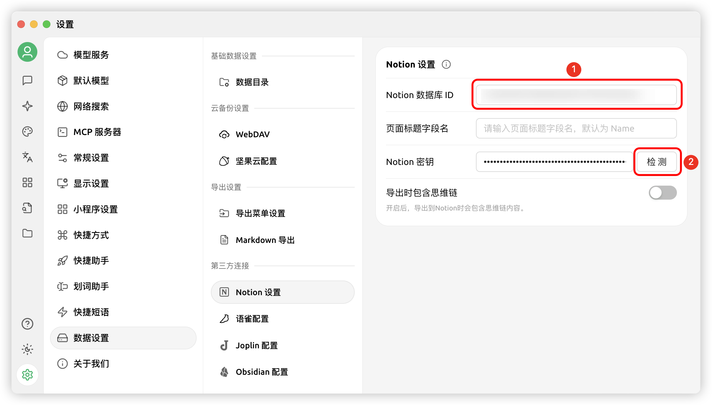


تمت ترجمة هذا المستند من الصينية بواسطة الذكاء الاصطناعي ولم تتم مراجعته بعد.


# دليل تهيئة Notion

يدعم Cherry Studio استيراد المحادثات إلى قاعدة بيانات Notion.

## الخطوة الأولى

افتح موقع [Notion Integrations](https://www.notion.so/profile/integrations) لإنشاء تطبيق

<figure><figcaption>
انقر فوق علامة الجمع لإنشاء تطبيق
</figcaption></figure>

## الخطوة الثانية

قم بإنشاء تطبيق

<figure><figcaption>
املأ معلومات التطبيق
</figcaption></figure>

الاسم: Cherry Studio

النوع: اختر الأول

الأيقونة: يمكنك حفظ هذه الصورة

<figure><figcaption></figcaption></figure>

## الخطوة الثالثة

انسخ مفتاح التفعيل وألصقه في إعدادات Cherry Studio

<figure><figcaption>
انقر فوق نسخ المفتاح
</figcaption></figure>

<figure><figcaption>
ألصق المفتاح في إعدادات البيانات
</figcaption></figure>

## الخطوة الرابعة

افتح موقع [Notion](https://www.notion.so/) وأنشئ صفحة جديدة، اختر نوع قاعدة البيانات من الأسفل، اكتب الاسم Cherry Studio، واتبع الإرشادات للاتصال

<figure><figcaption>
أنشئ صفحة جديدة واختر نوع قاعدة البيانات
</figcaption></figure>

<figure><figcaption>
أدخل اسم الصفحة واختر التوصيل بالتطبيق
</figcaption></figure>

## الخطوة الخامسة

<figure><figcaption>
انسخ معرّف قاعدة البيانات
</figcaption></figure>

إذا كان رابط قاعدة بيانات Notion الخاص بك يشبه هذا:

https://www.notion.so/\<long\_hash\_1>?v=\<long\_hash\_2>

فسيكون معرّف قاعدة بيانات Notion هو الجزء `<long_hash_1>`

<figure><figcaption>
املأ معرّف قاعدة البيانات وانقر فوق التحقق
</figcaption></figure>

## الخطوة السادسة

املأ `اسم حقل عنوان الصفحة`:

إذا كانت واجهتك باللغة الإنجليزية: اكتب `Name`
إذا كانت واجهتك باللغة الصينية: اكتب `名称`

<figure><figcaption>
املأ اسم حقل عنوان الصفحة
</figcaption></figure>

## الخطوة السابعة

مبروك! تم إكمال تهيئة Notion ✅ يمكنك الآن تصدير محتوى Cherry Studio إلى قاعدة بيانات Notion الخاصة بك

<figure><figcaption>
تصدير إلى Notion
</figcaption></figure>

<figure><figcaption>
عرض نتائج التصدير
</figcaption></figure>