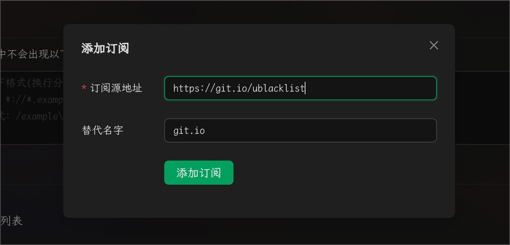


تمت ترجمة هذا المستند من الصينية بواسطة الذكاء الاصطناعي ولم تتم مراجعته بعد.


# تهيئة القائمة السوداء لبحث الويب

يدعم Cherry Studio طريقتين لتهيئة القائمة السوداء: الإعداد اليدوي وإضافة مصادر الاشتراكات. قواعد التهيئة مرجع [ublacklist](https://github.com/iorate/ublacklist)

## التهيئة اليدوية

يمكنك إضافة قواعد لنتائج البحث أو النقر على أيقونة شريط الأدوات لحظر مواقع ويب محددة. يمكن تحديد القواعد باستخدام: [أنماط المطابقة](https://developer.mozilla.org/zh-CN/docs/mozilla/add-ons/webextensions/match_patterns) (مثال: `*://*.example.com/*`) أو [التعبيرات النمطية](https://developer.mozilla.org/zh-CN/docs/web/javascript/guide/regular_expressions) (مثال: `/example\.(net|org)/`).

## تهيئة مصادر الاشتراك

يمكنك أيضًا الاشتراك في مجموعات القواعد العامة. يسرد هذا الموقع بعض الاشتراكات:\
https://iorate.github.io/ublacklist/subscriptions

فيما يلي بعض مصادر الاشتراك الموصى بها:

| الاسم                                                                                                    | الرابط                                                                                                   | النوع   |
| ----------------------------------------------------------------------------------------------------- | ---------------------------------------------------------------------------------------------------- | ---- |
| [uBlacklist subscription compilation](https://github.com/eallion/uBlacklist-subscription-compilation) | https://git.io/ublacklist                                                                            | صيني   |
| [uBlockOrigin-HUGE-AI-Blocklist](https://github.com/laylavish/uBlockOrigin-HUGE-AI-Blocklist)         | https://raw.githubusercontent.com/laylavish/uBlockOrigin-HUGE-AI-Blocklist/main/list\_uBlacklist.txt | تم إنشاؤه بواسطة الذكاء الاصطناعي |

<figure><figcaption>
تهيئة مصادر الاشتراك
</figcaption></figure>