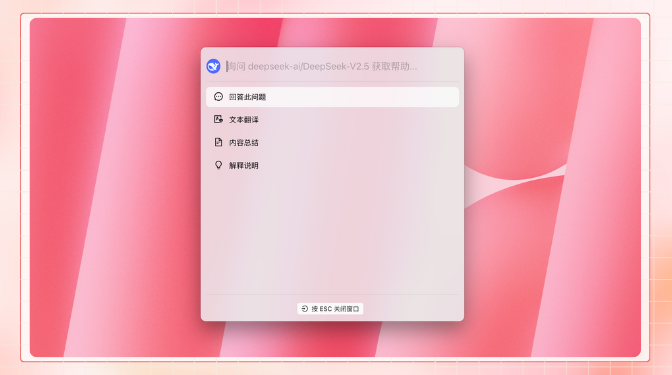


এই নথিটি এআই দ্বারা চীনা থেকে অনুবাদ করা হয়েছে এবং এখনও পর্যালোচনা করা হয়নি।


# প্রকল্পের পরিচয়

<figure><figcaption></figcaption></figure>

আমাদের সামাজিক মিডিয়া একাউন্টগুলো অনুসরণ করুন: [টুইটার(X)](https://x.com/CherryStudioAPP), [শিয়াওহংশু](https://www.xiaohongshu.com/user/profile/662b6853000000000b031d9a), [উইবো](https://weibo.com/u/7975656228), [বিলিবিলি](https://space.bilibili.com/3546657515898892), [ডুইন](https://www.douyin.com/user/MS4wLjABAAAAmw9A54m5J0hHVMQY5eGrVJ-EHDoOS0hgJ6M1F9MN2Tn2V163A0xrC4_KVzfmQSxC)

আমাদের কমিউনিটিতে যোগ দিন: [QQ গ্রুপ (575014769)](https://qm.qq.com/q/lo0D4qVZKi), [টেলিগ্রাম](https://t.me/CherryStudioAI), [ডিসকর্ড](https://discord.gg/wez8HtpxqQ), উইচ্যাট গ্রুপ (দেখতে ক্লিক করুন)[^1]

***

Cherry Studio হল একটি সর্বাঙ্গীন AI সহকারী প্ল্যাটফর্ম যা একাধিক মডেল চ্যাট, জ্ঞানভান্ডার ব্যবস্থাপনা, AI আঁকা, অনুবাদ ইত্যাদি সুবিধা সমন্বিত করে।\
Cherry Studio-এর অত্যন্ত কাস্টমাইজযোগ্য ডিজাইন, শক্তিশালী সম্প্রসারণ ক্ষমতা এবং ব্যবহারকারী-বান্ধব অভিজ্ঞতা একে পেশাদার ব্যবহারকারী এবং AI উত্সাহীদের জন্য আদর্শ পছন্দে পরিণত করেছে। শূন্য অভিজ্ঞতার ব্যবহারকারী থেকে ডেভেলপার পর্যন্ত সকলেই Cherry Studio-এ নিজের চাহিদা অনুযায়ী AI ফিচার খুঁজে পাবে, কাজের দক্ষতা এবং সৃজনশীলতা বৃদ্ধি করতে পারবে।

***

### **প্রধান বৈশিষ্ট্য ও বিশেষত্ব**

#### **1. মৌলিক চ্যাট ফাংশনালিটি**

* **এক প্রশ্নে একাধিক উত্তর**: একই প্রশ্নের জন্য একাধিক মডেল থেকে একসাথে উত্তর তৈরি করা সম্ভব, ব্যবহারকারী বিভিন্ন মডেলের পারফরম্যান্স তুলনা করতে পারবে, বিস্তারিত জানুন [চ্যাট ইন্টারফেসে](cherrystudio/preview/chat.md)।

<figure><figcaption></figcaption></figure>

* **স্বয়ংক্রিয় গ্রুপিং**: প্রতিটি সহকারীর চ্যাট রেকর্ড স্বয়ংক্রিয়ভাবে গ্রুপ করা থাকে, যাতে ব্যবহারকারী অতীতের চ্যাট দ্রুত খুঁজে পেতে পারে।
* **চ্যাট রপ্তানি**: সম্পূর্ণ বা আংশিক চ্যাট মার্কডাউন, ওয়ার্ড ইত্যাদি ফরম্যাটে রপ্তানি করা যায়, সংরক্ষণ ও শেয়ার করা সহজ হয়।
* **উচ্চ ডিগ্রি কাস্টমাইজযোগ্য প্যারামিটার**: বেসিক প্যারামিটার টিউনিং ছাড়াও, ব্যবহারকারী কাস্টম প্যারামিটার সংযুক্ত করতে পারে।

<figure><figcaption></figcaption></figure>

* **সহকারী মার্কেটপ্লেস**: অনুবাদ, প্রোগ্রামিং, লেখালেখি সহ বিভিন্ন খাতের জন্য পূর্বনির্মিত সহস্রাধিক সহকারী, সাথে ব্যবহারকারী-কাস্টমাইজড সহকারী তৈরি।

<figure><figcaption></figcaption></figure>

* **বহুমুখী ফরম্যাট রেন্ডারিং**: মার্কডাউন রেন্ডারিং, ফর্মুলা রেন্ডারিং, HTML রিয়েল-টাইম প্রিভিউ ইত্যাদি সমর্থিত।

<figure><figcaption></figcaption></figure>

#### **2. বহুমুখী বিশেষ ফাংশনালিটি ইন্টিগ্রেশন**

* **AI আঁকা**: নির্দিষ্ট ড্রয়িং প্যানেলের মাধ্যমে প্রাকৃতিক ভাষা বর্ণনা দিয়ে উচ্চমানের ছবি তৈরি করা যায়।

<figure><figcaption></figcaption></figure>

* **AI মিনি-অ্যাপস**: বিভিন্ন ওয়েব-ভিত্তিক AI টুলস একত্রিত, ব্রাউজার পরিবর্তন ছাড়াই ব্যবহার।
* **অনুবাদ ফিচার**: নির্দিষ্ট অনুবাদ প্যানেল, চ্যাট অনুবাদ, প্রম্পট অনুবাদ ইত্যাদি সমর্থিত।
* **ফাইল ব্যবস্থাপনা**: চ্যাট, ড্রয়িং ও জ্ঞানভান্ডারের ফাইলগুলি একত্রে শ্রেণীবদ্ধভাবে সংরক্ষণ করা যায়।

<figure><figcaption></figcaption></figure>

* **গ্লোবাল সার্চ**: ইতিহাস ও জ্ঞানভান্ডারে দ্রুত তথ্য খোঁজা।

<figure><figcaption></figcaption></figure>

#### **3. বহু পরিষেবাদাতার একত্রিত ব্যবস্থাপনা প্রক্রিয়া**

* **পরিষেবাদাতা মডেল সমষ্টিকরণ**: OpenAI, Gemini, Anthropic, Azure সহ প্রধান পরিষেবাদাতাদের মডেল একই প্ল্যাটফর্মে ব্যবহার।
* **স্বয়ংক্রিয় মডেল প্রাপ্তি**: ম্যানুয়াল কনফিগারেশন ছাড়াই এক ক্লিকে সম্পূর্ণ মডেল তালিকা প্রাপ্তি।
* **একাধিক API কী রোটেশন**: হার-লিমিট সমস্যা এড়াতে একাধিক API কী ঘূর্ণায়মানভাবে ব্যবহার।
* **সুনির্দিষ্ট অ্যাভাটার মিল**: প্রতিটি মডেলের জন্য স্বয়ংক্রিয় কাস্টম অ্যাভাটার মিলানো হয়।
* **কাস্টমাইজড পরিষেবাদাতা**: OpenAI, Gemini, Anthropic ইত্যাদির সাথে সামঞ্জস্যপূর্ণ তৃতীয়-পক্ষ পরিষেবাদাতা সমর্থিত।

<figure><figcaption></figcaption></figure>

#### **4. উচ্চ ডিগ্রি কাস্টমাইজযোগ্য ইন্টারফেস ও লেআউট**

* **কাস্টম CSS**: গ্লোবাল স্টাইল কাস্টমাইজেশন সমর্থিত।
* **কাস্টম চ্যাট লেআউট**: তালিকা বা বাবল স্টাইলে চ্যাট দেখা এবং বার্তার স্টাইল কাস্টমাইজেশন।
* **কাস্টম অ্যাভাটার**: সফটওয়্যার ও সহকারীদের জন্য ব্যক্তিগত অ্যাভাটার সেট করা যায়।
* **কাস্টম সাইডবার মেনু**: প্রয়োজন অনুযায়ী সাইডবার বৈশিষ্ট্যগুলো লুকানো বা সাজানো যাবে।

<figure><figcaption></figcaption></figure>

#### **5. লোকাল জ্ঞানভান্ডার সিস্টেম**

* **বহু ফরম্যাট সমর্থন**: PDF, DOCX, PPTX, XLSX, TXT, MD সহ নানা ফরম্যাট আমদানি করা যায়।
* **বহু ডেটা উৎস সমর্থন**: লোকাল ফাইল, URL, সাইটম্যাপ এমনকি ম্যানুয়াল ইনপুটও জ্ঞানভান্ডার উৎস হিসেবে ব্যবহার করা যায়।
* **জ্ঞানভান্ডার রপ্তানি**: প্রক্রিয়াকৃত জ্ঞানভান্ডার রপ্তানি করে শেয়ার করা সম্ভব।
* **সার্চ টেস্টিং**: আমদানিকৃত জ্ঞানভান্ডার রিয়েল-টাইমে টেস্ট করা যায়।

<figure><figcaption></figcaption></figure>

#### **6. বিশেষ ফোকাস ফিচার**

* **কুইক Q&A**: যেকোনো পরিবেশে (যেমন উইচ্যাট, ব্রাউজার) সহকারী দ্রুত ডেকে প্রশ্নের উত্তর পাওয়া।
* **কুইক ট্রান্সলেশন**: যেকোনো শব্দ/টেক্সট দ্রুত অনুবাদ।
* **কনটেন্ট সামারি**: বড় লেখা দ্রুত সারাংশ করা।
* **এক-ক্লিক এক্সপ্লানেশন**: জটিল প্রম্পট ছাড়াই জিনিস বোঝা।

<figure><figcaption></figcaption></figure>

#### **7. ডেটা সুরক্ষা**

* **বহু ব্যাকআপ অপশন**: লোকাল, WebDAV এবং শিডিউলড ব্যাকআপ সমর্থিত।
* **ডেটা সিকিউরিটি**: লোকাল এনভায়রনমেন্ট ব্যবহার ও লোকাল লার্জ মডেলের সাথে সুরক্ষা।

***

### **প্রকল্পের সুবিধা**

1. **সহজ ব্যবহার**: প্রযুক্তিগত জটিলতা কমাতে সাহায্য করে, নতুন ব্যবহারকারীরা সহজে শুরু করতে পারে।
2. **সম্পূর্ণ ডকুমেন্টেশন**: বিস্তারিত ব্যবহার নির্দেশিকা এবং সাধারণ সমস্যা সমাধান গাইড।
3. **অবিরাম উন্নয়ন**: ব্যবহারকারী ফিডব্যাকের ভিত্তিতে ক্রমাগত উন্নতকরণ।
4. **ওপেন সোর্স ও এক্সটেনসিবিলিটি**: ওপেন সোর্স কোডের মাধ্যমে প্রসারণযোগ্য।

***

### **ব্যবহারের ক্ষেত্র**

* **জ্ঞান ব্যবস্থাপনা ও অনুসন্ধান**: গবেষণা, শিক্ষা ইত্যাদির জন্য লোকাল জ্ঞানভান্ডার তৈরি।
* **বহু-মডেল চ্যাট ও সৃজনশীলতা**: একসাথে একাধিক মডেল ব্যবহার করে তথ্য সংগ্রহ।
* **অনুবাদ ও অফিস অটোমেশন**: ভাষান্তর ও ডকুমেন্ট প্রসেসিং সহায়ক।
* **AI আঁকা ও ডিজাইন**: প্রাকৃতিক ভাষার বর্ণনা দিয়ে সৃজনশীল কাজ।

### স্টার হিস্ট্রি

## আমাদের সামাজিক মিডিয়া একাউন্টগুলো অনুসরণ করুন

<table data-view="cards"><thead><tr><th></th><th data-hidden data-card-cover data-type="files"></th><th data-hidden data-card-target data-type="content-ref"></th></tr></thead><tbody><tr><td><a href="https://www.xiaohongshu.com/user/profile/662b6853000000000b031d9a?xsec_token=YB_1nKvlH4r5hPYVVbbsNHF8Y6n6AKlm5-DaggPCtd2DQ%3D&#x26;xsec_source=app_share&#x26;xhsshare=CopyLink&#x26;appuid=662b6853000000000b031d9a&#x26;apptime=1738627324&#x26;share_id=ace5db41b5954fab8d98a2a7865a62bc&#x26;share_channel=copy_link">শিয়াওহংশু</a></td><td><a href=".gitbook/assets/1.png">1.png</a></td><td><a href="https://www.xiaohongshu.com/user/profile/662b6853000000000b031d9a?xsec_token=YB_1nKvlH4r5hPYVVbbsNHF8Y6n6AKlm5-DaggPCtd2DQ%3D&#x26;xsec_source=app_share&#x26;xhsshare=CopyLink&#x26;appuid=662b6853000000000b031d9a&#x26;apptime=1738627324&#x26;share_id=ace5db41b5954fab8d98a2a7865a62bc&#x26;share_channel=copy_link">https://www.xiaohongshu.com/user/profile/662b6853000000000b031d9a?xsec_token=YB_1nKvlH4r5hPYVVbbsNHF8Y6n6AKlm5-DaggPCtd2DQ%3D&#x26;xsec_source=app_share&#x26;xhsshare=CopyLink&#x26;appuid=662b6853000000000b031d9a&#x26;apptime=1738627324&#x26;share_id=ace5db41b5954fab8d98a2a7865a62bc&#x26;share_channel=copy_link</a></td></tr><tr><td><a href="https://b23.tv/hIfGgDW">বিলিবিলি</a></td><td><a href=".gitbook/assets/3.png">3.png</a></td><td><a href="https://b23.tv/hIfGgDW">https://b23.tv/hIfGgDW</a></td></tr><tr><td><a href="https://weibo.com/u/7975656228">উইবো</a></td><td><a href=".gitbook/assets/2.png">2.png</a></td><td><a href="https://weibo.com/u/7975656228">https://weibo.com/u/7975656228</a></td></tr><tr><td><a href="https://v.douyin.com/ifTpX4X7">ডুইন</a></td><td><a href=".gitbook/assets/4.png">4.png</a></td><td><a href="https://v.douyin.com/ifTpX4X7">https://v.douyin.com/ifTpX4X7</a></td></tr><tr><td><a href="https://x.com/CherryStudioAPP?t=DYR0ulaLur-bO4Us3bG79A&#x26;s=05">টুইটার(X)</a></td><td><a href=".gitbook/assets/5.png">5.png</a></td><td><a href="https://x.com/CherryStudioAPP?t=DYR0ulaLur-bO4Us3bG79A&#x26;s=05">https://x.com/CherryStudioAPP?t=DYR0ulaLur-bO4Us3bG79A&#x26;s=05</a></td></tr></tbody></table>

[^1]: 