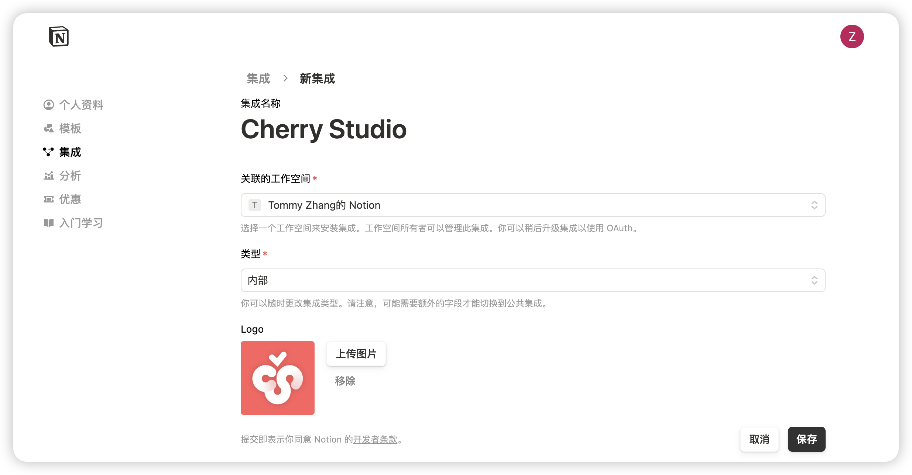
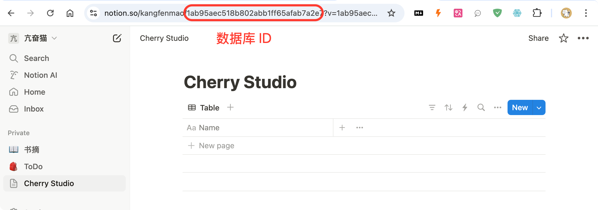


এই নথিটি এআই দ্বারা চীনা থেকে অনুবাদ করা হয়েছে এবং এখনও পর্যালোচনা করা হয়নি।


# Notion কনফিগারেশন টিউটোরিয়াল

Cherry Studio টপিকগুলি Notion এর ডাটাবেসে ইম্পোর্ট করতে সমর্থন করে।

## প্রথম ধাপ

ওয়েবসাইট [Notion Integrations](https://www.notion.so/profile/integrations) খুলে একটি অ্যাপ্লিকেশন তৈরি করুন

<figure><figcaption>
অ্যাপ্লিকেশন তৈরি করতে প্লাস আইকনে ক্লিক করুন
</figcaption></figure>

## দ্বিতীয় ধাপ

একটি অ্যাপ্লিকেশন তৈরি করুন

<figure><figcaption>
অ্যাপ্লিকেশনের তথ্য পূরণ করুন
</figcaption></figure>

নাম: Cherry Studio

ধরণ: প্রথমটি নির্বাচন করুন

আইকন: এই ছবিটি সংরক্ষণ করতে পারেন

<figure><figcaption></figcaption></figure>

## তৃতীয় ধাপ

কী অনুলিপি করে Cherry Studio সেটিংসে পেস্ট করুন

<figure><figcaption>
অভ্যন্তরীণ কী অনুলিপি করতে ক্লিক করুন
</figcaption></figure>

<figure><figcaption>
ডাটা সেটিংসে কীটি পূরণ করুন
</figcaption></figure>

## চতুর্থ ধাপ

[Notion](https://www.notion.so/) ওয়েবসাইট খুলে একটি নতুন পৃষ্ঠা তৈরি করুন, নীচে ডাটাবেস ধরণ নির্বাচন করুন, নাম Cherry Studio দিন, নির্দেশিতভাবে সংযোগ করুন

<figure><figcaption>
ডাটাবেস ধরণ নির্বাচন করে একটি নতুন পৃষ্ঠা তৈরি করুন
</figcaption></figure>

<figure><figcaption>
পৃষ্ঠার নাম লিখুন এবং APP-এর সাথে সংযুক্তি নির্বাচন করুন
</figcaption></figure>

## পঞ্চম ধাপ

<figure><figcaption>
ডাটাবেস আইডি অনুলিপি করুন
</figcaption></figure>

যদি আপনার Notion ডাটাবেসের URL এইরকম হয়:

https://www.notion.so/\<long\_hash\_1>?v=\<long\_hash\_2>

তাহলে Notion ডাটাবেস আইডি হল `<long_hash_1>` অংশটি

<figure><figcaption>
ডাটাবেস আইডি পূরণ করুন এবং পরীক্ষা বোতামে ক্লিক করুন
</figcaption></figure>

## ষষ্ঠ ধাপ

`পৃষ্ঠা শিরোনাম ক্ষেত্রের নাম` পূরণ করুন:

যদি আপনার ওয়েবপেজ ইংরেজিতে হয়, `Name` লিখুন
যদি আপনার ওয়েবপেজ চীনা ভাষায় হয়, `名称` লিখুন

<figure><figcaption>
পৃষ্ঠা শিরোনাম ক্ষেত্রের নাম পূরণ করুন
</figcaption></figure>

## সপ্তম ধাপ

অভিনন্দন! Notion কনফিগারেশন সম্পূর্ণ হয়েছে ✅ এখন থেকে Cherry Studio কনটেন্ট আপনার Notion ডাটাবেসে এক্সপোর্ট করতে পারবেন

<figure><figcaption>
Notion এ এক্সপোর্ট করুন
</figcaption></figure>

<figure><figcaption>
এক্সপোর্ট ফলাফল দেখুন
</figcaption></figure>