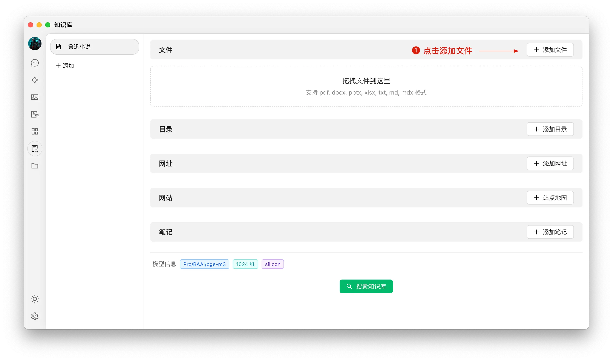
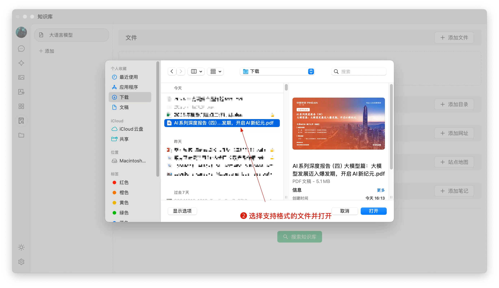


Dit document is door AI vertaald vanuit het Chinees en is nog niet beoordeeld.


# Kennisdatabase Tutorial

In versie 0.9.1 introduceert CherryStudio de langverwachte kennisdatabase-functionaliteit.

Hieronder presenteren we stap voor stap gedetailleerde instructies voor het gebruik van CherryStudio.

## Embeddingsmodel toevoegen

1. Zoek modellen in modelbeheerservice - klik op "Embeddingsmodel" voor snelle filtering;
2. Zoek het gewenste model en voeg het toe aan Mijn Modellen.

<figure><figcaption></figcaption></figure>

## Kennisdatabase aanmaken

1. Toegangspunt: Klik op het kennisdatabase-icoon in de linkertoolbar van CherryStudio om naar de beheerpagina te gaan;
2. Database toevoegen: Klik op "Toevoegen" om een kennisdatabase te creëren;
3. Benoemen: Voer een naam in voor de kennisdatabase en selecteer een embeddingsmodel (bijvoorbeeld bge-m3) om het aanmaken te voltooien.

<figure><figcaption></figcaption></figure>

<figure><figcaption></figcaption></figure>

## Bestanden toevoegen en vectoriseren

1. Bestand toevoegen: Klik op de "Bestand toevoegen"-knop om bestandsselectie te openen;
2. Bestand kiezen: Selecteer ondersteunde bestandsformaten zoals pdf, docx, pptx, xlsx, txt, md, mdx en open ze;
3. Vectoriseren: Het systeem verwerkt automatisch de vectorisering. Een groen vinkje (✓) geeft voltooide vectorisering aan.

<figure><figcaption></figcaption></figure>

<figure><figcaption></figcaption></figure>

<figure><figcaption></figcaption></figure>

## Meerdere databronnen toevoegen

CherryStudio ondersteunt verschillende datatoevoegmethoden:

1. Mapstructuur: Voeg volledige mappen toe - ondersteunde bestanden worden automatisch gevectoriseerd;
2. URL-link: Ondersteunde website-urls zoals [https://docs.siliconflow.cn/introduction](https://docs.siliconflow.cn/introduction);
3. Sitemap: XML-sitemaps zoals [https://docs.siliconflow.cn/sitemap.xml](https://docs.siliconflow.cn/sitemap.xml);
4. Tekstnotities: Voer aangepaste tekstuele inhoud in.


Tips:
1. Illustraties in documenten worden nog niet automatisch gevectoriseerd - handmatige conversie naar tekst is nodig;
2. Webscraping via URL werkt niet altijd (door anti-scrapingmaatregelen of loginvereisten). Controleer altijd via zoekopdrachten;
3. De meeste websites bieden sitemaps (bijv. [CherryStudio's sitemap](https://docs.cherry-ai.com/sitemap-pages.xml)). Probeer `/sitemap.xml` toe te voegen aan domeinnamen (bv. `domein.nl/sitemap.xml`);
4. Ontbrekende sitemaps? Genereer zelf een XML-bestand via:
> a) Gebruik AI om een sitemapgenerator te maken  
> b) Publieke OSS-links of tools zoals [ocoolAI](https://one.ocoolai.com/login) voor directe links


## Kennisdatabase doorzoeken

Na vectorisatie kunt u zoeken:
1. Klik op "Kennisdatabase doorzoeken";
2. Voer zoekterm in;
3. Resultaten worden getoond;
4. Relevantiescore per resultaat wordt weergegeven.

<figure><figcaption></figcaption></figure>

<figure><figcaption></figcaption></figure>

## Kennisdatabase gebruiken in chats

1. Start een nieuw gesprek → Klik op "Kennisdatabase" in de toolbar → Selecteer database;
2. Stel uw vraag → Het model genereert antwoorden gebaseerd op zoekresultaten;
3. Bronverwijzingen worden onder antwoorden getoond (directe toegang tot bronbestanden).

<figure><figcaption></figcaption></figure>

<figure><figcaption></figcaption></figure>