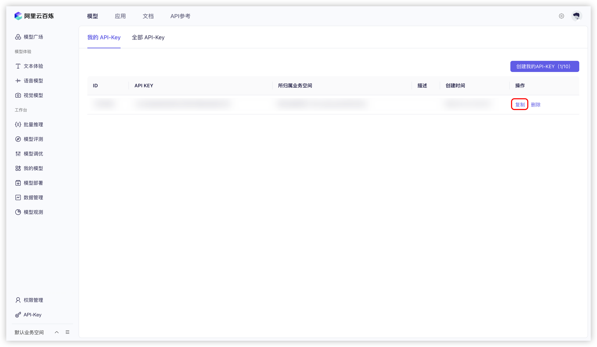


Dit document is door AI vertaald vanuit het Chinees en is nog niet beoordeeld.


# Alibaba Cloud Bailian

1. Meld je aan bij [Alibaba Cloud Bailian](https://bailian.console.aliyun.com/?tab=model#/api-key). Registreer als je nog geen Alibaba Cloud-account hebt.
  
  <figure><figcaption>API-sleutel maken in Alibaba Cloud Bailian</figcaption></figure>

2. Klik op de knop `创建我的 API-KEY` (Mijn API-sleutel maken) in de rechterbovenhoek.
  
3. Selecteer in het pop-upvenster de standaard werkruimte (of maak een aangepaste) en voer eventueel een beschrijving in.
  <figure><figcaption>Pop-up voor het maken van API-sleutel in Alibaba Cloud Bailian</figcaption></figure>
  
4. Klik op de knop `确定` (Bevestigen) in de rechteronderhoek.

5. Er verschijnt nu een nieuwe regel in de lijst. Klik op de knop `查看` (Bekijken) rechts van de regel.
   <figure><figcaption>API-sleutel bekijken in Alibaba Cloud Bailian</figcaption></figure>
   
6. Klik op de knop `复制` (Kopiëren).
    <figure><figcaption>API-sleutel kopiëren in Alibaba Cloud Bailian</figcaption></figure>

7. Ga naar Cherry Studio, navigeer naar `设置` → `模型服务` → `阿里云百炼`, zoek het veld `API 密钥` en plak daar de gekopieerde API-sleutel.
    <figure><figcaption>API-sleutel invullen in Alibaba Cloud Bailian</figcaption></figure>
    
8. Pas de instellingen aan volgens de instructies in [模型服务](../../cherrystudio/preview/settings/providers.md) en je kunt beginnen met gebruiken.

Als je de modellen van Alibaba Cloud Bailian niet in de modellijst ziet, controleer dan of je het model hebt toegevoegd volgens de instructies in [模型服务](../../cherrystudio/preview/settings/providers.md) en of je deze provider hebt ingeschakeld.
