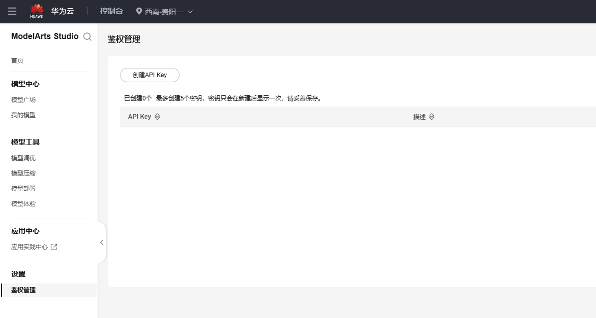


Dit document is door AI vertaald vanuit het Chinees en is nog niet beoordeeld.


# Huawei Cloud

1.  Ga naar [Huawei Cloud](https://auth.huaweicloud.com/authui/login) om een account aan te maken en in te loggen
2.  Klik op [deze link](https://console.huaweicloud.com/modelarts/?region=cn-southwest-2#/model-studio/homepage) om naar het ModelArts-dashboard te gaan
3.  Autorisatie

Autorisatiestappen (overslaan indien reeds geautoriseerd)

1.  Na het openen van de link in stap 2, ga naar de autorisatiepagina volgens de aanwijzingen (klik op IAM-subgebruiker → Nieuwe delegatie → Standaardgebruiker)

.png>)

2.  Na het aanmaken, keer terug naar de pagina van stap 2
3.  Er verschijnt een melding over onvoldoende toegangsrechten, klik op "Klik hier" in de melding
4.  Voeg bestaande autorisatie toe en bevestig

.png>)

&#x20;Opmerking: Deze methode is geschikt voor beginners, zonder veel inhoud te bekijken. Volg gewoon de aanwijzingen. Als je in één keer kunt autoriseren, gebruik dan je eigen methode.

4.  Klik op de zijbalk "Autorisatiebeheer", maak een API Key (geheime sleutel) aan en kopieer deze

<figure><figcaption></figcaption></figure>

Maak vervolgens een nieuwe serviceprovider aan in CherryStudio

<figure><figcaption></figcaption></figure>

Voer de geheime sleutel in na het aanmaken

5.  Klik op de zijbalk "Modelimplementatie", claim alles

<figure><figcaption></figcaption></figure>

6.  Klik op "Aanroepen"

<figure><figcaption></figcaption></figure>

Kopieer het adres bij ①, plak het in het serviceprovideradres in CherryStudio en voeg "#" toe aan het einde

en voeg "#" toe aan het einde

en voeg "#" toe aan het einde

en voeg "#" toe aan het einde

en voeg "#" toe aan het einde

Waarom "#" toevoegen? [Zie hier](https://docs.cherry-ai.com/cherrystudio/preview/settings/providers#api-di-zhi)

> Je kunt dit ook negeren en gewoon de tutorial volgen;  
> je kunt ook de methode gebruiken waarbij je v1/chat/completions verwijdert. Gebruik je eigen methode als je weet hoe, maar volg de tutorial als je niet zeker bent.

<figure><figcaption></figcaption></figure>

Kopieer vervolgens de modelnaam bij ②, ga naar CherryStudio en klik op de knop "+Toevoegen" om een nieuw model aan te maken

<figure><figcaption></figcaption></figure>

Voer de modelnaam in, voeg niets extra's toe, gebruik geen aanhalingstekens en kopieer precies zoals in het voorbeeld.

<figure><figcaption></figcaption></figure>

Klik op de knop "Model toevoegen" om het proces te voltooien.


Omdat elk model in Huawei Cloud een ander adres heeft, moet je voor elk model een nieuwe serviceprovider aanmaken door bovenstaande stappen te herhalen.
