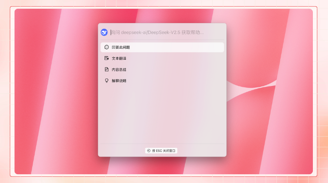

# Project Introduction


This document was translated from Chinese by AI and has not yet been reviewed.


## Project Introduction

<figure><figcaption></figcaption></figure>

Follow our social accounts: [Twitter(X)](https://x.com/CherryStudioAPP), [Xiaohongshu](https://www.xiaohongshu.com/user/profile/662b6853000000000b031d9a), [Weibo](https://weibo.com/u/7975656228), [Bilibili](https://space.bilibili.com/3546657515898892), [Douyin](https://www.douyin.com/user/MS4wLjABAAAAmw9A54m5J0hHVMQY5eGrVJ-EHDoOS0hgJ6M1F9MN2Tn2V163A0xrC4_KVzfmQSxC)

Join our communities: [QQ Group(575014769)](https://qm.qq.com/q/lo0D4qVZKi), [Telegram](https://t.me/CherryStudioAI), [Discord](https://discord.gg/wez8HtpxqQ), WeChat Group(click to view)

***

Cherry Studio is an all-in-one AI assistant platform integrating multi-model conversations, knowledge base management, AI painting, translation, and more.\
Cherry Studio's highly customizable design, powerful extensibility, and user-friendly experience make it an ideal choice for professional users and AI enthusiasts. Whether you are a beginner or a developer, you can find suitable AI functions in Cherry Studio to enhance your work efficiency and creativity.

***

#### **Core Features & Highlights**

**1. Basic Chat Functionality**

* **One Question, Multiple Answers**: Supports generating replies from multiple models simultaneously for the same question, allowing users to compare the performance of different models. For details, see [Chat Interface](cherry-studio/preview/chat.md).

<figure><figcaption></figcaption></figure>

* **Automatic Grouping**: Conversation records for each assistant are automatically grouped and managed, making it easy for users to quickly find historical conversations.
* **Conversation Export**: Supports exporting full or partial conversations to various formats (e.g., Markdown, Word) for easy storage and sharing.
* **Highly Customizable Parameters**: In addition to basic parameter adjustments, it also supports custom parameters to meet personalized needs.

<figure><figcaption></figcaption></figure>

* **Assistant Market**: Built-in with over a thousand industry-specific assistants, covering fields like translation, programming, and writing, while also supporting user-defined assistants.

<figure><figcaption></figcaption></figure>

* **Multiple Format Rendering**: Supports Markdown rendering, formula rendering, real-time HTML preview, and other functions to enhance content display.

<figure><figcaption></figcaption></figure>

**2. Integration of Various Special Features**

* **AI Painting**: Provides a dedicated painting panel where users can generate high-quality images through natural language descriptions.

<figure><figcaption></figcaption></figure>

* **AI Mini-programs**: Integrates various free web-based AI tools, allowing direct use without switching browsers.
* **Translation Function**: Supports a dedicated translation panel, in-conversation translation, prompt translation, and other translation scenarios.
* **File Management**: Files from conversations, paintings, and knowledge bases are managed in a unified and classified manner, avoiding tedious searches.

<figure><figcaption></figcaption></figure>

* **Global Search**: Supports quick location of historical records and knowledge base content, improving work efficiency.

<figure><figcaption></figcaption></figure>

**3. Unified Management for Multiple Service Providers**

* **Service Provider Model Aggregation**: Supports unified calling of models from major service providers like OpenAI, Gemini, Anthropic, and Azure.
* **Automatic Model Fetching**: One-click to get a complete list of models without manual configuration.
* **Multi-key Polling**: Supports rotating multiple API keys to avoid rate limit issues.
* **Precise Avatar Matching**: Automatically matches each model with an exclusive avatar for better recognition.
* **Custom Service Providers**: Supports third-party service providers that comply with specifications like OpenAI, Gemini, and Anthropic, offering strong compatibility.

<figure><figcaption></figcaption></figure>

**4. Highly Customizable Interface and Layout**

* **Custom CSS**: Supports global style customization to create a unique interface style.
* **Custom Chat Layout**: Supports list or bubble style layouts and allows customization of message styles (e.g., code snippet styles).
* **Custom Avatars**: Supports setting personalized avatars for the software and assistants.
* **Custom Sidebar Menu**: Users can hide or reorder sidebar functions according to their needs to optimize the user experience.

<figure><figcaption></figcaption></figure>

**5. Local Knowledge Base System**

* **Multiple Format Support**: Supports importing various file formats such as PDF, DOCX, PPTX, XLSX, TXT, and MD.
* **Multiple Data Source Support**: Supports local files, URLs, sitemaps, and even manually entered content as knowledge base sources.
* **Knowledge Base Export**: Supports exporting processed knowledge bases to share with others.
* **Search and Check Support**: After importing a knowledge base, users can perform real-time retrieval tests to check the processing results and segmentation effects.

<figure><figcaption></figcaption></figure>

**6. Special Focus Features**

* **Quick Q\&A**: Summon a quick assistant in any context (e.g., WeChat, browser) to get answers quickly.
* **Quick Translation**: Supports quick translation of words or text from other contexts.
* **Content Summarization**: Quickly summarizes long text content to improve information extraction efficiency.
* **Explanation**: Explains complex issues with one click, without needing complicated prompts.

<figure><figcaption></figcaption></figure>

**7. Data Security**

* **Multiple Backup Solutions**: Supports local backup, WebDAV backup, and scheduled backups to ensure data safety.
* **Data Security**: Supports fully local usage scenarios, combined with local large models, to avoid data leakage risks.

***

#### **Project Advantages**

1. **Beginner-Friendly**: Cherry Studio is committed to lowering the technical barrier, allowing even users with no prior experience to get started quickly, focusing on their work, study, or creation.
2. **Comprehensive Documentation**: Provides detailed user manuals and FAQs to help users solve problems quickly.
3. **Continuous Iteration**: The project team actively responds to user feedback and continuously optimizes features to ensure the project's healthy development.
4. **Open Source and Extensibility**: Supports customization and extension through open-source code to meet personalized needs.

***

#### **Applicable Scenarios**

* **Knowledge Management and Query**: Quickly build and query exclusive knowledge bases using the local knowledge base feature, suitable for research, education, and other fields.
* **Multi-model Conversation and Creation**: Supports simultaneous conversation with multiple models, helping users quickly obtain information or generate content.
* **Translation and Office Automation**: Built-in translation assistants and file processing functions are suitable for users who need cross-lingual communication or document processing.
* **AI Painting and Design**: Generate images from natural language descriptions to meet creative design needs.

#### Star History

### Follow Our Social Accounts

<table data-view="cards"><thead><tr><th></th><th data-hidden data-card-cover data-type="files"></th><th data-hidden data-card-target data-type="content-ref"></th></tr></thead><tbody><tr><td><a href="https://www.xiaohongshu.com/user/profile/662b6853000000000b031d9a?xsec_token=YB_1nKvlH4r5hPYVVbbsNHF8Y6n6AKlm5-DaggPCtd2DQ%3D&#x26;xsec_source=app_share&#x26;xhsshare=CopyLink&#x26;appuid=662b6853000000000b031d9a&#x26;apptime=1738627324&#x26;share_id=ace5db41b5954fab8d98a2a7865a62bc&#x26;share_channel=copy_link">Xiaohongshu</a></td><td></td><td><a href="https://www.xiaohongshu.com/user/profile/662b6853000000000b031d9a?xsec_token=YB_1nKvlH4r5hPYVVbbsNHF8Y6n6AKlm5-DaggPCtd2DQ%3D&#x26;xsec_source=app_share&#x26;xhsshare=CopyLink&#x26;appuid=662b6853000000000b031d9a&#x26;apptime=1738627324&#x26;share_id=ace5db41b5954fab8d98a2a7865a62bc&#x26;share_channel=copy_link">https://www.xiaohongshu.com/user/profile/662b6853000000000b031d9a?xsec_token=YB_1nKvlH4r5hPYVVbbsNHF8Y6n6AKlm5-DaggPCtd2DQ%3D&#x26;xsec_source=app_share&#x26;xhsshare=CopyLink&#x26;appuid=662b6853000000000b031d9a&#x26;apptime=1738627324&#x26;share_id=ace5db41b5954fab8d98a2a7865a62bc&#x26;share_channel=copy_link</a></td></tr><tr><td><a href="https://b23.tv/hIfGgDW">Bilibili</a></td><td></td><td><a href="https://b23.tv/hIfGgDW">https://b23.tv/hIfGgDW</a></td></tr><tr><td><a href="https://weibo.com/u/7975656228">Weibo</a></td><td></td><td><a href="https://weibo.com/u/7975656228">https://weibo.com/u/7975656228</a></td></tr><tr><td><a href="https://v.douyin.com/ifTpX4X7">Douyin</a></td><td></td><td><a href="https://v.douyin.com/ifTpX4X7">https://v.douyin.com/ifTpX4X7</a></td></tr><tr><td><a href="https://x.com/CherryStudioAPP?t=DYR0ulaLur-bO4Us3bG79A&#x26;s=05">Twitter(X)</a></td><td></td><td><a href="https://x.com/CherryStudioAPP?t=DYR0ulaLur-bO4Us3bG79A&#x26;s=05">https://x.com/CherryStudioAPP?t=DYR0ulaLur-bO4Us3bG79A&#x26;s=05</a></td></tr></tbody></table>
