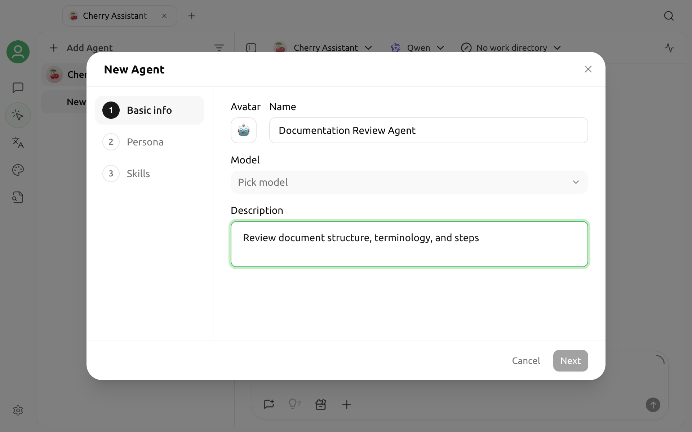

# Agents



An Agent can read a workspace, call tools, and complete multi-step tasks in sequence under controlled permissions. It is designed for work that must actually be performed, such as organizing a batch of files, modifying project code, calling MCP services, or generating scheduled reports.

If you only need a consistent persona, knowledge base Q&A, or everyday chat, an Assistant is simpler. See [Concepts 101](concepts-101.md) for a comparison.

## Before you begin

### Configure a compatible model

An Agent model must support Anthropic Messages endpoints. The model selector automatically hides Embedding, Rerank, and image-generation models and displays only models suitable for Agent conversations and execution.

If the list is empty, first open **Settings → Model Services** and:

1. Configure the API URL and API key.
2. Fetch or manually add a model.
3. Confirm that the model supports Anthropic Messages endpoints.

See [Model Services](../pre-basic/providers/) for general configuration instructions.

### Make sure the local API Server is available

The Agent page depends on Cherry Studio's local API Server. V2 automatically attempts to start the service when you create an Agent, so you usually do not need to open Settings first.

If the Agent page says that the service is disabled or not running, click the start button on the page. If it still does not start, open **Settings → API Server** and inspect the port and running status. See [API Server](api-server.md).

## Create an Agent

Open **Agents** from the Launchpad or sidebar, then click **+ Agent** above the Agent list on the left.

You can also open the [Library](../cherrystudio/preview/library.md), switch to **Agents**, and click New. The Library opens the complete configuration page directly.

### Minimum required fields

| Field | Required | Description |
| :--- | :--- | :--- |
| Name | Yes | The Agent's display name in lists and sessions |
| Model | Yes | The primary execution model; only models supporting Anthropic Messages are shown |
| Accessible directories | No | Limits the local directories the Agent can access; a default workspace is created when omitted |
| Description | No | Describes the purpose and helps identify the Agent in the Library |


Accessible directories are also a security boundary. Do not grant access to the entire user directory, system directories, or directories that store secrets. Create a separate workspace for the task and add only the locations that are genuinely required.


After saving, the Agent appears in the left list and the Library. Skills are bound to an Agent, so you must complete the first save before enabling Skills for it.

## Configuration page

Click an Agent card in the Library, or open Settings at the top of an Agent session, to edit these sections:

| Section | Available settings |
| :--- | :--- |
| Basic Settings | Avatar, name, primary model, planning model, small model, accessible directories, Autonomous Mode, heartbeat, and description |
| Prompt Settings | The Agent's system instructions |
| Permission Mode | Default approval behavior for tool calls |
| Capability Extensions | Built-in tools, MCP Servers, and Skills |
| Advanced Settings | Maximum execution turns and environment variables |

### Primary, planning, and small models

* The **Primary Model** is required and handles most conversations and tool execution.
* The **Planning Model** is optional and can be used for workflows that need separate planning.
* The **Small Model** is optional and can be used for supporting steps suitable for a lightweight model.

All three selectors show only Agent-compatible models. Unless you have a specific need, configuring only the Primary Model is sufficient.

### Prompt

The prompt defines the role, goals, work rules, and output requirements. Instead of listing extensive background, specify:

* What the Agent is and is not responsible for.
* Which directories, data sources, and tools it may use.
* Which operations require confirmation before execution.
* Where to save results and which format to use.

Do not rely on the prompt alone for security restrictions. Configure directory scope, Permission Mode, and tool switches separately.

## Choose a Permission Mode

Permission Mode determines which tools are approved automatically. When you switch modes, Cherry Studio updates the tools added automatically by that mode.

| Mode | Default behavior | Recommended use |
| :--- | :--- | :--- |
| Normal Mode | Can read files freely; asks before editing files or running commands | First-time use and interactive tasks |
| Plan Mode | Can only read files and create a plan; cannot edit files or run commands | Code review, solution design, and risk assessment |
| Auto-edit Mode | Can read and edit files freely; asks before running commands | Document organization and controlled code changes |
| Full Auto Mode | All currently available tools run without individual approval | Unattended tasks with a strictly controlled scope |

In addition to the tools added automatically by a mode, you can add other tools manually under **Capability Extensions → Built-in Tools**.


Full Auto Mode skips tool approval. An Agent may write files, run commands, or call external services. Use it only in an isolated workspace, and first test the same task completely in Normal Mode.


## Autonomous Mode and heartbeat

### Autonomous Mode

When Autonomous Mode is enabled, the Agent uses soul files in the workspace to build a custom system prompt, gains autonomous task-management capabilities, and disables interactive tools that are unsuitable for unattended operation.

Enabling Autonomous Mode also switches Permission Mode to **Full Auto Mode**. If you switch from Full Auto Mode to another mode, Autonomous Mode turns off.

Autonomous Mode is suitable for long-running work, Channels, and other unattended scenarios. It is not a general switch for improving response quality. If a task requires frequent confirmation from the user, a regular Agent is more appropriate.

### Heartbeat

Heartbeat lets an Agent that supports autonomous operation check and continue its work at the configured interval. You can enable or disable it in Basic Settings and set the interval in minutes.

Enable Heartbeat only after the Agent has a clear goal, restricted directories, and a safe tool set, so it does not perform meaningless repeated runs.

## Add tools, MCP, and Skills

Open **Capability Extensions** to switch among three tabs:

### Built-in Tools

Built-in Tools provide capabilities such as reading and editing files, running commands, and managing tasks. Permission Mode adds some tools automatically; tools marked as part of a mode cannot be removed individually.

Enable only the tools that the task genuinely needs. Even in Normal Mode, an excessively large tool set increases the risk that the model selects the wrong tool.

### MCP

This tab lists MCP Servers already available in Cherry Studio. An inactive Server can appear in the bound list but cannot be selected from the add list; enable it first under **Settings → MCP Servers**.

An MCP Server may access a local program or remote service. Before binding it, inspect its command, environment variables, directories, and remote address. See the [MCP Tutorial](mcp/) for complete guidance.

### Skills

Skills provide task instructions, workflows, scripts, or templates. Only an Agent that has been saved and assigned an ID can enable Skills.

If the list is empty, install Skills from the Library or **Settings → Skills** first. See [Skills](../pre-basic/settings/skills.md).

## Configure advanced options

### Maximum execution turns

Maximum execution turns limits the number of turns that one task can continue. If left blank or set to `0`, it uses the default value; the current default limit is 100.

A turn is not the same as “response length.” Each planning step, tool call, and continuation may consume a turn. If a task loops unexpectedly, inspect the prompt and tool results before increasing the limit.

### Environment variables

Enter one `KEY=VALUE` pair per line. For example:

```text
PROJECT_ENV=staging
OUTPUT_FORMAT=markdown
```

Environment variables become part of the Agent runtime configuration. Do not put passwords, API keys, or access tokens in documentation, prompts, or screenshots. Store sensitive values only in controlled configuration and manage them with least privilege.

## Start a session

1. Open the **Agents** page.
2. Select an Agent from the left.
3. Create a session and enter a clearly bounded task.
4. Inspect the tool-call cards. In Normal, Plan, or Auto-edit Mode, approve or reject operations when prompted.
5. Inspect the generated or modified files before continuing.

A good first test task has a small scope and an easily verified result. For example:

> Read `README.md` in the current workspace and list three areas that need updating. Do not modify the file yet.

After confirming that the read scope is correct, gradually allow editing, commands, or external tools.

## Workspace and memory

The Agent's first accessible directory is its primary workspace. Some capabilities store persistent files in the workspace, including soul files for Autonomous Mode and Agent workspace memory.

If two Agents use the same first accessible directory, they may read and write the same workspace files. Use a different directory for each Agent when projects or identities must be isolated.

See [Agent Workspace Memory](memory.md) for the file structure and usage.

## Troubleshooting

### The Agent page says the API Server is not running

Click the start button on the page first. If startup fails:

1. Open **Settings → API Server**.
2. Check whether another program is using the port.
3. Restart the service, then return to the Agent page.

### No models are available when creating an Agent

Agents show only conversational models that support Anthropic Messages endpoints. Make sure the model was added to Model Services and that its endpoint capabilities are correct. Embedding, Rerank, and image-generation models do not appear.

### Skills cannot be enabled

Save the Agent first. Skill enablement is stored by Agent ID; a newly created Agent that has not been saved does not have an ID to bind.

### An MCP Server cannot be found

Open **Settings → MCP Servers** and make sure the Server was added and enabled. The Agent add list allows only active Servers to be selected.

### Every file edit or command asks for confirmation

This is expected in Normal Mode. Select Auto-edit Mode according to the risk, or adjust individual tools under Capability Extensions. Do not switch directly to Full Auto Mode only to reduce prompts.

### A task stops early or repeats

Check the following in order:

1. Whether the model reliably supports tool calls.
2. Whether tool results contain errors or omit required data.
3. Whether the prompt provides a clear stopping condition.
4. Whether Maximum execution turns is too low.
5. Whether Autonomous Mode or Heartbeat keeps the task running in an unsuitable scenario.

## Next steps

* Use [Skills](../pre-basic/settings/skills.md) to standardize work methods.
* Use [MCP](mcp/) to connect external tools and data.
* Learn about [Agent Workspace Memory](memory.md).
* After the Agent runs reliably, configure [Channels](agent-channels.md) or [Scheduled Tasks](scheduled-tasks.md).
