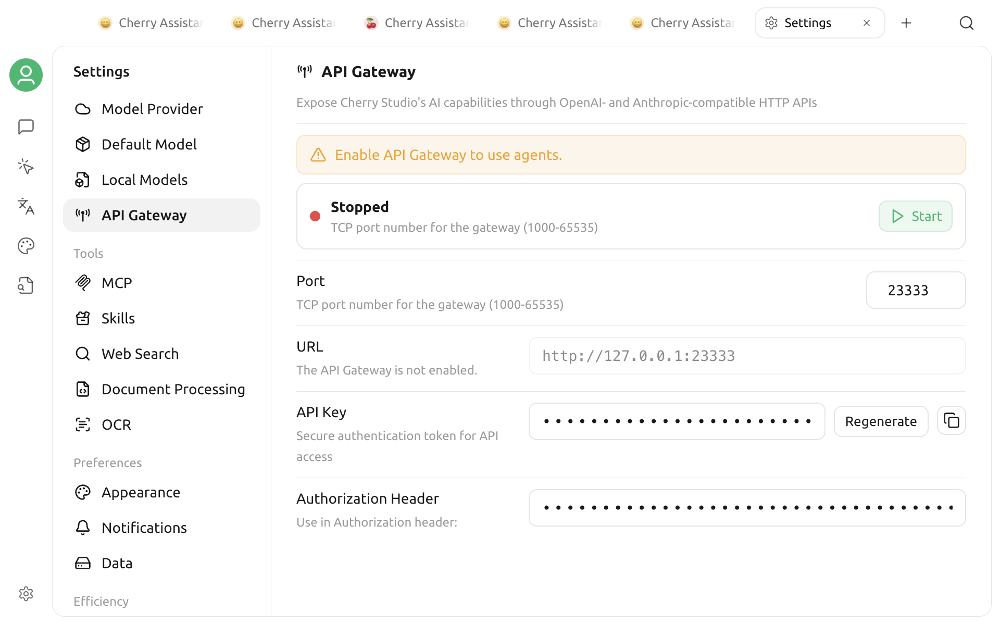

# API Gateway

The API Gateway exposes the models, MCP, and knowledge-base capabilities configured in Cherry Studio as local HTTP endpoints. Other applications can call these capabilities with OpenAI- or Anthropic-compatible request formats without configuring provider keys separately in every tool.



Common uses include:

* Reusing the model providers configured in Cherry Studio from scripts or third-party tools.
* Starting conversations through the OpenAI Chat Completions or Anthropic Messages format.
* Querying MCP Servers or searching Cherry Studio knowledge bases from an external program.
* Supporting the Agent page and certain internal operations in Cherry Studio.


The Agent page currently requires the API Server. When Cherry Studio detects an existing Agent, it attempts to start the service automatically. If the service is stopped, the Agent page prompts you to enable it again. Channels and scheduled tasks use separate local main-process services and do not require you to enable the API Server.


## Start the server

1. Open `Settings → API Server`.
2. Confirm that the port is available. The default is `23333`, and you can set it from `1000` to `65535`.
3. Click **Start**.

After startup, the page shows **Running**, the server address, and an **API Documentation** button. With the standard configuration, the address is:

```
http://127.0.0.1:23333
```

You cannot edit the port while the server is running. To change it, click **Stop**, enter a different port, and start the server again.

When you reopen Cherry Studio, it attempts to start the server automatically if either condition is true:

* The API Server was enabled the last time you used the app;
* At least one Agent already exists in Cherry Studio.


The API Server runs with Cherry Studio. The local endpoints stop when you exit the app.


## API key

The first time you start the server, Cherry Studio generates an API key beginning with `cs-sk-` and stores it locally. Restarting the server or the app does not rotate it automatically.

Protected endpoints support two authentication headers:

```
Authorization: Bearer YOUR_API_KEY
```

or:

```
x-api-key: YOUR_API_KEY
```

The Settings page displays the Bearer format by default and provides a copy button. To replace the key, stop the server first, then click **Regenerate**. After the new key is generated, the previous key immediately fails authentication.


The API key can call the model and data capabilities enabled in Cherry Studio. Do not put a real key in a code repository, screenshot, document, or public chat. Pass it to the calling program through an environment variable.


## Available endpoints

After starting the server, click **API Documentation** at the top right of the page, or open:

* `/api-docs`: Interactive Swagger documentation
* `/api-docs.json`: OpenAPI JSON

The main public endpoints are:

| Capability | Endpoint |
|---|---|
| Service status | `GET /health` |
| OpenAI-compatible chat | `POST /v1/chat/completions` |
| Anthropic-compatible chat | `POST /v1/messages` |
| Anthropic-compatible chat for a specified provider | `POST /{provider_id}/v1/messages` |
| MCP Server list and details | `GET /v1/mcps`, `GET /v1/mcps/:server_id` |
| Knowledge-base list and details | `GET /v1/knowledge-bases`, `GET /v1/knowledge-bases/:id` |
| Knowledge-base search | `POST /v1/knowledge-bases/search` |

`GET /`, `GET /health`, `/api-docs`, and `/api-docs.json` do not require authentication. Model, MCP, knowledge-base, and other `/v1` endpoints require the API key.


The current API does not provide `GET /v1/models`. If a third-party client must fetch a model list automatically, enter the model ID manually instead, or confirm that the client can skip model discovery.


## Make your first request

The following example calls the OpenAI-compatible endpoint. Replace `YOUR_API_KEY`, `provider-id`, and `model-id` with your own values:

```bash
curl http://127.0.0.1:23333/v1/chat/completions \
  -H "Authorization: Bearer YOUR_API_KEY" \
  -H "Content-Type: application/json" \
  -d '{
    "model": "provider-id:model-id",
    "messages": [
      {
        "role": "user",
        "content": "Introduce Cherry Studio in one sentence."
      }
    ]
  }'
```

For streaming output, add the following to the request body:

```json
{
  "stream": true
}
```

Streaming responses use Server-Sent Events and end with `data: [DONE]`.

## Enter a model ID

The API locates a model with this format:

```
provider ID:model ID
```

For example, if the provider ID is `my-openai` and the model ID is `gpt-4o-mini`, enter:

```
my-openai:gpt-4o-mini
```

This must be Cherry Studio's internal provider ID, which may differ from the name displayed in Settings. The model must already be added to that provider and be available. A missing colon, a disabled provider, or a nonexistent model returns a request error.

The API Server resolves available models from enabled providers of the OpenAI, Anthropic, Ollama, and New API types. The upstream provider still determines the model's actual capabilities.

The compatible endpoints have different restrictions:

* `/v1/chat/completions` currently accepts only providers whose type is OpenAI.
* `/v1/messages` and `/{provider_id}/v1/messages` accept Anthropic Messages-compatible requests.
* A provider appearing in Cherry Studio's Settings does not mean that every API endpoint can call it.

If you receive a “provider not supported” error, verify that the provider type matches the endpoint instead of checking only the model name.

## Use a third-party client

For a client that accepts a custom OpenAI Base URL, the usual settings are:

| Setting | Value |
|---|---|
| Base URL | `http://127.0.0.1:23333/v1` |
| API Key | The Cherry Studio API key shown in Settings |
| Model | `provider ID:model ID` |

Some clients append `/v1` automatically. Check the client's Base URL instructions before entering it. If the final request contains `/v1/v1/chat/completions`, remove one occurrence of `/v1`.

Some clients accept only public HTTPS addresses, always call `/v1/models`, or reject colons in model IDs. These clients cannot use the current local endpoints directly.

## Security boundary

The standard configuration listens on `127.0.0.1`, so only programs on the same computer can access it directly. The Settings page lets you change the port but does not provide a switch for LAN access.

Users who upgraded from an older release may retain a historical listen address. Use the actual URL shown in the running status on the Settings page. If it displays `0.0.0.0` or a LAN address, confirm immediately that this is your intended configuration.

If you forward the endpoints to another device through a reverse proxy, port forwarding, an SSH tunnel, or another method, you are responsible for the additional access controls:

* Require HTTPS.
* Add source and rate limits at the proxy layer.
* Do not pass the API key in URL query parameters.
* Rotate the key regularly and stop forwarding when it is not needed.
* Remember that `/health` and the API documentation do not require authentication.

Do not expose the listen address directly to the public internet. The API allows cross-origin requests, so the browser same-origin policy alone is not a security boundary.

## Troubleshooting

### Startup fails or the port is in use

If the error contains `EADDRINUSE`:

1. Stop other Cherry Studio instances or local services that may be using the same port.
2. Select a different available port on the Settings page.
3. On macOS or Linux, run `lsof -i :23333` to identify the process. On Windows, run `netstat -ano | findstr :23333`.

### A request returns 401 or 403

* `401` usually means the authentication header is missing, the Bearer format is invalid, or the key is empty.
* `403` usually means the key does not match the current value on the Settings page.
* If you just regenerated the key, update the calling program's environment variable or configuration before trying again.

First, use this unauthenticated request to confirm that the service is online:

```bash
curl http://127.0.0.1:23333/health
```

### A request returns a model-format or provider error

Confirm that the model uses the `provider ID:model ID` format, then check that:

* The provider is enabled;
* The API Server supports the provider type;
* The model exists in that provider's model list;
* The request uses the internal provider ID, not merely its display name.

Also confirm that the endpoint matches the provider type. OpenAI Chat Completions currently requires an OpenAI-type provider; Anthropic Messages should use a Messages endpoint.

### A knowledge-base endpoint returns 503

Knowledge-base endpoints need to read the current knowledge-base state from Cherry Studio's main window. They return `503` when the main window is not ready, is closing, or its internal state is unavailable. Keep the main window open, wait for the app to finish loading, and try again.

### A third-party client cannot connect

* Confirm that Cherry Studio and the API Server are both still running.
* Check whether the client runs on another device, in a container, or in a virtual machine. In those environments, `127.0.0.1` may not refer to the computer running Cherry Studio.
* Check whether the Base URL duplicates or omits `/v1`.
* Test `/health` and the target endpoint separately with `curl` to distinguish network, authentication, and request-body problems.

For further troubleshooting, open the log directory from `Settings → Data Settings`. Before sharing logs, search for and redact API keys, tokens, personal paths, and business data.

***

### 💡 Get help and submit feedback

If you have questions, encounter a bug, or have an improvement suggestion while configuring or using the API Server, see the official options in [Feedback and Suggestions](../question-contact/suggestions.md).
