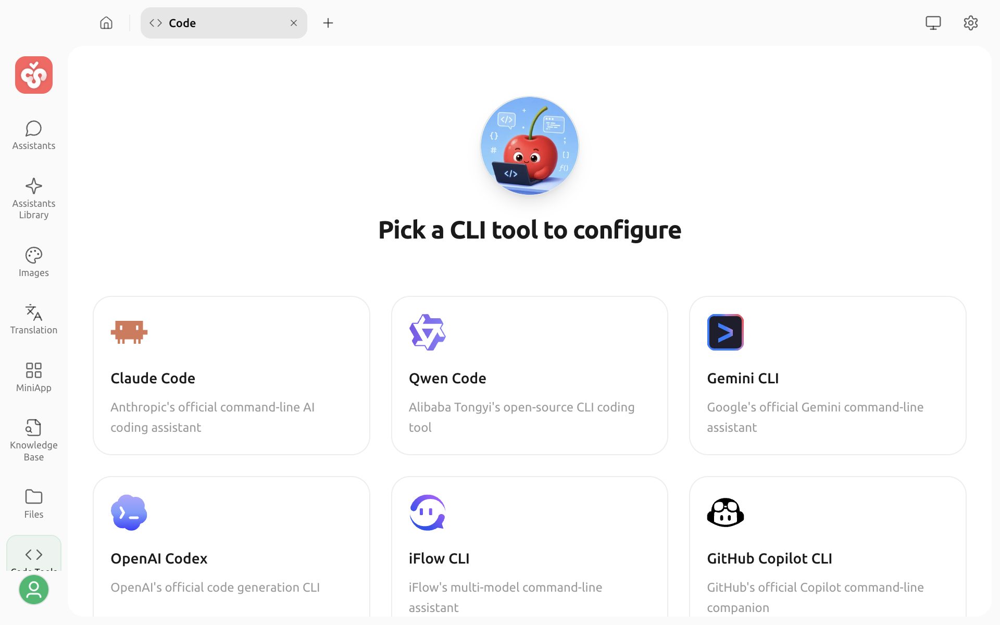
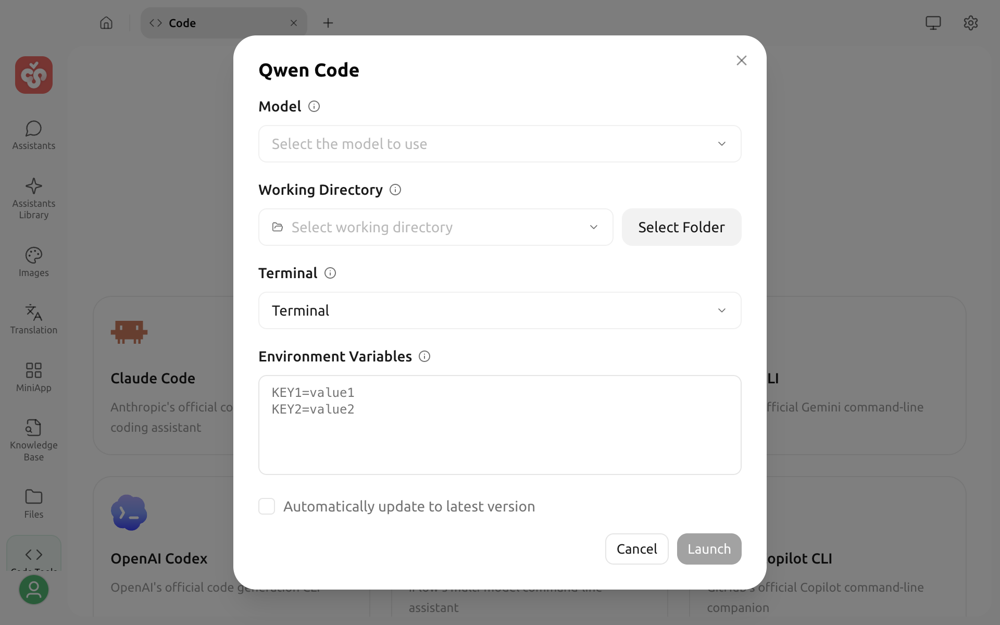

# Code Tools

Code Tools lets you configure and launch AI coding CLIs from Cherry Studio. You can reuse model services that are already configured, select a project directory and terminal, and then work with the CLI in a separate terminal window.

## Before you start

* Code Tools requires **Bun**. If the page reports that it is not installed, select **Install Bun** in the prompt.
* Kimi CLI also requires **uv**. You can install it under **Settings → MCP Servers → Dependencies**.
* Except for GitHub Copilot CLI, configure a compatible model service and API key in Cherry Studio before you begin.


AI coding CLIs can read and modify files and run commands in the selected working directory. Save the current version with Git or another method first, and do not select a directory that contains unrelated sensitive files.


## Open Code Tools

1. Select `+` on the right side of the top tab bar to open the Launchpad.
2. Select **Code**.
3. On the Code Tools page, select the CLI that you want to use.

The following CLIs are supported:

| CLI | Model source |
| :--- | :--- |
| Claude Code | Anthropic-compatible models |
| Qwen Code | OpenAI-compatible models |
| Gemini CLI | Gemini-compatible models |
| OpenAI Codex | OpenAI- or OpenAI Responses-compatible models |
| iFlow CLI | OpenAI-compatible models |
| GitHub Copilot CLI | No model selector; uses GitHub Copilot's own authentication and model capabilities |
| Kimi CLI | OpenAI-compatible models |
| OpenCode | OpenAI-, OpenAI Responses-, or Anthropic-compatible models |

The model list is automatically filtered by the endpoint types supported by the selected CLI. If a model is missing, check whether its provider is enabled, the model has been added, and its endpoint type is compatible.

## Configure and launch

After selecting a CLI card, complete the following fields in the configuration dialog:

1. **Model**: Select the model that the CLI should use. GitHub Copilot CLI does not show this field.
2. **Working Directory**: Select the project directory where the CLI should start. Recently used directories remain in the list.
3. **Terminal**: On macOS or Windows, select a detected terminal. On Windows, if Cherry Studio cannot locate WSL, Alacritty, or WezTerm automatically, set a custom executable path.
4. **Environment Variables**: Enter one variable per line in `KEY=value` format. Cherry Studio generates the variables required by the model; a custom variable with the same name overrides the generated value.
5. **Automatically update to latest version**: Enable this when needed. When enabled, Cherry Studio checks for and installs updates for the selected CLI before launch.
6. Select **Launch**.

If the CLI is not installed, Cherry Studio downloads and installs it on the first launch, then runs it in the selected terminal and working directory. Kimi CLI is downloaded and launched through uv, so its first run also requires a network connection.


GitHub Copilot CLI does not use Cherry Studio's model selector. If it requires additional authentication, add the information requested by that CLI in the Environment Variables field, for example `GITHUB_TOKEN`.


## Environment variables and credentials

In addition to your custom environment variables, Cherry Studio reads the API address, model identifier, and API key from the selected model service and converts them into the variables or launch arguments required by the CLI.

Custom variables are useful for proxy addresses and CLI-specific switches. Confirm each variable name before adding it. A custom value takes precedence over a generated value with the same name, and an incorrect override can cause authentication or connection failures.


Do not expose API keys, GitHub tokens, or other credentials in screenshots, logs, or public issues. Code Tools saves custom environment variables in the current configuration, so use them only on a trusted device.


## Troubleshooting

### The Launch button is unavailable

Confirm that Bun is installed and a working directory is selected. For every tool except GitHub Copilot CLI, also select a model.

### The model list is empty

The selected CLI shows only models with compatible endpoint types. Return to the model service settings and check that the provider is enabled, the API key works, the model has been added, and the model has a compatible endpoint type.

### Kimi CLI cannot find uv

Install uv under **Settings → MCP Servers → Dependencies**. If Cherry Studio still cannot find it after installation, restart the app.

### The terminal did not open

Switch to the system default terminal. On Windows, confirm that the other terminal application is installed. For WSL, Alacritty, or WezTerm, you can also use **Set custom terminal path** to select the executable.

The first launch, CLI installation, and update checks all require a network connection and may take some time. If an operation fails, check your network, proxy, and API service settings, then try launching again.
