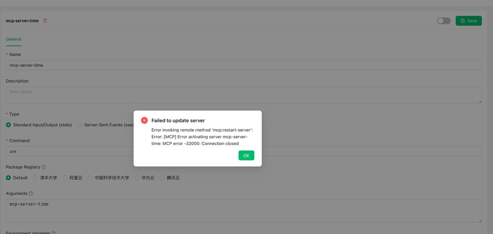


This document was translated from Chinese by AI and has not yet been reviewed.


# Frequently Asked Questions

### 1. mcp-server-time

<figure><figcaption><p>Error screenshot</p></figcaption></figure>

**Solution**&#x20;

In the "Parameters" field, enter:

```
mcp-server-time
--local-timezone
<Your standard timezone, e.g., Asia/Shanghai>
```