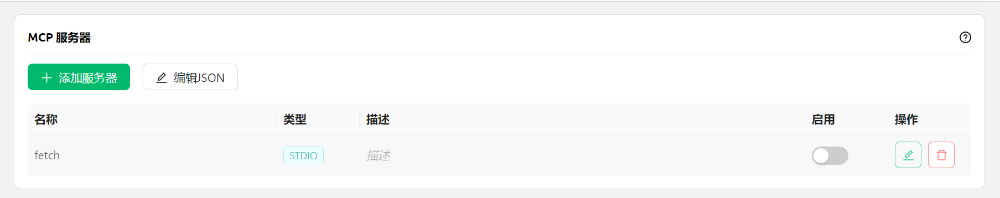

# Configure and Use MCP


This document was translated from Chinese by AI and has not yet been reviewed.


<figure><figcaption></figcaption></figure>

1. Open Cherry Studio settings.
2. Find the `MCP Server` option.
3. Click `Add Server`.
4. Fill in the relevant parameters for the MCP Server ([reference link](https://github.com/modelcontextprotocol/servers/tree/main/src/fetch)). Information that may need to be filled in includes:
   * Name: Customize a name, e.g., `fetch-server`
   * Type: Select `STDIO`
   * Command: Enter `uvx`
   * Arguments: Enter `mcp-server-fetch`
   * (There may be other parameters, depending on the specific Server)
5. Click `Save`.


After completing the above configuration, Cherry Studio will automatically download the required MCP Server - `fetch server`. Once downloaded, we can start using it! Note: If mcp-server-fetch configuration is unsuccessful, you can try restarting your computer.


### Enable MCP Service in the Chat Box

<figure><figcaption></figcaption></figure>

* Successfully added the MCP Server in the `MCP Server` settings.

<figure><figcaption></figcaption></figure>

### **Usage Demonstration**

<figure><figcaption></figcaption></figure>

As seen from the image above, by integrating MCP's `fetch` capability, Cherry Studio can better understand the user's query intent and retrieve relevant information from the web, providing more accurate and comprehensive answers.