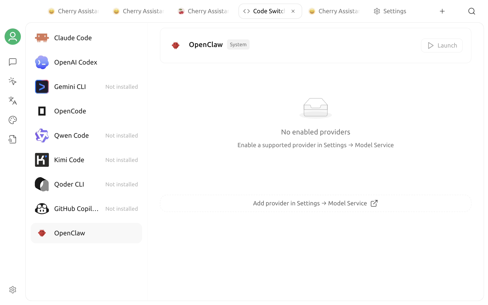

# OpenClaw

Cherry Studio can install and manage OpenClaw, start the OpenClaw Gateway locally, and sync model services that are already configured in Cherry Studio to OpenClaw. After startup succeeds, Cherry Studio automatically opens the embedded OpenClaw Dashboard, where you can continue configuring channels such as WhatsApp, Telegram, Slack, and Discord.

OpenClaw is a standalone personal AI assistant and is not the same as a Cherry Studio [agent](agent.md). If you only need to complete conversations or tool-based tasks inside Cherry Studio, use an agent directly. Enable the feature on this page when you need OpenClaw's Dashboard, channels, and runtime.


OpenClaw has elevated system permissions, and agent tasks may also consume a significant number of tokens. Run it only on trusted devices and in trusted workspaces, and review the file, command, and third-party channel permissions that it receives.


## Open OpenClaw

1. Select **+** on the right side of the top tab bar to open the **Launchpad**.
2. Select **OpenClaw**.
3. Cherry Studio first checks whether its managed OpenClaw installation is present.

Cherry Studio only uses the OpenClaw binary in its own managed directory. Even if OpenClaw was installed by another method and is available in the system `PATH`, the page still prompts you to install or migrate to the managed version so that an outdated external version is not used accidentally.

## Install the managed version

The first time you open the page, select **Install OpenClaw**. Cherry Studio downloads the standalone binary package for your operating system and processor and displays the installation log. The managed version does not require Node.js or Git to be installed beforehand.

Supported combinations include x64 and ARM64 builds for macOS, Windows, and Linux. Cherry Studio automatically selects an available download source and prefers a mirror in Mainland China network environments.

After installation, the page shows the OpenClaw installation path. On macOS and Linux, Cherry Studio also tries to create a link at `/usr/local/bin/openclaw`. On Windows, it tries to add the managed directory to the current user's `PATH`. These steps make terminal access more convenient but do not affect Cherry Studio's ability to start OpenClaw from the managed path.

## Select a model and start

Before starting, enable at least one available provider in Cherry Studio's model service settings and confirm that its models work correctly. Then:

1. Select a model on the OpenClaw page.
2. Select **Start**.
3. Cherry Studio syncs the selected provider and model configuration to OpenClaw.
4. Cherry Studio starts the Gateway locally and waits for the health check to pass.
5. After startup succeeds, the OpenClaw Dashboard opens automatically inside Cherry Studio.

The model list only shows providers that are enabled and available. Local services such as Ollama and LM Studio can be used without an API key. Other providers usually require an API key and model configuration first.

The default Gateway address is `127.0.0.1:18790`. While it is running, the OpenClaw page shows its status and port. Closing the Dashboard does not stop the Gateway. To return to it, select **Open Dashboard**.


Every time you select **Start**, Cherry Studio first syncs the currently selected model. After changing models, stop the Gateway, select the new model, and start it again.


## What is synchronized

Cherry Studio merges the following information into `~/.openclaw/openclaw.json`:

* The current provider's API address, authentication details, and model list;
* The currently selected default model;
* Local Gateway mode, port, and an automatically generated authentication token.

Existing OpenClaw configuration is not replaced in full. Cherry Studio preserves existing extended configuration for the same model, then updates the provider and default model that it manages. If it finds the legacy `openclaw.cherry.json`, it migrates the file to `openclaw.json` and backs up the original when needed.


The OpenClaw configuration file contains model-service authentication details and the Gateway token. Do not share this file, sensitive content from installation logs, or Dashboard addresses that contain a token.


## Stop, update, or uninstall

### Stop the Gateway

Return to the OpenClaw page and select **Stop**. When Cherry Studio exits normally, the app also attempts to stop the Gateway that it manages.

### Update OpenClaw

Cherry Studio checks the managed version when you open the installed view. If a newer version is available, a version number appears next to the installation path. Select it and confirm to update. Cherry Studio stops a running Gateway before the update; after the update finishes, select **Start** again.

### Uninstall OpenClaw

When the Gateway is stopped, select **Uninstall** on the right side of the installation path area, confirm, and wait for the log to complete. Cherry Studio removes the managed binary and its command link or `PATH` entry.

Uninstalling does not delete `~/.openclaw/openclaw.json`. If you no longer need the provider authentication details in that file, remove them yourself only after confirming that no other OpenClaw installation uses the file.

## Troubleshooting

### Installation download failed

Confirm that the device can access a download source and check the installation log for the specific error. After network access is restored, select Install again. Installation also fails if no binary package is available for the current platform or processor.

### OpenClaw is installed in the terminal, but the page still reports that it is missing

This is expected. Cherry Studio does not run an external OpenClaw found in the system `PATH`. Install the Cherry Studio-managed version from the page.

### No models are available

Open the model service settings, enable a provider, and configure its API key, API address, and models. Confirm that the model responds in a regular conversation before returning to the OpenClaw page.

### The Gateway cannot start

Another program may be using the default port `18790`. Stop any existing OpenClaw process or other application using that port, then start it again. The page waits up to approximately 30 seconds for the health check. If startup still fails, copy the error message for troubleshooting.

### The terminal cannot find `openclaw`

The Dashboard inside Cherry Studio does not depend on the terminal command. If you need to invoke it from a terminal, check that the managed installation path is included in `PATH`. On macOS or Linux, creating the `/usr/local/bin/openclaw` link may fail because of insufficient permissions.

For more information about OpenClaw channels and Dashboard features, see the [official OpenClaw documentation](https://docs.openclaw.ai/).
