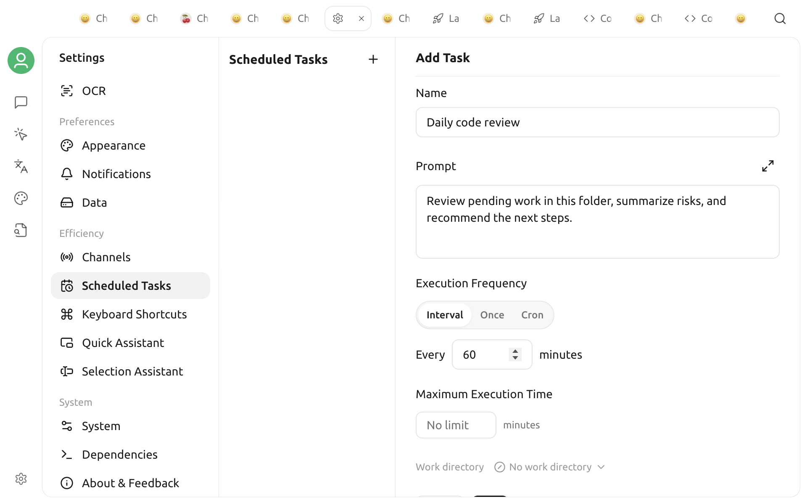

# Scheduled Tasks

Scheduled tasks let an [agent](agent.md) run a prompt automatically at a specified time. Use them for daily reports, recurring checks, reminders, or sending results to a messaging channel. Each run creates a conversation and a run record so you can review its result or error.

Cherry Studio's local scheduler runs these tasks; it is not an operating-system background service. Cherry Studio must be running when a task becomes due. When you reopen the app, it resumes tasks that are still active.


Scheduled tasks run unattended. The agent must have Autonomous Mode (Soul Mode) enabled or use Bypass Permissions (Full Auto). When Autonomous Mode is enabled, Cherry Studio automatically switches the agent to Full Auto permissions. Tool calls do not wait for approval one by one. Restrict the working directories the agent can access, and do not store passwords, API keys, or other sensitive information in prompts.


## Before you create a task

1. Create or select an [agent](agent.md), then configure an available model.
2. Enable **Autonomous Mode** in the agent settings. If you only plan to create tasks manually from Settings, you can also use an agent configured with Bypass Permissions (Full Auto).
3. Test the same prompt in a regular conversation first. Confirm that the model, tools, and working-directory permissions behave as expected.
4. To send results to an instant-messaging service, configure and connect the relevant [channel](agent-channels.md) first.

The Settings page lists only agents with Autonomous Mode or Bypass Permissions (Full Auto) enabled. You do not need to enable the API Server to create or run scheduled tasks.

## Create a task from a conversation

For an agent with Autonomous Mode enabled, describe what you need directly. For example:

> Every weekday at 9:00 AM, summarize project updates from the past 24 hours in five bullet points.

The agent can use its built-in scheduled-task tools to create, list, or delete tasks. Your request should include:

* A task name and what it should do;
* The run time, repeat interval, or one-time date;
* Whether to send the result to a channel;
* A timeout if the task may take longer than usual.

After the task is created, go to **Settings → Scheduled Tasks** and verify its schedule value, prompt, recipient channels, and next run time.

## Create a task in Settings

1. Open **Settings → Scheduled Tasks**.
2. Click **+ Add** in the left panel.
3. Select an agent and complete the form.
4. Click **Save**. The task starts waiting for its schedule with an “Active” status.

| Field | Purpose |
| :--- | :--- |
| Name | Used in the task list and as the conversation name, such as “Daily code review” |
| Prompt | The complete instruction sent to the agent as a user message on every run |
| Schedule Type | `Cron`, `Interval`, or `Once` |
| Schedule Value | A Cron expression, an interval in minutes, or a one-time date and time |
| Timeout | The maximum duration of one run, in minutes |
| Send to Channels | Optional; sends generated text and the final result to the selected channels |


The current data layer uses a default timeout of 2 minutes. Although the empty field's placeholder says “No limit,” leaving it blank when creating a task still saves a 2-minute timeout. Enter a larger positive integer explicitly for longer-running tasks.


### Choose a schedule type



Enter a positive whole number of minutes. `60` runs the task every 60 minutes. Intervals are calculated from the scheduled time. If the app is temporarily closed, it does not run repeatedly to catch up on every missed interval.



Enter a standard five-field Cron expression: `minute hour day month weekday`.

| Expression | Meaning |
| :--- | :--- |
| `0 9 * * *` | Every day at 9:00 AM |
| `*/15 * * * *` | Every 15 minutes |
| `0 9 * * 1-5` | Every weekday at 9:00 AM |

Cron uses the device's current time zone. After saving, verify the “Next Run” time shown on the page.



Select a single run time with the date and time picker. After it runs, the task is marked “Completed” and cannot be edited, run, or resumed. Create a new task if you need to run it again.



## Send to channels

When creating or editing a task, you can select one or more configured channels. While the task runs, the agent's text output is sent to those channels. If the task fails, an error notification is sent as well.

Each channel must be connected and have a valid Chat ID that can receive notifications. If the page reports that “the selected channels have no available recipients (Chat ID),” send a message to the Bot on the corresponding platform first. This lets Cherry Studio record the conversation target; then return and select the channel.

If you do not select a channel, the task still runs normally. Its result remains available in the task conversation and Run History in Cherry Studio.

## Manage tasks

Select a task in the left panel to:

* Change its name, agent, prompt, schedule, timeout, and recipient channels;
* Click the run button to trigger it immediately without changing future runs;
* Pause or resume a recurring task;
* Delete a task you no longer need.

When you change the schedule or resume a paused task, Cherry Studio recalculates its “Next Run” time. If the same task is already running, a second run does not start concurrently.

Recurring tasks reuse the conversation from the last successful run whenever possible, preserving context for subsequent runs. The first run—or a run whose previous conversation no longer exists—creates a new conversation named after the task.

## Review Run History

**Run History** on the details page shows each run's time, duration, status, and result or error. You can search the records or click the conversation icon to open the full conversation for that run.

When a run reaches its timeout, it is stopped and recorded as an error. After three consecutive failed runs, the scheduler automatically pauses the task. Resolve any model, network, tool-permission, or prompt issues, then resume it manually.

## If a task does not run on time

Check the following in order:

1. Was Cherry Studio running at the scheduled time?
2. Is the task's status “Active,” and is “Next Run” correct?
3. Is the agent's model available, and are the provider balance and network connection working?
4. Is the agent still using Autonomous Mode or Bypass Permissions (Full Auto)?
5. Does Run History show a timeout, tool-permission error, or channel-delivery error?

The scheduler checks for due tasks about once per minute, so a task may start slightly later than scheduled. Long-running tasks continue to consume model tokens. Run a task manually and verify its output before enabling a high-frequency schedule.
