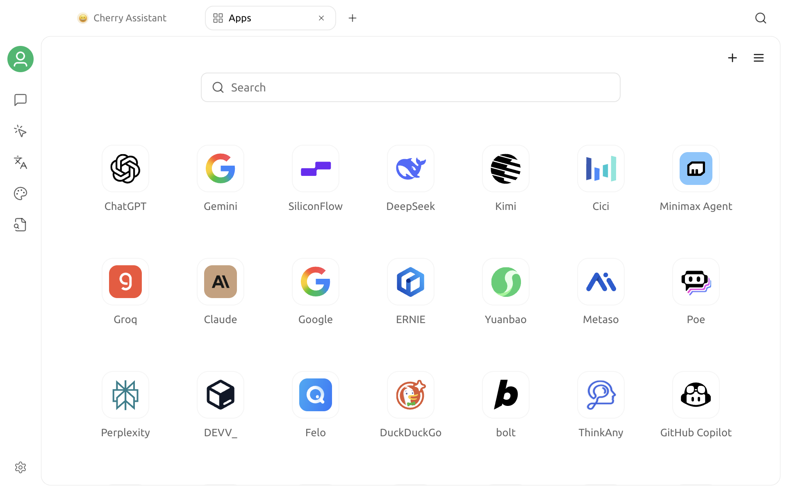

# Mini Apps

Mini Apps let you open frequently used websites inside Cherry Studio. The built-in catalog includes various AI, search, and development services. You can also add your own web address as a Mini App and use top tabs to switch between multiple websites.


A Mini App loads the third-party website itself; it is not the same as a Cherry Studio model API. The corresponding service provider determines website accounts, features, regional restrictions, and pricing.


## Open Mini Apps

Click `+` on the right side of the top tab bar to open the **Launchpad**, then select **Mini Apps**.

The Mini Apps home page provides:

- **Search box**: Filter Mini Apps by name or URL;
- **Mini App grid**: Open a visible built-in or custom Mini App;
- **Add button**: Create a custom Mini App;
- **Display Settings**: Control visibility, order, region, cache, and related behavior.

When you click a Mini App, its website opens in a new top tab. When you switch to another tab, cached Mini App pages remain loaded.

## Use a Mini App website

After opening a website, the toolbar at the top provides common browser actions:

| Action | Purpose |
| --- | --- |
| Back / Forward | Navigate the browsing history of the current Mini App |
| Refresh | Reload the current website |
| Open in Browser | Open the current URL in the system's default browser |
| Pin | Add the Mini App entry to or remove it from the Launchpad / Sidebar |
| New window link behavior | Choose whether pop-up links open inside Cherry Studio or in the system browser |

You can also use these shortcuts on a Mini App page:

| Shortcut | Purpose |
| --- | --- |
| `Ctrl / Command + F` | Search the current page; use `Enter` / `Shift + Enter` to move between matches |
| `Ctrl / Command + P` | Print the current page to PDF |
| `Ctrl / Command + S` | Save the current page as HTML |

Some websites may redefine certain keys. Refer to the behavior shown in Cherry Studio.

## Add a custom Mini App

Click the Add button in the upper-right corner of the Mini Apps home page, then enter:

| Field | Requirement |
| --- | --- |
| ID | Required and unique; use only English letters, numbers, underscores, and hyphens |
| Name | The name shown in the Mini App grid and tab |
| URL | The complete web address to open, usually beginning with `https://` |
| Icon | Optional; enter an image URL or upload an image from your device |

After saving, the custom Mini App is added to the visible list and appears in the grid.


Add only URLs you trust. A custom Mini App loads the website inside Cherry Studio, and the website can still receive login details, files, and form content that you submit.


The current version cannot directly edit a saved Mini App's ID, name, URL, or icon. To change one, remove the original custom Mini App and recreate it with the new information.

## Pin, hide, or remove

Right-click an icon in the Mini App grid to perform actions available for its current state:

- **Add to Launchpad / Sidebar**, or unpin it;
- **Hide** a built-in or custom Mini App;
- **Remove Custom Mini App**.

Built-in Mini Apps cannot be deleted, but they can be hidden. Only Mini Apps you create can be removed completely. Depending on the current navigation layout, a pinned entry appears in the Launchpad or Sidebar.

When you hide a Mini App that is in the cache list, its page is also removed from the list of pages kept loaded.

## Manage visibility and order

Open Display Settings in the upper-right corner of the Mini Apps home page. The top of the panel contains **Visible Mini Apps** and **Hidden Mini Apps** lists:

- Click an item to move it between visible and hidden;
- Drag within one list to change the order;
- **Swap** exchanges all currently visible and hidden items;
- **Reset** restores currently hidden items to the visible list.

Pinned Mini Apps always remain visible and are not hidden with ordinary visible items.

## Filter by region

Region settings provide **Auto Detect**, **China**, and **Global** options. The grid is filtered according to regions declared by the built-in catalog, reducing the number of services shown that are typically inaccessible in your current region.

Region filtering changes only the current display. It does not register accounts, bypass service restrictions, or guarantee that a website is accessible. By default, custom Mini Apps appear in both China and Global views.

## Control how links open

When **Open New Window Links in Browser** is enabled, the system's default browser handles new windows requested by a website. When it is disabled, the Cherry Studio Mini App environment handles them.

You can change this option globally in Display Settings or switch it quickly from the top toolbar of an open Mini App. Regardless of this setting, the toolbar's **Open in Browser** button always opens the current URL directly.

## Mini App cache limit

The cache limit controls how many Mini App pages can remain loaded at the same time. You can set it from `1` to `10`; the default is `3`.

- Higher limit: Returning to a page is more likely to preserve its signed-in state, but uses more memory;
- Lower limit: Uses less memory, but older unpinned pages may be unloaded and must reload when opened again.

After lowering the limit, the new value takes effect gradually as the current open-page list changes to fit it. Pinned pages in the top tabs are not removed automatically because of the cache limit.

## Sign-in state and data

Mini Apps use a persistent web session separate from the system browser. As a result:

- The first time you use a website, you usually need to sign in separately inside the Mini App;
- After you close and reopen Cherry Studio, website Cookies and sign-in state are usually still available;
- Sign-in state from the system browser is not synchronized automatically with Mini Apps;
- Multiple Mini Apps share the same Cherry Studio web session partition.

A website may still require you to sign in again because of its account security policy, expired Cookies, a region change, or a website update.

## Troubleshooting

### A website keeps loading or shows a blank page

Click Refresh first. If the problem continues, use the toolbar to open the website in the system browser and confirm that the URL and account service work. Also check the network, proxy, and regional restrictions. Some websites block embedded browser environments and can be used only in the system browser.

See [General Settings](settings/general.md) for proxy configuration.

### Sign-in repeatedly returns to the login page

Try refreshing and confirm that the system time is correct, the website allows Cookies, and the network or proxy is not blocking the sign-in process. If the service does not support embedded web sign-in, use the system browser.

### A Mini App is missing

Check the search term, region filter, and the hidden list in Display Settings. If the Mini App is pinned, also check its entry in the Launchpad or Sidebar.

### A custom Mini App cannot be saved

Make sure the ID contains only letters, numbers, underscores, or hyphens and does not duplicate a built-in or existing Mini App. Also confirm that both Name and URL are filled in.

### A page reloads when you return to it

The number of open Mini Apps may exceed the cache limit, causing an older unpinned page to be unloaded. Increase the cache limit or pin a top tab that must remain loaded.

## Privacy and security

Account details, messages, files, and other content you enter in a Mini App are sent to the corresponding website, not to the model selected in the current chat. Cherry Studio chats also do not read Mini App page content automatically. To reference it, confirm permissions and sensitivity, then copy only the necessary content manually.

***

If you encounter a problem or want to suggest an improvement, go to [Feedback and suggestions](../../question-contact/suggestions.md).
