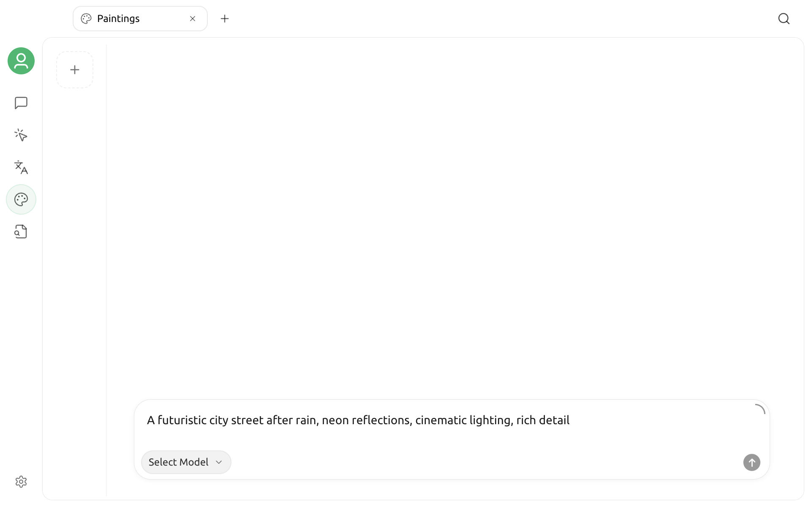

# Painting



Painting is Cherry Studio's dedicated image generation workspace. It uses your configured providers and models, allowing you to select an image model, enter a prompt, adjust supported parameters, and manage the images generated for the current task from one page.


The Painting page shows only available models with image generation capabilities. The options depend on the current version, enabled providers, and model configuration, so the list in the app is the authoritative source.


## Before you begin

You need at least one available image generation model before using Painting:

1. Open `Settings` → `Model Services`.
2. Enable a provider and complete any required API key or connection configuration.
3. Confirm that an image generation model has been added under the provider.

If you have not configured a provider, see [Configure Model Services](../../pre-basic/providers/README.md) first.

## Open Painting

Click `+` on the right side of the top tab bar to open the **Launchpad**, then select **Painting**.

The page has three main areas:

| Area | Purpose |
| --- | --- |
| Settings panel on the left | Select a provider and model, then adjust generation parameters supported by the current model |
| Canvas in the center | View generation status and results; move between images when a request returns more than one |
| History panel on the right | Start a new painting, switch between previous records, or delete records you no longer need |

The prompt input area is at the bottom. After selecting a model and writing a description, you can begin generating.

## Text-to-image

For text-to-image generation, describe the image you want:

1. Select a provider and image generation model on the left.
2. Enter a prompt at the bottom.
3. Adjust the size, aspect ratio, resolution, or other parameters as needed.
4. Click the Send button to begin generation.
5. Wait for the result to appear on the central canvas.

For example:

```text
An orange cat wearing round glasses sits on a stack of books, vintage oil painting style, warm sunset lighting, medium shot
```

The canvas displays progress during generation. You can cancel the current task if you need to stop it. When the model returns multiple images, use the Previous and Next buttons on the canvas to move between them.

## Use a reference image or edit an image

In addition to text-to-image generation, some models support image editing, blending, or other image modes. When you select one of these models, an option to add images appears in the prompt input area.

You can:

- Select an image from your device;
- Drag an image into the input area;
- Paste an image from the clipboard;
- Add multiple reference images when the model supports them.

After adding an image, describe what to preserve and what to change, then start generation. For example:

```text
Keep the subject and composition, change the background to a Tokyo street after rain, and add neon reflections
```


If the input area does not provide an option to add an image, the selected model does not support image editing. Switch to a model that supports the required mode.


## Adjust generation parameters

The parameter panel changes dynamically with the selected model and shows only options that the model declares it supports. Common parameters include:

| Parameter | Purpose |
| --- | --- |
| Size or aspect ratio | Control the canvas shape and output dimensions |
| Resolution | Select the output clarity when supported by the model |
| Number of images | Control how many results one generation returns |
| Quality, style, and background | Adjust visual options provided by the model |
| Seed, Guidance, and Steps | Control randomness or the generation process; available only for some models |

Parameter names, values, and pricing can differ between models. If you are unsure, first complete one generation with the default values, then adjust one option at a time. You do not need to add parameters that the model does not display.

## Manage painting records

Use the history panel on the right to manage separate painting tasks:

- Click `+` at the top to create a blank painting;
- Click a thumbnail to return to an existing record;
- Scroll down to load more when you have many records;
- The app asks for confirmation before deleting a record.

Generated results appear on the central canvas. Click an image to open a larger preview, then use the actions in the preview to view or save the result.

## Write more effective prompts

Prompts do not require a fixed format, but should usually include:

- **Subject**: A person, object, or scene;
- **Environment**: Location, time, weather, and background;
- **Visual style**: Photography, illustration, oil painting, 3D, and so on;
- **Composition**: Close-up, full body, overhead view, symmetrical composition, and so on;
- **Lighting and color**: Soft light, backlighting, cool colors, low saturation, and so on;
- **Constraints**: Elements to preserve or avoid.

Models interpret languages and prompt structures differently. If the result does not match your intent, remove conflicting requirements first, then add details gradually.

## Troubleshooting

### No providers or models are available

The Painting page lists only enabled models with image generation capabilities. Check that the provider is enabled, its key is valid, the model has been added, and its capability or endpoint type is configured correctly.

### The add image button is missing

The current model either supports text-to-image only or has not declared image editing capabilities to Cherry Studio. Switch to a model that supports image editing and try again.

### Generation keeps failing

Check the following in order:

1. The provider connection and API key;
2. Whether the model is still available;
3. Account balance, quota, or rate limits;
4. Whether the prompt or reference image triggers the provider's content policy;
5. Whether the model supports the current parameter combination;
6. Whether your network or proxy can reach the provider and its image URLs.

Detailed errors returned by the provider usually help identify whether the problem involves authentication, quota, parameters, or content restrictions.

### Why the same prompt produces different results

Image generation usually involves randomness. If the model provides `Seed`, fix the seed and keep all other parameters unchanged to improve reproducibility. When the parameter is unavailable, differences between repeated generations are expected.

## Privacy and cost

Your prompt, reference images, and generation parameters are sent to the selected provider for processing. Do not upload sensitive images that you are not authorized to process. Review the provider's privacy policy, content policy, and pricing before use. Higher resolution, more images, or editing modes may cost more.

***

If you encounter a problem or want to suggest an improvement, go to [Feedback and suggestions](../../question-contact/suggestions.md).
