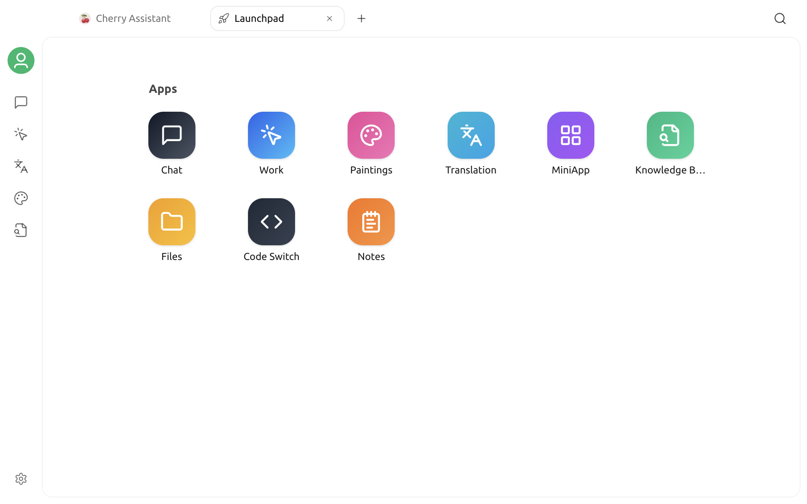

# Launchpad

The Launchpad is Cherry Studio's home page. It provides one place to open built-in features and pinned MiniApps, making it a convenient starting point for new work across multiple tabs.

## Open the Launchpad

Cherry Studio opens the Launchpad by default when the app starts. While using the app, you can also return to the Launchpad or open another one:

* Select the Home button on the left side of the tab bar to return to an existing Launchpad tab.
* Select `+` in the tab bar to open a new tab. Every new tab starts on the Launchpad.

When you select an app from the Launchpad, its workspace opens in the current tab. To work across several features at the same time, use `+` to open additional tabs.

## App shortcuts

The **Apps** section of the Launchpad includes these shortcuts:

| App | What it is for |
| :--- | :--- |
| Chat | Start conversations and use assistants |
| Work | Create and run agent tasks |
| Paintings | Generate and manage images with image models |
| Translation | Translate text and compare the source with the translation |
| MiniApp | Open and manage web MiniApps |
| Knowledge Base | Manage knowledge bases, data sources, and retrieval settings |
| Files | View files that you have used in Cherry Studio |
| Code Switch | Manage and run supported AI coding tools |
| Notes | Create and organize Markdown notes |

Drag an icon to reorder the built-in apps on the Launchpad. Right-click an icon to pin that app to the left sidebar or remove it from the sidebar. Required entries such as Chat cannot be unpinned.

## MiniApps section

MiniApps pinned to the Launchpad appear below the **Apps** section. MiniApps and built-in apps have separate orders; drag a MiniApp icon to change its position in this section.

To add or remove a shortcut, open the actions menu for the MiniApp on the **MiniApps** page, then select **Add to Launchpad** or **Remove from Launchpad**.


Removing a MiniApp from the Launchpad only removes its shortcut. It does not delete the MiniApp.


## Tips

* Start new work from the Launchpad. To continue an existing conversation or task, use the left sidebar or the history list for that feature.
* Keep different features open in separate tabs so that you do not have to leave your current workspace.
* Add frequently used web MiniApps to the Launchpad, and pin high-use built-in apps to the sidebar.
