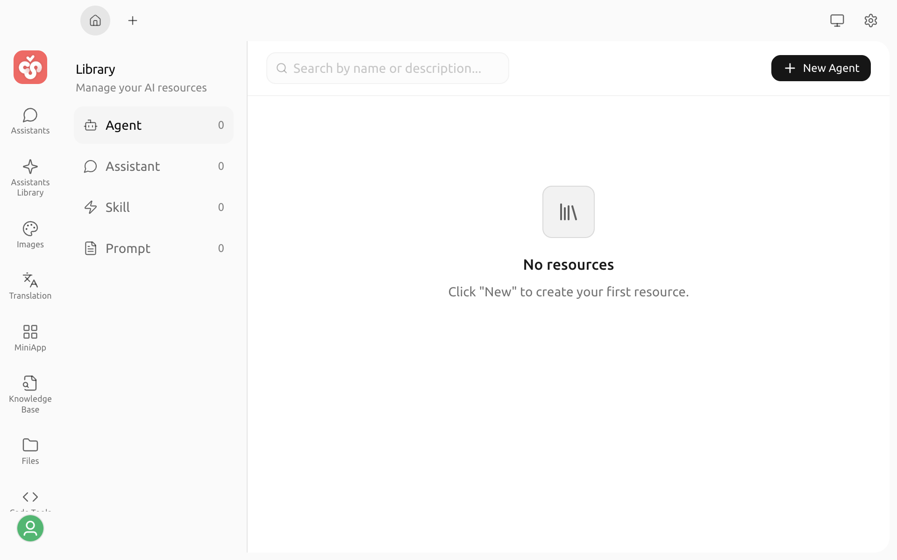

# Library

Library provides one place to manage the assistants, agents, skills, and prompts that you create or install in Cherry Studio. You can switch between resource types, search your existing resources, and create, import, edit, or delete them from the same page.


Library and [Assistant Library](agents.md) serve different purposes. Assistant Library is where you browse and import community assistants; Library is where you manage resources that belong to you.


## Open Library

Select **Library** on the Launchpad. The left sidebar shows the four resource types and their item counts, while the main area shows cards for the selected type.

| Type | What you can do |
| :--- | :--- |
| Assistant | Create or import assistants, then configure their models, prompts, knowledge bases, and tools |
| Agent | Create agents and configure their models, working directories, permissions, and available tools |
| Skill | Install skills from ZIP files or directories, view their contents, and uninstall them |
| Prompt | Create and maintain reusable prompts |

## Find and organize resources

1. Select a resource type in the left sidebar.
2. Enter a name or keyword in the search box at the top.
3. In the **Assistant** list, you can also filter resources by tag.

The actions menu on an assistant card includes **Manage tags**. After creating a tag, you can assign it to other assistants as well.

## Create or import resources

Use the action button in the upper-right corner. The available action changes with the selected resource type:

* Assistants, agents, and prompts open their respective configuration pages. The resource is created only after you complete the required fields and save it.
* Assistants can be imported from a JSON file.
* Skills can be installed from a local ZIP file or directory. To search the skills marketplace, go to **Settings → Skills**.

After a resource is created or installed, it appears in the list for its resource type.

## Edit and manage resources

Select a resource card to open its editor or details page. You can also use the card's actions menu to:

* Edit the resource configuration.
* Duplicate or export an assistant.
* Delete an assistant, agent, or prompt.
* View skill details or uninstall a skill that you no longer need.

Before deleting or uninstalling a resource, Cherry Studio asks you to confirm. This action may affect workflows that reference the resource, so make sure it is no longer in use.

## Next steps

* Learn how to create and run [agents](../../advanced-basic/agent.md).
* Learn how to install and manage skills.
