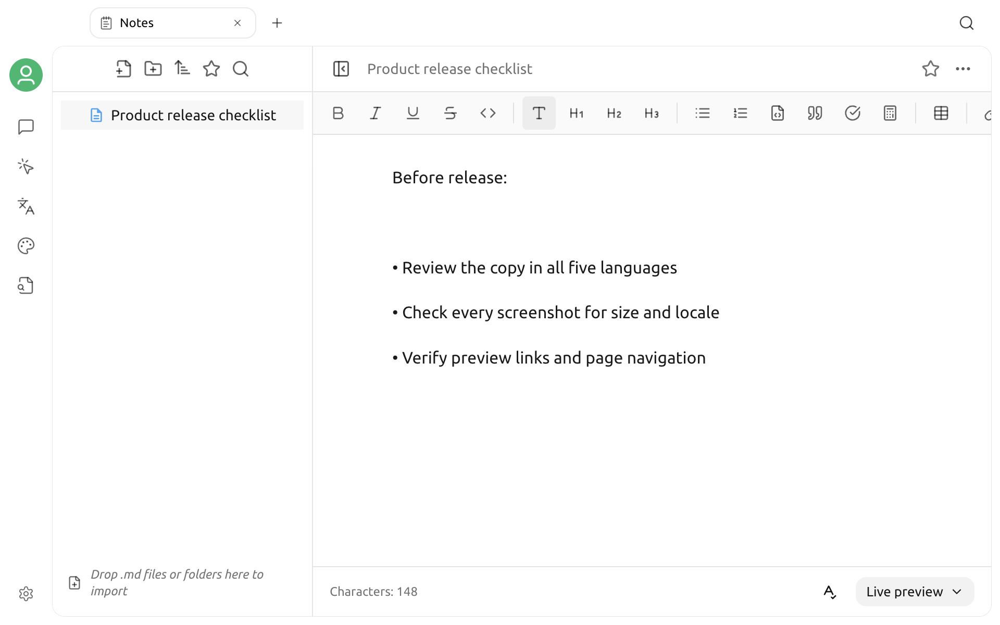

# Notes

Notes is Cherry Studio's built-in Markdown workspace. Each note is stored as a local `.md` file, making it suitable for organizing chat results, drafting content, and maintaining material that other Markdown tools can read.


Notes do not become chat context automatically. To let a model retrieve note content, export the target note to a [Knowledge Base](knowledge-base.md).


## Open Notes

1. Click **+** on the right side of the top tab bar to open a new Launchpad tab.
2. Click **Notes** in the Launchpad.

Notes and folders appear on the left, and the editor for the current note appears on the right.

## Create your first note

1. Click **New Note** at the top of the left panel.
2. Enter a note name at the top of the page.
3. Enter content in the editor.

Changes are saved automatically to the current Markdown file. Cherry Studio also attempts to save unsaved changes when you switch notes or leave the page.


If the note file cannot be read, the editor blocks writing to avoid replacing the original file with empty content. If you see a read or save error, check the working directory and file permissions first.


## Organize notes with folders

Click **New Folder** at the top of the left panel to create a directory in the root or the currently selected folder.

You can also:

* Expand or collapse folders
* Drag a note or folder into another folder
* Right-click a folder to create a child note or folder
* Rename the current note by editing the title at the top of the page
* Right-click a note or folder in the directory tree to rename it

The Notes workspace reads only Markdown files and does not show hidden files.

## Import existing Markdown

Use any of these methods:

* Drag an `.md` file into the directory tree on the left
* Drag a folder containing Markdown files into the directory tree on the left
* Right-click an empty area on the left and select Upload File or Upload Folder
* Click the import prompt in an empty Notes workspace and select a folder

When importing a folder, the app preserves its original directory structure where possible. Other formats are skipped, and the completed import reports the numbers that succeeded, were skipped, or failed.

## Edit and read

At the bottom of the editor, you can switch between three modes:

| Mode | Best for |
| --- | --- |
| Live Preview | Edit with the toolbar while viewing the Markdown formatting |
| Source Mode | Edit the Markdown source directly |
| Reading Mode | Read only the rendered content |

The toolbar in Live Preview provides common formatting such as headings, bold, italics, lists, quotes, code, and tables. The Notes editor does not currently provide commands for inserting images or inline formulas.

The bottom area also shows the character count. In Live Preview, click the spell-check button to enable or disable checking.

### Page display

Click the More menu in the upper-right corner to:

* Copy the current note content
* Export quickly to Word
* Limit the body width
* Show or hide the table of contents
* Switch between the default and serif fonts
* Select a small, medium, or large font size
* Open the full Notes settings

The full settings also provide the default view, default edit mode, a 10–30 px font size, and the table of contents.

## Search and favorites

### Search

Click the Search button at the top of the left panel and enter a keyword. Search matches:

* Note names
* Note content

When note content matches, the result shows the match type and relevant lines. Click matching content to open the note and jump to that location.

### Favorites

After opening a note, click the star button at the top to add it to favorites. The Favorites entry at the top of the left panel shows only favorited notes.

### Sort

The directory supports six sort orders:

* Name from A to Z
* Name from Z to A
* Updated time from newest to oldest
* Updated time from oldest to newest
* Created time from newest to oldest
* Created time from oldest to newest

Folders always appear before notes at the same level.

## Context menus

### Note

Right-click a note to:

* Generate a note name from its content with a model
* Rename it
* Open it externally
* Add it to or remove it from favorites
* Export it to a knowledge base
* Export it in an enabled format
* Delete it

Generating a name automatically requires an available model configuration. Before exporting to a knowledge base, create at least one knowledge base.

### Folder

Right-click a folder to create a child note or folder, rename it, open it externally, or delete it.


Deleting a folder also deletes the notes inside it. Make sure the target directory is backed up before deleting it.


## Export notes

Export options in a note's context menu may include:

* Copy as Image or Export as Image
* Markdown
* Word
* Notion
* Yuque
* Obsidian
* Joplin
* SiYuan

The items shown are controlled by **Settings → Data Settings → Export Menu**. Export to Word in the top More menu is a shortcut for the current note.

## Use Notes with Chat and Knowledge Base

### Save from Chat to Notes

The export menus for chat messages and topics can save content to the Notes working directory. Whether this option appears depends on Export Menu settings.

### Add a note to a knowledge base

1. Create a knowledge base first.
2. Right-click the target note in the Notes directory tree.
3. Select **Export Note to Knowledge Base**.
4. Select the target knowledge base and confirm.
5. Wait for the knowledge base to finish indexing, then select it in Chat.

The original note and the copy in the knowledge base are separate data sources. After editing the note, export it again or update the material in the knowledge base.

## Working directory and backups

Open the More menu in the upper-right corner and go to **More Settings → Data Settings** to view the current Notes working directory, select another directory, or restore the default directory.


Changing the working directory changes only the location Cherry Studio currently reads. It does not move Markdown files from the old directory automatically. Copy or back up the original directory before switching.


Notes are ordinary Markdown files, so you can protect them with file synchronization, version control, or backup software. When using a custom working directory, back up that directory separately instead of relying only on Cherry Studio app configuration backups.

After restoring across operating systems, Cherry Studio returns to the default Notes directory if the original path does not exist. Copy the old notes into the new directory manually, or select a valid directory again in Settings.

## Troubleshooting

### A new note is not saved

Check that the working directory exists and is writable. If the current file cannot be read, Cherry Studio pauses saving to protect the original content.

### Some files are missing after import

The Notes workspace imports only `.md` files. Check whether skipped files use the `.md` extension.

### Recently edited content does not appear in search

Wait for automatic saving to finish before searching. If the file is on a synchronized drive, also confirm that external synchronization is not locking or overwriting it.

### Notes are empty after switching computers

Note content is stored in the working directory, not only in Settings. Copy the Markdown files from the original directory to the new computer, then select that directory under Notes settings.

***

### Get help and submit feedback

If you encounter a problem, contact the community using the information under [Feedback and suggestions](../../question-contact/suggestions.md).
