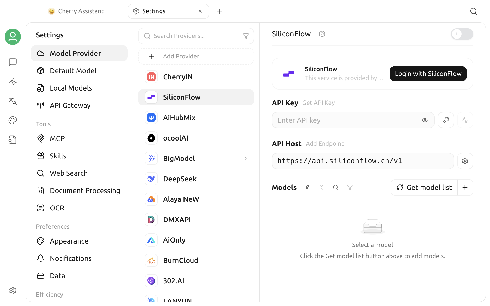

# Software Settings

Cherry Studio V2 brings model connections, tool services, application preferences, data management, and productivity features together in Settings. This page is a navigation guide and does not repeat every switch in detail. Find the relevant section for your goal, then open the corresponding topic page.

## Open Settings

Click the **Settings** icon in the lower-left corner of the main window.

Settings opens **Model Provider** by default. The top model entries have no section heading; four labeled sections follow:

1. Model Provider, Default Model, Local Models, and API Gateway;
2. Tools;
3. Preferences;
4. Efficiency;
5. System.


Labels and positions may differ slightly by operating system, window size, or version. If a feature is missing, first confirm the version under **About Us** and check whether it is available only on a specific platform.


## Model Entries

| Setting | Purpose | Related documentation |
| --- | --- | --- |
| Model Provider | Add or manage model providers, API Keys, API addresses, connection methods, and model lists | [Model Provider Settings](providers.md) |
| Default Model | Select the Default Assistant, Quick, Translation, and Painting models | [Default Model Settings](default-models.md) |
| Local Models | Download or remove local embedding and OCR model components | [Local Models](local-models.md) |
| API Gateway | Expose Cherry Studio model capabilities to other applications through a local OpenAI-compatible API | [API Gateway](../../../advanced-basic/api-server.md) |

For first-time setup, use this order:

1. Enable a provider under **Model Provider** and complete a connection check;
2. Confirm that the models you need appear in the model list;
3. Set each type of default model under **Default Model**;
4. Return to the chat page and send a test message.

API Keys for model providers are sensitive credentials. Do not put real keys in screenshots, public documentation, or feedback reports.

## Tools

| Setting | Purpose | Related documentation |
| --- | --- | --- |
| MCP | Install and manage MCP tools that connect assistants or agents to external capabilities | [Using MCP](../../../advanced-basic/mcp/) |
| Skills | Manage skills available to agents | — |
| Web Search | Select keyword search and URL retrieval providers, and configure result count, compression, and the blacklist | [Web Search](../../../websearch/) |
| Document Processing | Configure PDF and Office document parsing | [Document Processing](../../../pre-basic/settings/doc-process.md) |
| OCR | Configure image text recognition | [Document Processing](../../../pre-basic/settings/doc-process.md) |

Tool availability usually depends on all of the following:

- The feature itself is configured;
- The current model supports tool calling or the relevant input type;
- The assistant or agent has permission to use the tool;
- The local network and third-party service are accessible.

Do not assume that a feature is ready just because a switch appears in the interface. After configuring it, perform one minimal test in an actual conversation.

## Preferences

| Setting | Purpose | Related documentation |
| --- | --- | --- |
| Appearance | Language, theme, fonts, message display, math rendering, and Custom CSS | [Appearance Settings](display.md) |
| Notifications | Manage application notifications | — |
| Data | Local data directory, import and export, backups, WebDAV, S3, and note services | [Data Settings](../../../data-settings/) |

Appearance, Notifications, and Data now have separate entries. Use **System** for startup, proxy, privacy, and other system-level options.


Most appearance options take effect immediately, but language, proxy, storage location, and some system integrations may require reopening the window or restarting the application. Follow the notice beside the setting and the actual interface to determine whether a restart is required.


## Efficiency

| Setting | Purpose | Related documentation |
| --- | --- | --- |
| Channels | Let agents receive and send messages through external channels such as Feishu and Telegram | [Channels](../../../advanced-basic/agent-channels.md) |
| Scheduled Tasks | Run agent tasks automatically on a schedule | [Scheduled Tasks](../../../advanced-basic/scheduled-tasks.md) |
| Shortcuts | View, change, enable, or disable application and global shortcuts | [Shortcut Settings](key-shortcut.md) |
| Quick Assistant | Open a lightweight question window from a global shortcut or the system tray | [Quick Assistant](../kuai-jie-zhu-shou.md) |
| Selection Assistant | Translate, summarize, explain, or perform other actions on text selected in another application | [Selection Assistant](../selection-assistant.md) |

Channels and scheduled tasks may let agents run outside the main window or while unattended. Before enabling them, review model costs, tool permissions, accessible data, and task stop conditions.

## System

| Setting | Purpose | Related documentation |
| --- | --- | --- |
| System | Manage startup, proxy, privacy, and other system-level options | [General Settings](general.md) |
| Environment Dependencies | View and manage external runtimes required by features | — |
| About Us | View the version, update channel, official website, open-source repository, and license | — |

## Recommended First-Time Setup Order

If you have just installed Cherry Studio, complete the minimum setup in this order:

1. **Model Provider**: enable a provider, enter credentials, and check the connection;
2. **Default Model**: select the Default Assistant model;
3. **Appearance**: select the language and theme;
4. **Data**: confirm the data location and review the export or migration options available in the current version;
5. **Web Search or Document Processing**: configure only the tools you currently need;
6. **Shortcuts**: avoid conflicts between global key combinations and other applications;
7. **About Us**: confirm that you are using the expected version.

You do not need to enable every service at once. Stabilize basic chat first, then add Web Search, MCP, channels, and automated tasks one at a time so configuration issues are easier to isolate.

## Check Settings After Changes

Use these checks after changing settings:

| Change | Recommended check |
| --- | --- |
| Model provider or API Key | Run a connection check, then send a short message |
| Default model | Start a new conversation and confirm the model displayed at the top |
| Web Search | Enable the Globe icon and ask a question that requires current information |
| Document processing | Upload a small test file and inspect the parsed result |
| Proxy | Access a service that requires the proxy again; restart the application if necessary |
| Shortcut | Press the key combination once in the target window |
| Data, import, or export | Confirm that the expected content appears in the target file or application |

## Troubleshooting

### Changed Settings Do Not Take Effect

First confirm that the input has lost focus or that you clicked Save or Check. Reopen the relevant page. For language, network, system permission, or storage path changes, restart Cherry Studio afterward.

### A Setting Mentioned in the Documentation Is Missing

Check:

1. Whether the current Cherry Studio installation is a recent V2 community edition;
2. Whether the feature supports only specific operating systems;
3. Whether a provider, model, or experimental feature must be enabled first;
4. Whether the Settings sidebar can scroll farther;
5. Whether the feature has moved to an assistant, agent, or application page.

### Can Every Setting Be Synchronized to Another Device?

Different backup methods cover different data. Do not assume that every credential and local path will be synchronized just because a backup succeeded. Before migrating, read [Data Settings](../../../data-settings/) and verify model providers, paths, and system permissions on the target device.

***

### Get Help and Submit Feedback

If you encounter a problem in Settings, submit feedback through the official channels listed in [Feedback and Suggestions](../../../question-contact/suggestions.md). Include the Cherry Studio version, operating system, setting name, and sanitized error message.
