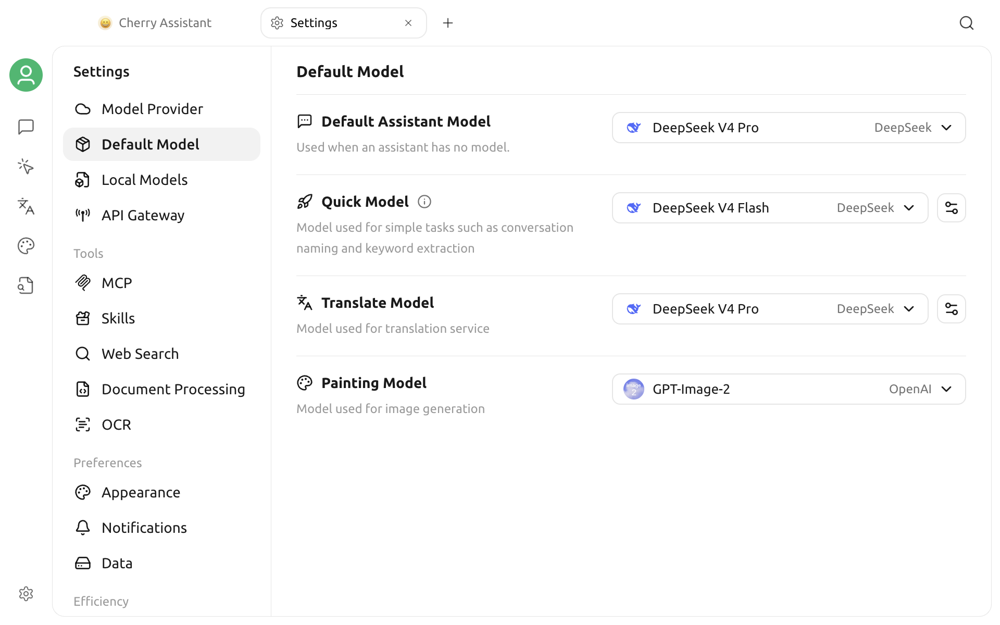

# Default Model Settings

Different Cherry Studio features use default models when no model is specified separately. V2 currently provides four global roles: **Default Assistant Model**, **Quick Model**, **Translation Model**, and **Painting Model**.

They can use the same model, or be configured separately for quality, speed, and cost.

## Before You Begin

Before opening Default Model Settings, confirm that:

1. At least one provider is configured under **Settings → Model Provider**;
2. The target model was added to that provider;
3. Both the provider and model are enabled;
4. The target model works in a connection check or actual conversation.

For setup instructions, see [Model Provider Settings](providers.md).


The first three text-model selectors show enabled chat models from enabled providers and exclude embedding, rerank, and image-generation-only models. The Painting Model selector shows only models recognized for image generation. If a target model is missing, return to Model Providers and check its enabled state and capability labels.


## Open Model Settings

Open:

> **Settings → Default Model**

The page contains four selectors: Default Assistant, Quick, Translation, and Painting. Quick and Translation also provide additional settings on the right.

## Four Default Models

| Role | Main use | Selection priorities |
| --- | --- | --- |
| Default Assistant Model | Chat model used when an assistant does not specify one separately | Stability, instruction following, everyday cost |
| Quick Model | Topic naming, note summaries, some lightweight internal tasks, and LLM language detection | Fast responses, concise output, low cost |
| Translation Model | Translation page, Quick Translate, and other features that use the shared translation model | Language coverage, fidelity, format preservation |
| Painting Model | Default image-generation model for the Paintings page | Image-generation capability, quality, speed, and cost |

## Default Assistant Model

### When It Is Used

An assistant's actual model priority is usually:

1. The model explicitly selected for the current assistant;
2. The default model saved by that assistant;
3. The global Default Assistant Model.

Changing the global default therefore does not force every assistant with a separately selected model to switch.

### How to Choose

For everyday use, prioritize a model that:

- Provides stable text chat;
- Follows system prompts;
- Has sufficient context length for common tasks;
- Has acceptable account quota and latency;
- Supports tool calling if you frequently use MCP, Web Search, or agents.

Do not label capabilities manually based only on a model name. Vision, native web search, tool calling, and other capabilities must match actual server support.

## Quick Model

The Quick Model handles background or lightweight tasks that do not require all capabilities of the main chat model, including:

- Generating a topic name from recent conversation content;
- Generating a short title or summary for a note;
- Detecting the source language when LLM detection is selected for translation;
- Other internal flows that call the application's Quick Model.

### Selection Recommendations

A suitable Quick Model:

- Responds quickly with its first token;
- Reliably follows short-text instructions;
- Produces concise results;
- Has a low per-request cost;
- Does not depend on complex tools or extremely long context.

The fastest model is not necessarily the best choice. If topic names often miss the point, language detection is unstable, or output includes explanations, switch to a more reliable lightweight model.

### Topic Naming Settings

Click the settings button beside the Quick Model to:

- Enable or disable automatic topic naming;
- Edit the topic naming prompt;
- Restore the default prompt.

When automatic topic naming is disabled, the application attempts to use text from the first message as the topic name instead of calling the Quick Model.

When customizing the prompt, retain the variables required by the interface instructions. Removing a variable or asking for a long response may produce an incomplete topic name.

### Relationship to Translation Language Detection

The Translation page can use an algorithm or an LLM for language detection. When LLM is selected, it calls the Quick Model.

Some dedicated translation models are not suitable for language detection. For example, the current implementation refuses to use Qwen-MT models for LLM language detection. If the Translation Model is a dedicated translation model, the Quick Model should still be a regular chat model.

## Translation Model

The Translation Model is used by:

- The Translation page;
- Translation in Quick Assistant;
- Translation actions in Selection Assistant;
- Other entry points that call the shared translation service.

For quick entry points, see [Quick Assistant](../kuai-jie-zhu-shou.md) and [Selection Assistant](../selection-assistant.md).

### Selection Recommendations

Test with your own language pairs and check whether:

- Proper nouns are preserved correctly;
- Markdown, code, and placeholders are changed unexpectedly;
- Long text is omitted;
- Less common languages are stable;
- Output includes unwanted explanations or preambles;
- Cost and response speed are acceptable.

Regular chat models and dedicated translation models can both be used, but their capabilities and parameters differ. Test with real text rather than selecting only from provider marketing.

### Additional Translation Settings

Click the settings button beside the Translation Model to change:

- The translation prompt;
- Custom language names, codes, and icons.

After the translation prompt is changed, a restore button appears. Restoring replaces the current custom prompt.

The target-language and source-text variables in the translation prompt must be retained. Removing them may leave the model unaware of the target language or without the text to translate.

## Painting Model

The Painting Model is the default image-generation model used on the Paintings page. It does not automatically fall back to the Default Assistant Model. If it is empty, first enable an image-generation model under Model Providers, then select it here.

Test the output sizes you use, prompt following, text rendering, latency, and pricing. Only models recognized by Cherry Studio as image-generation models appear in this selector.

## Recommended Configurations

### Keep It Simple

The Default Assistant, Quick, and Translation text roles can use one stable general-purpose chat model. The Painting Model still requires a separately selected image-generation model.

### Balance Cost

| Role | Recommendation |
| --- | --- |
| Default Assistant Model | Your most reliable everyday chat model |
| Quick Model | An inexpensive, low-latency lightweight chat model |
| Translation Model | The model that performs best for your target language pairs in testing |
| Painting Model | An image-generation model with suitable quality, speed, and cost for your typical images |

### Prioritize Privacy

You can choose local models, but still confirm that:

- The local service is running;
- The model connects in Cherry Studio;
- The computer has enough memory or VRAM;
- Translation and topic naming are fast enough;
- The relevant feature does not also call external web search or third-party tools.

## Verify Changes

### Default Assistant Model

1. Create an assistant or conversation with no separately fixed model;
2. Check the model name at the top;
3. Send a short message;
4. If tools are needed, run one additional tool-calling test.

### Quick Model

1. Enable automatic topic naming;
2. Create a topic and complete at least one conversation turn;
3. Wait for the topic name to update;
4. Check that the name is concise and relevant.

If you use LLM language detection, also enter a short text on the Translation page and inspect the detected language.

### Translation Model

1. Open the Translation page;
2. Enter test text containing proper nouns, Markdown, or code;
3. Select a commonly used target language;
4. Compare translation completeness and formatting;
5. Test Quick Assistant or Selection Assistant once more.

### Painting Model

1. Open the Paintings page;
2. Enter a test prompt that contains no sensitive information;
3. Confirm that an image is generated;
4. Check its size, prompt following, latency, and cost.

## Troubleshooting

### Target Model Is Missing from a Selector

Check that both the provider and model are enabled. The Default Assistant, Quick, and Translation selectors exclude embedding, rerank, and image-generation-only models. The Painting Model selector shows only image-generation models. If a model appears in the wrong place, return to Model Providers and check its capability labels.

### A Previously Selected Model Becomes Blank

The model may have been deleted or disabled, the provider may have been disabled, or the model's unique ID may have changed during migration.

Return to [Model Provider Settings](providers.md), pull or add the model again, then select it again.

### Existing Assistants Do Not Change After the Default Assistant Model Changes

This is expected. An existing assistant with its own saved model continues to prioritize that selection. Edit each assistant or clear its independent model setting.

### Automatic Topic Naming Does Not Work

Confirm that:

- Automatic topic naming is enabled;
- The Quick Model still exists and is enabled;
- The Quick Model provider and API Key work;
- The conversation contains enough messages;
- The topic name was not edited manually;
- The custom naming prompt did not remove required variables.

### The Translation Model No Longer Exists

Select the Translation Model again. If you use a dedicated translation model, also check whether its provider requires special parameters or particular language codes.

### Unexpected Background Task Costs

Topic naming, note summaries, LLM language detection, and translation may each send separate requests. Switch the Quick Model to a lower-cost model, or disable automatic topic naming and LLM detection when they are not needed.

## Data and Security

- Default model settings do not contain API Keys; credentials remain managed under Model Providers;
- Model calls send the relevant text to the selected provider;
- Topic naming may send text from several recent messages;
- Translation sends the text to be translated;
- For sensitive content, choose a provider or local model that meets your privacy requirements.

***

### Get Help and Submit Feedback

If a default model does not work, submit feedback through the official channels listed in [Feedback and Suggestions](../../../question-contact/suggestions.md). Include the Cherry Studio version, selections for all four model roles, provider, model ID, and sanitized error message.
