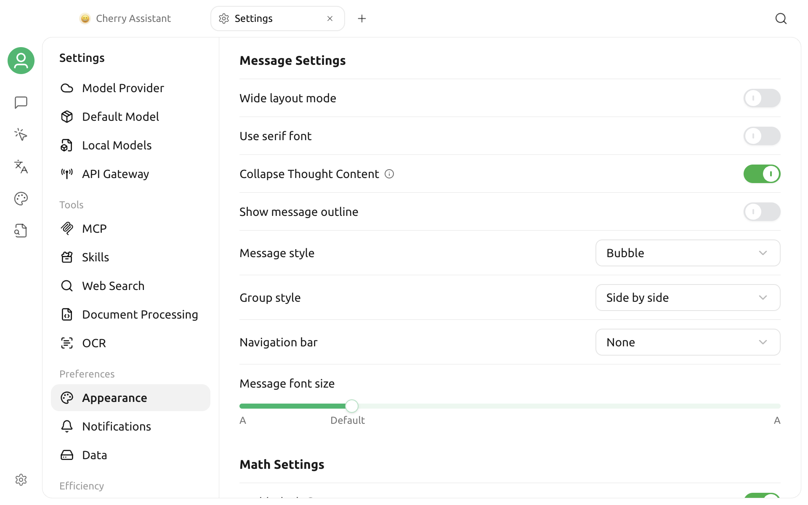

# Appearance Settings

Open **Settings > Appearance**. The page contains Display & Language, font, input, message, math, code display, code execution, and Custom CSS sections. This guide focuses on themes, zoom, fonts, message display, and math rendering.

## Theme and Accent Color

### Choose a theme

**Theme** provides three modes:

| Mode | Effect |
| --- | --- |
| Light | Always use the light interface |
| Dark | Always use the dark interface |
| System | Follow the operating system's current light or dark appearance |

The interface updates immediately after you choose a mode. With **System**, Cherry Studio changes when the operating system switches appearance.

### Set the accent color

**Accent Color** affects primary buttons, selected states, and emphasized elements. You can:

- Choose a green, red, amber, blue, or purple preset.
- Click the color picker to choose another color.
- Enter a hexadecimal color in the input box, such as `#3B82F6`.

Color input supports `#RGB` and `#RRGGBB`. When saved, the value is converted to the full six-character uppercase format. Invalid colors are not applied.

The default accent color is `#00B96B`.


The accent color is not a complete custom theme. To change more interface styles, use [Custom CSS](../../../personalization-settings/css.md), and save your existing styles before making changes.


## Platform-Specific Window Options

Some display options appear only on the relevant operating system:

- **macOS: Transparent Window** — Switch between transparent and opaque window styles.
- **Linux: Use System Title Bar** — Use the window title bar provided by the system. The app restarts after you confirm.

Windows does not display either option. Desktop environment, system theme, and graphics configuration can affect transparency and title bar appearance.

## Interface Zoom

The **Zoom** section displays the current percentage:

- Click `-` to zoom out.
- Click `+` to zoom in.
- Click the reset icon to restore the default percentage.

Each adjustment changes zoom by 10%. Zoom affects text, icons, and interface controls together; it is different from changing only the font size of chat messages.

You can also use these default shortcuts:

| Action | macOS | Windows / Linux |
| --- | --- | --- |
| Zoom in | `⌘ + =` | `Ctrl + =` |
| Zoom out | `⌘ + -` | `Ctrl + -` |
| Reset | `⌘ + 0` | `Ctrl + 0` |

Use **Settings > Shortcuts** as the source of truth for the current shortcut states. For details, see [Shortcut Settings](key-shortcut.md).

## Font Settings

### Global font

**Global Font** affects regular text throughout the app interface. The selector reads fonts available on the current system and previews them in the list.

If a font name does not appear:

1. Confirm that the font is installed in the operating system.
2. Close and reopen Cherry Studio so the app reads the font list again.
3. Return to the font selector and search again.

Click the reset icon on the right to restore the default font.

### Code font

**Code Font** is used for code and other areas that need monospaced text. Choose a monospaced font that contains the target language characters, numbers, and common symbols to avoid misaligned code or missing glyphs.

Global Font and Code Font are independent. Resetting one does not affect the other.


The chat message font size belongs to message display settings and is not adjusted separately here. Use Zoom when the entire interface is too large or small. Use Global Font or Code Font when you only want to change the typeface.


## Message Settings

Message Settings controls the layout and reading behavior of conversation content:

- **Wide layout mode:** Increases the usable width for message content;
- **Use serif font:** Changes only the font style of message text;
- **Collapse Thought Content:** Collapses model reasoning by default;
- **Show message outline:** Adds a structure entry point for long conversations;
- **Message style:** Switches between bubble and other display styles;
- **Multiple-model answer style:** Uses folded, vertical, horizontal, or grid layouts;
- **Message navigation:** Uses no navigation, buttons, or anchors;
- **Message font size:** Changes message text without zooming the entire interface.

Message font size ranges from 12 to 22, with 14 as the default.

## Math Settings

**Enable `$...$`** controls whether content enclosed by single dollar signs is rendered as inline math. It is enabled by default. If a currency amount in regular text is incorrectly rendered as an equation, turn it off and check the message again.

## FAQ

### The interface did not change immediately after selecting “System”

First confirm that the operating system has switched to another appearance and that Cherry Studio still has **System** selected. If the desktop environment does not deliver the system theme event correctly, reopen the app and check again.

### A newly installed font is missing from the list

Cherry Studio reads system fonts when you enter Settings. After installing a font, reopen the app, then return to **Display & Language**.

### Custom CSS causes display problems

Go to **Settings > Appearance > Custom CSS**, temporarily remove the relevant styles, and see whether the interface recovers. Custom CSS selectors may change between versions, so avoid relying on deeply nested internal DOM structures.

If the problem persists, submit your operating system, Cherry Studio version, display setting values, and a full interface screenshot through [Feedback and Suggestions](../../../question-contact/suggestions.md).
