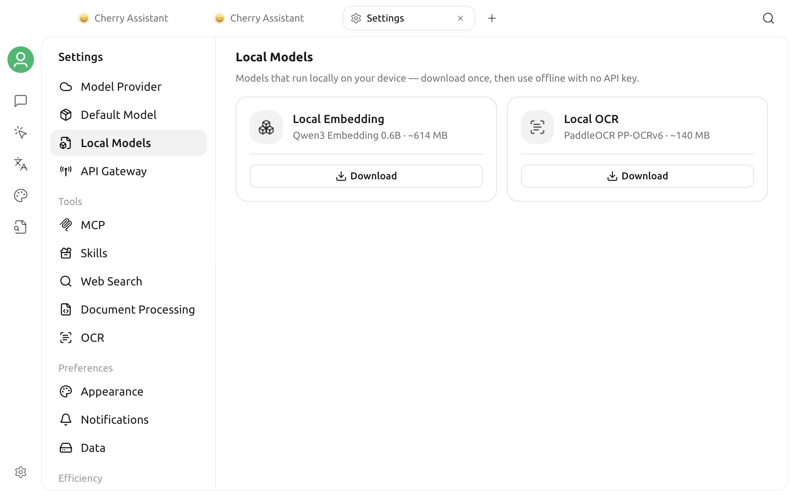

# Local Models

Local models run on your device. After a model is downloaded, you can use it offline without an API key. The initial download still requires an internet connection.

## Open Local Models

Open **Settings > Local Models**. The page contains two model cards showing each model's purpose, approximate size, and current status.

## Available Models

| Model | Displayed Size | Purpose |
| --- | --- | --- |
| **Local Embedding** (Qwen3 Embedding 0.6B) | ~614 MB | Generate text embeddings for knowledge base content |
| **Local OCR** (PaddleOCR PP-OCRv6) | ~140 MB | Recognize text in images |

Local OCR processes images only. It is not used for document-to-Markdown conversion.

## Download and Manage Models

1. Click **Download** on the model card you need.
2. Follow the progress bar and percentage. Click **Cancel** if you need to stop the download.
3. When the download finishes, the card shows **Ready**.
4. To remove a model you no longer need, click the remove icon in the upper-right corner of its card.

The card shows the model's approximate size. The first local-model download may also fetch a runtime shared by both models, so the actual download and disk usage can be slightly larger.

## Removal Rules and Automatic Behavior

- After Local Embedding is downloaded, it becomes available as a knowledge base embedding model. If it is ready before you create a new knowledge base, the new knowledge base uses it by default.
- Cherry Studio does not remove Local Embedding while a knowledge base still uses it. Change the embedding model for the affected knowledge bases, then try removing it again.
- After Local OCR is downloaded, Cherry Studio makes it the default image-to-text processor only if you have not explicitly selected another processor. Removing it restores the platform default.

## Platform Limitation

These local models are not supported on Intel Macs. The page shows **Local models are not supported on this platform** and hides the download cards.

## Troubleshooting

### The Download Fails

Check your internet connection, then click **Download** again. A failed or canceled download is not kept as a usable model.

### Local Embedding Remains After Removal

At least one knowledge base still uses the model. Change its embedding model, then return to this page and remove Local Embedding again.

### Removal Fails

Reopen this page and try again. If it still fails, check the application logs for the error.
