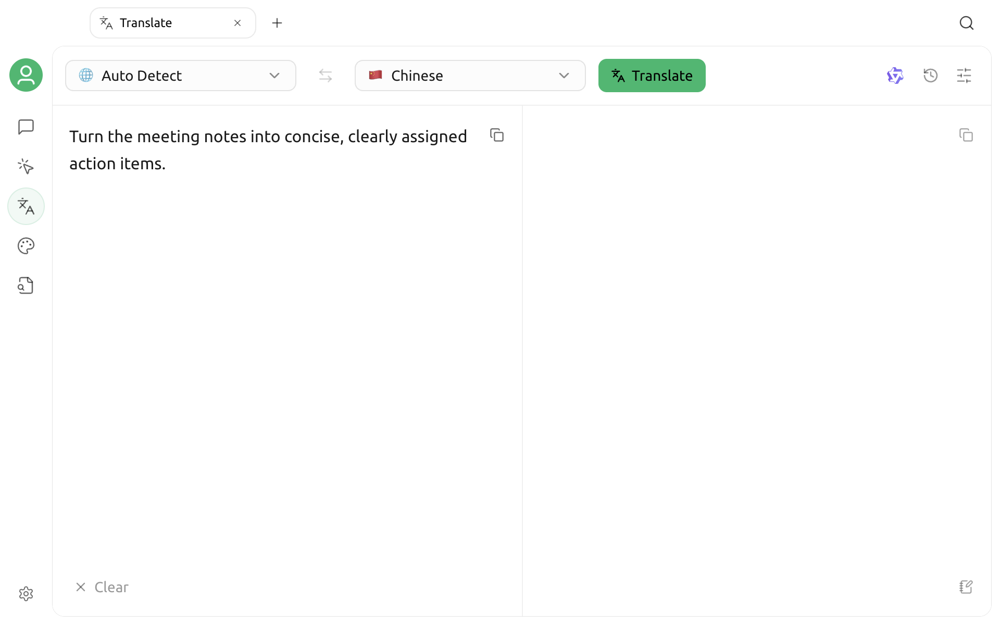

# Translation

The Translation page uses your configured language models to translate text. It supports automatic language detection, streaming results, text and document import, image OCR, translation history, and custom languages. It is suitable for short passages, emails, code snippets, and text extracted from files.

## Before you begin

Translation requires at least one enabled text model:

1. Open `Settings` → `Model Services` and configure a provider and model.
2. Select the translation model in the upper-right corner of the Translation page.
3. To use LLM automatic language detection, also configure the **Quick Assistant Model** under `Settings` → `Default Models`.

Embedding, reranking, and image generation models do not appear in the translation model list. If no model is available, see [Configure Model Services](../../pre-basic/providers/README.md) first.

## Open Translation

Click `+` on the right side of the top tab bar to open the **Launchpad**, then select **Translation**.

The page contains:

| Area | Purpose |
| --- | --- |
| Language bar at the top | Select source and target languages, swap the translation direction, and start or stop translation |
| Input area on the left | Enter, paste, or import content to translate |
| Results area on the right | Display streaming results and copy the translation |
| Tools in the upper-right corner | Select a model and open Translation History or Translation Settings |

In a narrower window, the input and results areas are arranged vertically.

## Complete a translation

1. Select the source language. Leave **Auto Detect** selected if you are unsure.
2. Select the target language.
3. Enter or paste content on the left.
4. Click **Translate**, or press `Ctrl + Enter` on Windows or Linux, or `Command + Enter` on macOS.
5. View the streaming result on the right, then click Copy when it finishes.

While translation is running, click **Stop** to interrupt the request. Clearing the input on the left also clears the result on the right.


The currently selected model generates the translation. Terminology, contracts, medical text, and other high-risk content should still be reviewed by someone with the relevant expertise.


## Select source and target languages

### Auto Detect

When the source language is set to **Auto Detect**, Cherry Studio identifies the input language before starting the translation. After successful detection, the result appears in the source language position.

Three detection methods are available in Settings:

| Method | Behavior |
| --- | --- |
| Automatic | Chooses an LLM or local algorithm based primarily on content length; falls back to the LLM when the local algorithm cannot identify the language |
| Local algorithm | Detects quickly on your device without calling a model, but supports a more limited range of languages |
| LLM | Uses the Quick Assistant Model; usually better for short or ambiguous text, but makes one additional model call |

If LLM detection fails, check that the Quick Assistant Model is configured and available.

### Swap translation direction

When the source language is not **Auto Detect**, click the swap button in the middle. Cherry Studio swaps the source language, target language, original text, and existing translation together.

### Bidirectional translation

After enabling **Bidirectional Translation** and selecting a language pair in Settings, Cherry Studio detects the input language and automatically uses the other language in the pair as the target. This is useful for repeated communication between two fixed languages.

If the input language is not part of the configured pair, the app reports that it cannot determine the direction.

## Import a file or image

When the input is empty, a file import area appears on the left. Click it to select one file, drag a file onto the page, or paste an image from the clipboard.

| Content type | How it is processed |
| --- | --- |
| Image | Recognizes text using the current OCR configuration, then appends it to the input area |
| Plain text, Markdown, code, and other text files | Reads the text directly and appends it to the input area |
| PDF, Word, PowerPoint, Excel, and ODF documents | Extracts readable text and appends it to the input area |

You can import only one file at a time. The limit is 5 MB for text files and 20 MB for documents. The content that can be read still depends on the file format, document structure, and local file processing capabilities.


File import extracts text; it does not create a translated document that preserves the original layout. If you need precise formatting for each section, extract the content first, then translate and organize it in smaller sections.


If no text is recognized in an image, check the OCR configuration under `Settings` → `Document Processing`, and make sure the image is clear and correctly oriented.

## Select a translation model

Click the model icon in the upper-right corner to select from enabled text models. Consider:

- For everyday short text, prefer a responsive model with manageable cost;
- For long text, consider the model's context length and output limits;
- For specialized content, compare how different models handle terminology and tone;
- A dedicated translation model may use its own protocol and may not use the custom translation prompt.

If the Translate button remains unavailable, confirm that you entered content and selected a valid model.

## Translation settings

Click the Settings button in the upper-right corner to open the side panel.

### Results and actions

| Setting | Purpose |
| --- | --- |
| Markdown Preview | Render the translation as Markdown; when disabled, display plain text |
| Auto Copy | Copy the result to the clipboard automatically after translation finishes |
| Scroll Sync | Keep the left and right panels aligned by relative position while scrolling long text |

### Translation prompt

The translation prompt controls how a general-purpose chat model processes the source text. The default template contains:

- `{{target_language}}`: The current target language;
- `{{text}}`: The text to translate.

Keep both placeholders when editing the template. Without them, the model may not receive the target language or source text. Click **Reset** to restore the default.

### Custom languages

In addition to the built-in languages, you can add a custom language. Enter a display name and language code, then select an icon. After creating it, you can edit its name and icon or delete it.

The language code must be unique and cannot duplicate a built-in language. Reliable translation still depends on whether the selected model understands the language name and content.

## Use Translation History

After each successful translation, the original text, translated text, language direction, and time are added to Translation History. Open the history panel in the upper-right corner to:

- View and reload a translation;
- Copy the original text or translation from the history;
- Favorite frequently used records and show only favorites;
- Delete one record;
- Clear all history after confirmation.

Reloading a record restores its original text, translated text, and language direction together.

## Troubleshooting

### The Translate button is unavailable

Confirm that the input area is not empty, a translation model is selected, and file reading, language detection, or the previous translation has finished.

### Auto Detect reports an error

If detection is set to LLM, or Automatic falls back to the LLM, check the Quick Assistant Model. You can also select the source language explicitly or try the local algorithm.

### The result is empty or fails partway through

Check the model service key, network, balance, rate limits, and model availability. Long text may also exceed the model's context or output limits; split it into shorter sections and try again.

### The source and target languages cannot be swapped

The swap button is temporarily unavailable while the source language is **Auto Detect**, translation or language detection is running, or a file is being processed. Select a source language explicitly and wait for the current operation to finish.

### File import fails

Select only one supported file at a time and make sure it does not exceed the size limit. Scanned documents, complex tables, password-protected files, and damaged files may not yield all their text.

## Privacy and cost

Standard translation content is sent to the provider of the currently selected model. LLM automatic detection also calls the Quick Assistant Model. Images are processed by the current OCR component before translation. Choose services and deployment methods according to the sensitivity of your data, and review the relevant provider's privacy policy and pricing.

***

If you encounter a problem or want to suggest an improvement, go to [Feedback and suggestions](../../question-contact/suggestions.md).
