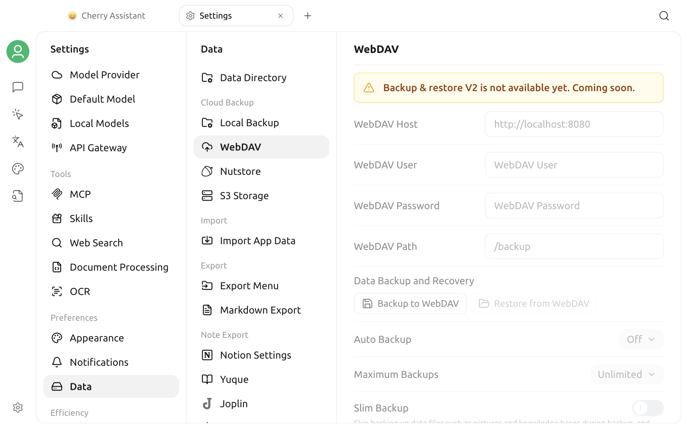

# WebDAV Backup

You can open the WebDAV page from **Settings > Data > WebDAV**, but the current version displays **“Backup & restore V2 is not available yet. Coming soon.”**


The current version cannot create, restore, or automatically manage WebDAV backups from this page. The visible controls do not mean that the feature is available.


## What the page currently shows

The page reserves controls for:

- the WebDAV host, user, password, and path;
- **Backup to WebDAV** and **Restore from WebDAV**;
- an automatic backup interval and maximum backup count;
- a slim backup option.

These fields, buttons, and switches are currently unavailable. Opening the page does not establish a WebDAV connection and cannot verify a server address or credentials.

## What to do

- Do not enter real WebDAV credentials on this page or rely on it to protect important data.
- Do not follow backup, restore, or automatic-backup steps written for an older interface.
- After a later release enables the feature, follow the enabled state in the app, its release notes, and the latest version of this page.
