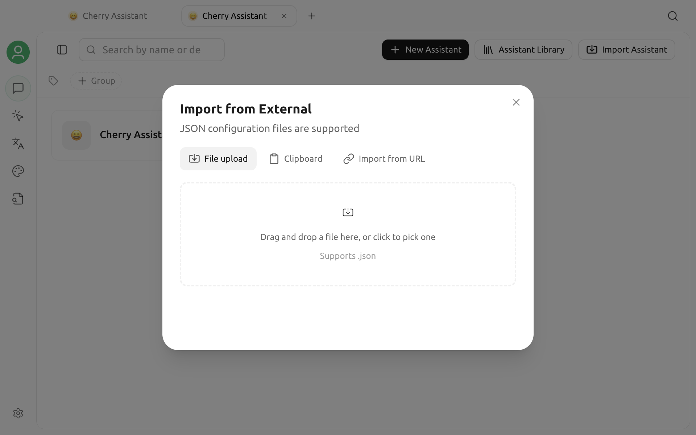

# Assistant Subscriptions and Import


Cherry Studio V2 Community Edition no longer provides persistent assistant subscriptions or automatic refresh of remote templates. Subscription URLs from older guides do not stay synchronized. The current replacement is a one-time **Import Assistant** action.


Importing copies the assistants in the JSON into your local assistant list. Later changes to the remote JSON do not update assistants you have already imported.

## Open Import Assistant

1. Open **Chat** from the sidebar or launchpad.
2. Open the assistant and topic list's more menu, then select **Manage Assistants**.
3. Select **Import Assistant** at the top of the management page.
4. In the **Import from External** dialog, choose:
   - **File upload:** Select a local `.json` file.
   - **Clipboard:** Paste JSON.
   - **Import from URL:** Fetch JSON from a supported raw GitHub or raw Gist URL.



URL import is a one-time download, not a saved subscription. It currently accepts HTTP(S) URLs only from `raw.githubusercontent.com` and `gist.githubusercontent.com`. A GitHub file preview page, a normal Gist page, or an arbitrary website URL is rejected.

## JSON format

You can import one object or an array of objects. Every assistant requires at least `name` and `prompt`:

```json
{
  "name": "Documentation reviewer",
  "emoji": "📝",
  "description": "Checks structure, terminology, and actionability",
  "prompt": "Review the product documentation and suggest specific, actionable improvements.",
  "group": ["Writing"]
}
```

`emoji`, `description`, and `group` are optional. If the imported data has no model information, Cherry Studio uses the current default chat model. The file, clipboard content, or URL response must not exceed 5 MB.

## Update an imported assistant

When remote content changes, import it again. Reimporting does not keep the local assistant linked to the remote source and may create another local copy. After import, check the name, group, and prompt under Manage Assistants, and remove the older copy if necessary.

For team distribution, maintain a versioned JSON file and put the version in its filename or assistant description. Do not rely on the legacy subscription behavior.

## Security guidance

- Import only from a trusted source and read the complete prompt first.
- Do not put API keys, tokens, internal addresses, or personal data in assistant JSON.
- After import, check the default model, knowledge base, tools, and MCP settings before processing sensitive data.
- If URL import fails, make sure it is a raw-content URL, the response contains JSON, and the size is within the limit.

See [Assistant Library](../cherrystudio/preview/agents.md) for assistant creation and management. If import still fails, use [Feedback & Suggestions](../question-contact/suggestions.md) and include the Cherry Studio version, import method, a redacted sample, and the error message.
