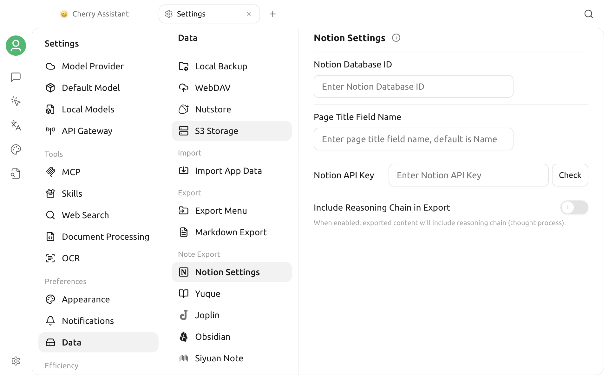

# Notion Configuration and Export

Cherry Studio V2 can export a topic or an individual message to a Notion database. Each export creates a new page in the target database and writes the converted content into the page body.

The configuration entry is under **Settings > Data > Notion Settings**. **Settings > Data > Export Menu** only shows or hides the “Export to Notion” option; it does not configure the connection.


A Notion Token is the access credential for this connection. Do not display the complete Token in screenshots, feedback, or shared configurations, and do not publish it on a public page.


## Configuration Overview

The connection requires four components:

1. Create an internal integration in your Notion workspace.
2. Create the target database and share it with the integration.
3. Obtain the database ID and title property name.
4. Enter three parameters in Cherry Studio and run the check.

## Create a Notion Internal Integration

1. Open [Notion Integrations](https://www.notion.so/profile/integrations).
2. Choose to create a new internal integration.
3. Select the Workspace that will store the exported content.
4. Give it a recognizable name, such as `Cherry Studio`.
5. Under integration capabilities, allow at least Read content and Insert content.
6. Save the integration and copy its internal integration Token.

An internal integration belongs only to the selected Workspace. If the target database is in another Workspace, create or install a suitable integration there as well.

Notion may change its interface and terminology. If the creation entry differs from this guide, see Notion's [official internal integration guide](https://developers.notion.com/guides/get-started/internal-connections).

## Create the Target Database

Create a database in Notion to receive pages exported from Cherry Studio. Table, list, and board views all work. The underlying object must be a database, not a regular page or a linked view that only displays data.

The database must have at least one property of type **Title**. A new database usually includes a title column named `Name` by default, but you can rename it to “Title,” “Page Name,” or another name.


Cherry Studio's “Page Title Field Name” depends on the property's actual name, not the Notion interface language. A localized interface may still use `Name`, and an English interface can use a custom title.


## Share the Database with the Integration

Creating a Token alone does not grant access to every page. Give the integration access to the target database:

1. Open the original page for the target database.
2. Open the page menu or sharing settings in the upper-right corner.
3. Find **Connections / Add connections**.
4. Search for and select the internal integration you created.
5. Confirm that the integration appears in the database's connection list.

You can also add the target page under the integration's **Content access** in the Notion Developer Portal. Whichever method you use, authorize the database itself, not only a linked view that cannot access the original data source.

According to Notion's documentation, a database not shared with the integration usually returns 404 through the API instead of explicitly reporting insufficient permission.

## Obtain the Database ID

Open the target database in a browser and copy its link. It may look like:

```text
https://www.notion.so/workspace/Tasks-0123456789abcdef0123456789abcdef?v=...
```

The Database ID is the 32-character identifier before `?`:

```text
0123456789abcdef0123456789abcdef
```

It may also appear as a hyphenated UUID. Do not copy:

- The view ID after `v=`;
- The complete web URL;
- The ID of a regular parent page;
- An identifier from a linked database view that does not belong to the original database.

If the database link includes a title prefix, take the 32-character ID from the last segment. If you are unsure, open the database as a full page and copy the link again.

## Obtain the Page Title Field Name

Review the properties in the target database, find the column whose type is **Title**, and copy its name exactly.

For example:

| Actual property name in Notion | Value to enter in Cherry Studio |
| --- | --- |
| `Name` | `Name` |
| `Page Name` | `Page Name` |
| `Title` | `Title` |
| `Conversation Title` | `Conversation Title` |

The name is sensitive to characters, spaces, and letter case. Do not enter the database name, page name, or a regular text property.

## Connect in Cherry Studio

Go to **Settings > Data > Notion Settings**.



Enter:

1. **Notion Database ID**;
2. **Page Title Field Name**;
3. **Notion API Key**.

Click **Check** beside the **Notion API Key** input. A successful check means:

- The Token is valid.
- Cherry Studio can read the target database through that Token.
- The database represented by the Database ID is shared with the integration.

The check does not validate the Page Title Field Name and does not create a test page. Run one real export even after the check succeeds.

## Choose Whether to Export Reasoning

With **Include Reasoning Chain in Export** enabled, Cherry Studio writes reasoning content from a message to Notion when that content is available.

When disabled, only the normal answer is exported. Keep it disabled when:

- The exported content will be shared with a client or published.
- Reasoning contains drafts, internal information, or intermediate work that should not be displayed.
- You want to preserve only the final answer.

The switch does not make a model generate reasoning that it did not originally provide.

## Enable the Notion Export Menu

If “Export to Notion” is missing from the conversation menu:

1. Open **Settings > Data > Export Menu**.
2. Enable **Export to Notion**.
3. Return to the conversation and reopen the topic or message export menu.

This switch controls only menu visibility; it does not repair a Token, permission, or database configuration problem.

## Perform the First Export

First test with a short conversation that contains no sensitive information:

1. Open the menu for a topic or individual message.
2. Choose **Export to Notion**.
3. Wait for the “Successfully exported to Notion” message.
4. Open the target database.
5. Confirm that the new page's title, paragraphs, code blocks, lists, and formulas appear as expected.

Cherry Studio uses the topic or message title for the database page. A title longer than 32 characters is truncated and receives an ellipsis.

Notion export uses Cherry Studio's Markdown conversion flow. Some options under **Settings > Data > Markdown Export**, such as formula delimiters, model information, and citation handling, may also affect the result.

## Permissions and Data Boundaries

- Cherry Studio calls the Notion API directly with the Token; you do not need to sign in to Notion in a browser.
- The integration can access only pages and databases explicitly shared with it.
- An export creates a new page in the target database and appends body blocks; it does not merge with or overwrite a page that has the same name.
- Deleting a conversation in Cherry Studio does not delete a page already exported to Notion.
- After you revoke the integration's permission or delete the Token in Notion, future exports fail, but existing pages remain.

## FAQ

### Check reports that the API Key or Database ID is not configured

Confirm that Notion Key and Database ID are not empty. Do not put the complete database URL in the ID input.

### The service returns 401 or reports an invalid Token

The Token may be incomplete, revoked, or associated with another Workspace. Return to Notion Integrations, review the integration status, and copy the Token again.

### The service returns 403

Confirm that the integration has Read content and Insert content capabilities. The check requires database read access; an actual export also needs to create a page and append content.

### The service returns 404, but the database opens in a browser

The database is usually not shared with the integration, or the entered ID is a view ID or regular page ID. Add the target database to Connections and copy its Database ID again.

### The check succeeds, but export fails

The most common cause is a mismatched **Page Title Field Name**. Enter the name of the property whose type is Title in the target database, not the database title. Also confirm that the integration has Insert content capability.

### The page is created, but body content is missing or malformed

Wait for export progress to finish completely, then refresh Notion. Complex Markdown, nested content, or Notion API limits can affect some blocks. Test with short text first and review Cherry Studio's Markdown Export settings.

### Notion is missing from the conversation menu

Go to **Settings > Data > Export Menu** and enable **Export to Notion**. If it is already enabled, reenter the current conversation and check the menu again.

If the issue persists, submit your Cherry Studio version, Notion status code, redacted Database ID, title field name, and complete error message through [Feedback and Suggestions](../question-contact/suggestions.md).
