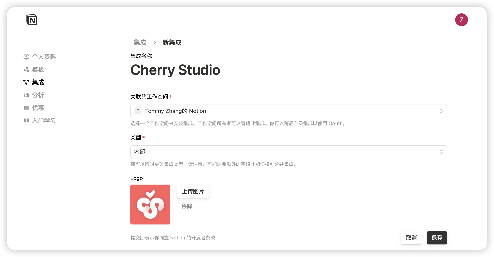

# Notion Configuration Tutorial


This document was translated from Chinese by AI and has not yet been reviewed.


Cherry Studio supports importing topics into Notion databases.

## Step One

Open the website [Notion Integrations](https://www.notion.so/profile/integrations) to create an integration.

<figure><figcaption>
Click the plus sign to create an integration
</figcaption></figure>

## Step Two

Create an integration.

<figure><figcaption>
Fill in integration information
</figcaption></figure>

Name: Cherry Studio

Type: Select the first one

Icon: You can save this image

<figure><figcaption></figcaption></figure>

## Step Three

Copy the secret and paste it into Cherry Studio settings.

<figure><figcaption>
Click to copy secret
</figcaption></figure>

<figure><figcaption>
Paste the secret into the data settings
</figcaption></figure>

## Step Four

Open the [Notion](https://www.notion.so/) website, create a new page, select the database type below, name it Cherry Studio, and connect as shown in the diagram.

<figure><figcaption>
Create a new page and select database type
</figcaption></figure>

<figure><figcaption>
Enter the page name and select to connect to the integration
</figcaption></figure>

## Step Five

<figure><figcaption>
Copy database ID
</figcaption></figure>

If your Notion database URL is similar to this:

https://www.notion.so/\<long\_hash\_1>?v=\<long\_hash\_2>

Then the Notion database ID is the `<long_hash_1>` part.

<figure><figcaption>
Enter the database ID and click check
</figcaption></figure>

## Step Six

Enter `Page Title Field Name`:

If your web page is in English, enter `Name`
If your web page is in Chinese, enter `名称`

<figure><figcaption>
Enter Page Title Field Name
</figcaption></figure>

## Step Seven

Congratulations, Notion configuration is complete ✅ You can now export Cherry Studio content to your Notion database.

<figure><figcaption>
Export to Notion
</figcaption></figure>

<figure><figcaption>
View export result
</figcaption></figure>