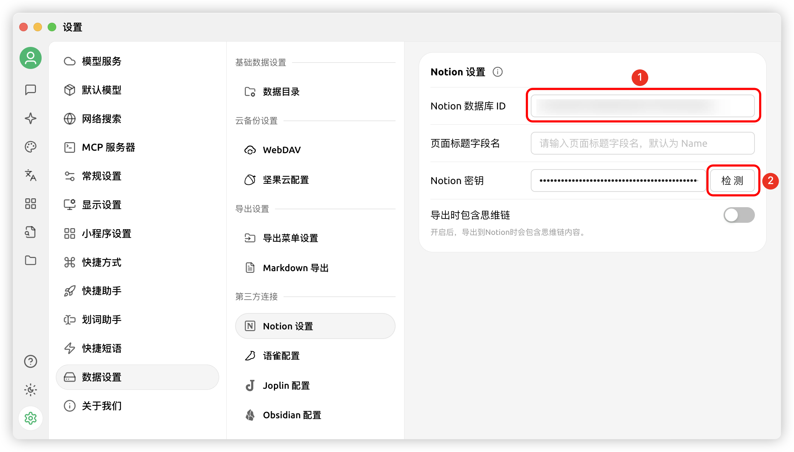
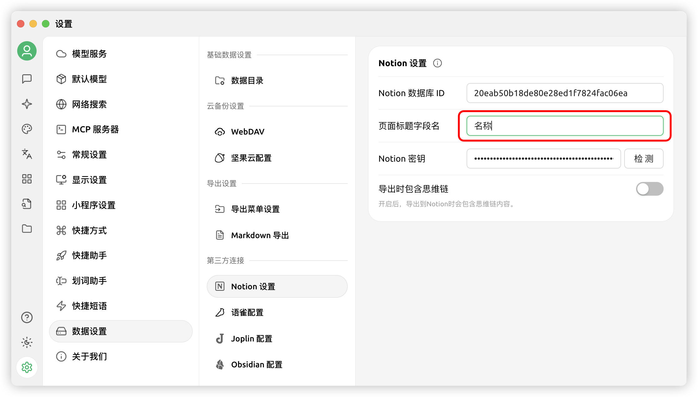


This document was translated from Chinese by AI and has not yet been reviewed.


# Notion Configuration Tutorial

Cherry Studio supports importing topics into Notion databases.

## Step One

Visit [Notion Integrations](https://www.notion.so/profile/integrations) to create an application

<figure><figcaption>
Click the plus sign to create an application
</figcaption></figure>

## Step Two

Create an application

<figure><figcaption>
Fill in application information
</figcaption></figure>

Name: Cherry Studio  
Type: Select the first option  
Icon: You can save this image

<figure><figcaption></figcaption></figure>

## Step Three

Copy the secret key and enter it in Cherry Studio settings

<figure><figcaption>
Click to copy the secret key
</figcaption></figure>

<figure><figcaption>
Enter the secret key in data settings
</figcaption></figure>

## Step Four

Open [Notion](https://www.notion.so/) website and create a new page. Select database type below, name it Cherry Studio, and connect as shown

<figure><figcaption>
Create a new page and select database type
</figcaption></figure>

<figure><figcaption>
Enter the page name and select "Connect to APP"
</figcaption></figure>

## Step Five

<figure><figcaption>
Copy the database ID
</figcaption></figure>

If your Notion database URL looks like this:  
https://www.notion.so/\<long_hash_1>?v=\<long_hash_2>  
Then the Notion database ID is the part `<long_hash_1>`

<figure><figcaption>
Enter database ID and click Check
</figcaption></figure>

## Step Six

Fill in `Page Title Field Name`:  
If your interface is in English, enter `Name`  
If your interface is in Chinese, enter `名称`

<figure><figcaption>
Enter page title field name
</figcaption></figure>

## Step Seven

Congratulations! Notion configuration is complete ✅ You can now export Cherry Studio content to your Notion database

<figure><figcaption>
Export to Notion
</figcaption></figure>

<figure><figcaption>
View export results
</figcaption></figure>