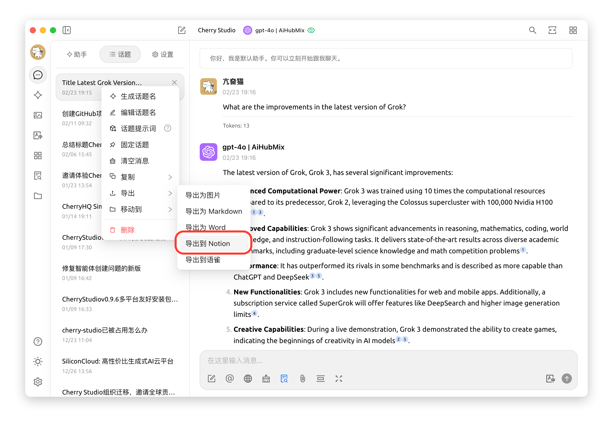


This document was translated from Chinese by AI and has not yet been reviewed.


# Notion Configuration Tutorial

Cherry Studio supports importing topics into a Notion database.

## Step 1

Go to the [Notion Integrations](https://www.notion.so/profile/integrations) website to create a new integration.

<figure><figcaption>
Click the plus sign to create a new integration
</figcaption></figure>

## Step 2

Create an integration.

<figure><figcaption>
Fill in the integration information
</figcaption></figure>

Name: Cherry Studio

Type: Select the first one

Icon: You can save this image

<figure><figcaption></figcaption></figure>

## Step 3

Copy the secret token and paste it into the Cherry Studio settings.

<figure><figcaption>
Click to copy the secret
</figcaption></figure>

<figure><figcaption>
Paste the secret into the data settings
</figcaption></figure>

## Step 4

Go to the [Notion](https://www.notion.so/) website and create a new page. Select the database type, name it Cherry Studio, and follow the illustration to connect.

<figure><figcaption>
Create a new page and select the database type
</figcaption></figure>

<figure><figcaption>
Enter the page name and choose to connect to an integration
</figcaption></figure>

## Step 5

<figure><figcaption>
Copy the database ID
</figcaption></figure>

If your Notion database URL looks like this:

https://www.notion.so/\<long\_hash\_1>?v=\<long\_hash\_2>

Then the Notion database ID is the `<long_hash_1>` part.

<figure><figcaption>
Enter the database ID and click Check
</figcaption></figure>

## Step 6

Fill in the `Page Title Field Name`:

If your web page is in English, enter `Name`
If your web page is in Chinese, enter `名称`

<figure><figcaption>
Fill in the Page Title Field Name
</figcaption></figure>

## Step 7

Congratulations, your Notion configuration is complete ✅ You can now export content from Cherry Studio to your Notion database.

<figure><figcaption>
Export to Notion
</figcaption></figure>

<figure><figcaption>
View the exported result
</figcaption></figure>