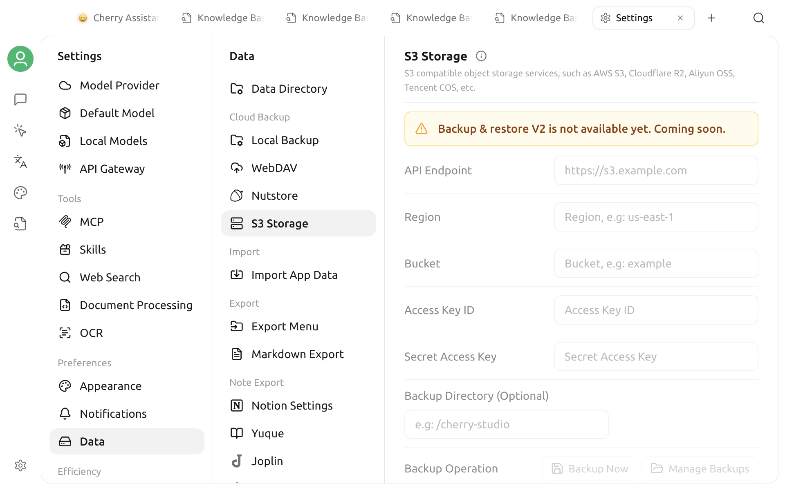

# S3-Compatible Storage Backup

The current version includes **Settings > Data > S3 Storage**, but the page explicitly states that **Backup & Restore V2 is not available yet**.


You cannot create, restore, or automatically manage S3 backups from this page in the current version. The presence of configuration fields does not mean the feature is available.


## What the page currently shows

The page reserves controls for:

- API endpoint, region, and bucket;
- Access Key ID and Secret Access Key;
- an optional backup directory;
- **Back Up Now** and **Manage Backups**;
- automatic sync, maximum backup count, and slim backup.

These fields, buttons, and switches are disabled. Opening the page does not establish an S3 connection and cannot validate an endpoint, bucket, or credential.

## Recommendations

- Do not enter real object-storage credentials or rely on this page to protect important data.
- Do not follow older instructions for backup, restore, automatic sync, or backup cleanup.
- Files already stored in your object storage are not read, changed, or deleted by this unavailable page.
- When the feature becomes available, follow the enabled controls, release notes, and the latest version of this guide.
