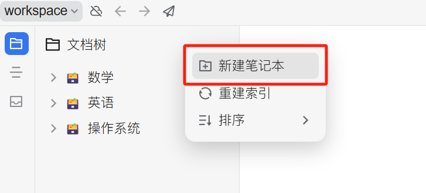


This document was translated from Chinese by AI and has not yet been reviewed.


# SiYuan Note Configuration Tutorial

Supports exporting topics and messages to SiYuan Note.

## Step 1

Open SiYuan Note and create a new notebook.

<figure><figcaption>
Click to create a new notebook
</figcaption></figure>

## Step 2

Open the notebook settings and copy the `Notebook ID`.

<figure><figcaption>
Open notebook settings
</figcaption></figure>

<figure><figcaption>
Click the button to copy the Notebook ID
</figcaption></figure>

## Step 3

Paste the copied Notebook ID into the Cherry Studio settings.

<figure><figcaption>
Paste the Notebook ID into the data settings
</figcaption></figure>

## Step 4

Enter the SiYuan Note address.

*   **Local**
    Usually `http://127.0.0.1:6806`
*   **Self-hosted**
    Your domain, e.g., `http://note.domain.com`

<figure><figcaption>
Enter your SiYuan Note address
</figcaption></figure>

## Step 5

Copy the SiYuan Note `API Token`.

<figure><figcaption>
Copy the SiYuan Note token
</figcaption></figure>

Paste it into the Cherry Studio settings and check the connection.

<figure><figcaption>
Enter the API Token and click Check
</figcaption></figure>

## Step 6

Congratulations, the SiYuan Note configuration is complete ✅ You can now export content from Cherry Studio to your SiYuan Note.

<figure><figcaption>
Export to SiYuan Note
</figcaption></figure>

<figure><figcaption>
View the export result
</figcaption></figure>