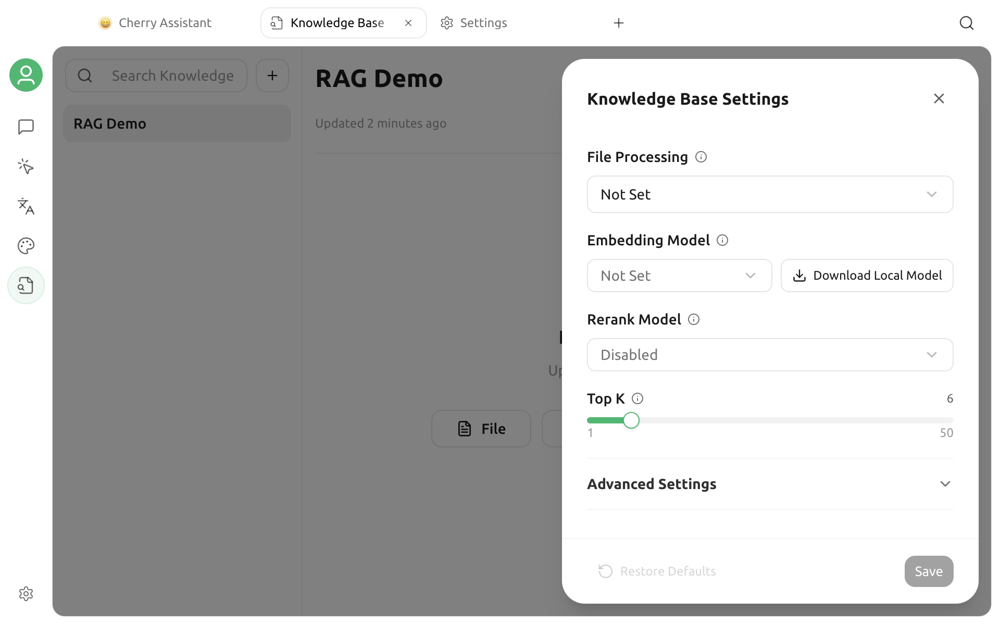

# Embedding Models

An embedding model converts text into vectors so that Cherry Studio can retrieve sources by meaning. It handles retrieval rather than answer generation; chat, embedding, and rerank models are separate capabilities.

## Default Behavior for a New Knowledge Base

The creation dialog asks only for a name and, optionally, a group. You do not select an embedding model there.

- If the local embedding model has not been downloaded, the knowledge base starts in **BM25** mode. BM25 retrieves by keywords, creates no vectors, and does not call an embedding API.
- If the local embedding model is already downloaded, a new knowledge base automatically uses it with its fixed dimensions and builds a vector index from the start.

You can therefore import and search sources without an embedding model, then enable semantic retrieval later from the knowledge base settings.

## Enable Semantic Retrieval

Open the target knowledge base, click **Settings** in the upper-right corner, and choose one of the following options under **Embedding Model**.

### Use the Local Model

Click **Download Local Model**. When the download finishes, Cherry Studio automatically selects and saves the built-in local embedding model, then backfills vectors for existing sources.

The local model keeps source passages away from an external embedding service. Its first download and first indexing run require time, memory, and disk space. The download button is hidden on platforms that cannot run the model locally.

### Use a Configured Model Provider

You can also choose an enabled model with **Embedding** capability from the list. If the model is missing, configure its provider under **Settings → Model Providers** and confirm that the model is marked as an embedding model.

When you save, Cherry Studio sends a short test string to determine the actual vector dimensions. Saving fails if the API URL, key, model ID, or network is unavailable; the app does not guess a dimension.


Names such as DeepSeek, Kimi, GLM, GPT, and Claude do not by themselves mean that a model supports embeddings. Availability depends on the capability of the specific model, not its brand.


## What Happens to Existing Sources

Cherry Studio chooses a safe path based on the current state of the knowledge base:

| Current state | Behavior |
| --- | --- |
| Enable embeddings for a BM25-only knowledge base | Backfill vectors in the same knowledge base; no recreation is required |
| Change the embedding model in an empty knowledge base | Save the new setting directly |
| Change the embedding model after vectors and sources exist | Start the restore/rebuild flow so old and new vectors are not mixed |

Do not quit the app or move original sources while enabling or rebuilding. More sources require more processing time and, with an online model, may incur more cost.

## Choose a Model

Compare these factors:

- **Language coverage**: Test with your own Chinese, English, Japanese, or Russian sources.
- **Privacy**: Online models receive source passages and queries; evaluate the local model for sensitive data.
- **Speed and cost**: Initial indexing, reindexing, and queries may all call an online embedding API.
- **Stability**: The model ID, vector dimensions, and API behavior should remain stable.

Do not choose solely from a leaderboard or model name. Use the same sources and a fixed set of questions, then compare whether the correct passages appear among the top results.

## Troubleshooting

### The Embedding Model List Is Empty

Confirm that the provider is enabled, the model has been added, and its capability includes **Embedding**. Chat and rerank models do not appear in this list.

### Saving Fails While Retrieving Dimensions

Check the provider status, API URL, key, model ID, network, and account balance. Saving makes one real embedding request.

### What Are the Limits of BM25-Only Search?

BM25 works well for exact keywords, product names, and identifiers, but it usually recalls paraphrases and natural-language expressions less effectively than semantic search. You can start with BM25 to validate source quality, then decide whether to enable an embedding model.

### Does Changing an API Key Require a Rebuild?

Usually not, provided that the same model and dimensions remain in use. If the provider routes requests to a different model version, run your retrieval tests again.

See [Knowledge Base Data](data.md) for the detailed data flow and local file locations.

***

### Get Help and Submit Feedback

If model detection, downloading, or indexing fails, contact the community through [Feedback and Suggestions](../question-contact/suggestions.md).
