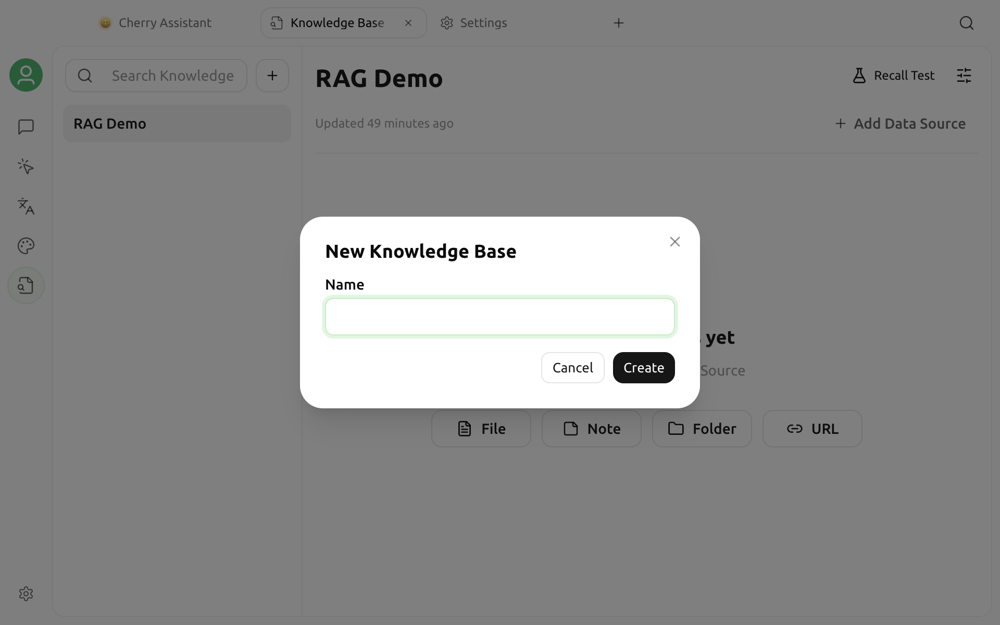

# Knowledge Base Tutorial

A knowledge base organizes local documents and webpages into a searchable repository. During a chat, Cherry Studio first finds passages related to the question, then sends those passages to the current model to generate an answer.

A knowledge base does not train or modify the model. It is useful for information that you need to query repeatedly, reuse across chats, or cannot conveniently attach to every message because of its volume.

This page walks you through the complete workflow: **create a knowledge base → check retrieval settings → add sources → test retrieval → use it in a chat**.


For a quick overview, start with [Knowledge Base Overview](../cherrystudio/preview/knowledge-base.md). For model selection, data storage, and document parsing, see [Embedding Models](emb-models-info.md), [Knowledge Base Data](data.md), and [Document Preprocessing](zhi-shi-ku-wen-dang-yu-chu-li.md), respectively.


## Before You Begin

You do not need to configure an embedding model before creating a knowledge base. Without one, the knowledge base starts with BM25 keyword retrieval. If the local embedding model has already been downloaded, a new knowledge base uses that model and its dimensions automatically.

If you plan to use vector or hybrid retrieval, you can prepare an embedding model under **Settings → Model Providers** and confirm that it:

* Has been added to the model list and is enabled
* Includes embedding in its capability types
* Has a working API endpoint, API key, and network connection

A regular chat model cannot replace an embedding model. The available list can change as providers update their offerings, so this guide does not prescribe a specific online model. See [Embedding Models](emb-models-info.md) for selection guidance and common options.

## Create a Knowledge Base

1. Open Launchpad from the top bar and select **Knowledge Base** in the app list.
2. Click the add button in the left navigation area and select **Create Knowledge Base**.
3. Enter a name that is easy to recognize.
4. If you have created groups, you can assign the knowledge base to one.

The creation window does not include an embedding-model selector. If the local embedding model is downloaded, Cherry Studio assigns it to the new knowledge base automatically; otherwise, the knowledge base starts in BM25 mode. After creation, use **RAG Settings** at the top of the page to review or change the embedding model and dimensions.


The embedding model and dimensions determine the vector-index format. If you intend to use vector or hybrid retrieval, finish this configuration and test with a small source before importing in bulk. Changing the model or dimensions later starts a rebuild.


## Add Sources

After opening the knowledge base, click the add button in the Data Sources area and choose a source type.

| Source | Suitable content | Current behavior |
| --- | --- | --- |
| File | One or more local files | Supports PDF, DOCX, MD, XLSX, TXT, CSV, and EPUB |
| Folder | A collection of sources in one directory | Select a local directory to import its contents in bulk |
| URL | A single public webpage | Enter a complete `http://` or `https://` address |
| Sitemap | Multiple pages from a website | Enter a directly accessible Sitemap address |
| Note | Manually entered text | Submission is not yet available in the current V2 add interface |

### Import Files

1. Select **File**.
2. Drag in files, or click to choose local files.
3. Review the file list and submit it.
4. Return to the Data Sources list and wait for processing to finish.

You can select multiple files at once. If a file format is not supported, convert it to one of the formats in the table above first.

### Import a Folder

1. Select **Folder**.
2. Click to choose a directory and approve the system's file access permission.
3. Confirm the directory and submit it.

Folders are useful for importing a collection of sources together. After importing, still check the Data Sources list to confirm that all required files were processed successfully.

### Import a Webpage or Sitemap

1. Select **URL** or **Sitemap**.
2. Enter a complete, publicly accessible address.
3. Submit it, then wait for page extraction and indexing to finish.

Cherry Studio might be unable to extract usable content from webpages that require login, depend on dynamic scripts to render, or enforce access restrictions. A Sitemap must also be directly accessible to the app. After importing, preview the extracted result and run a retrieval test.


After you submit an add task, Cherry Studio continues reading, chunking, and embedding the sources in the background. Do not quit the app or disconnect the model provider while processing is underway.


## Check Processing Status

While a source is being indexed, it progresses through stages such as preparing, reading, processing, chunking, and embedding. Intermediate statuses can vary by source type; the final successful status is **Completed**.

| Status | Meaning | Recommended action |
| --- | --- | --- |
| Preparing / Reading / Processing / Chunking / Embedding | The index is being built | Keep the app running and wait |
| Completed | The source can be retrieved and used in chats | Run a retrieval test first |
| Failed | The source did not finish indexing | Review the error, fix the cause, and reindex |

From the Data Sources list, you can also:

* Filter by file, folder, URL, and Sitemap
* Search source names and view the number that are ready
* Preview the extracted original content
* View the chunks for completed sources
* Reindex completed or failed sources
* Select multiple sources to reindex or delete them in bulk

If the original file or webpage changes, use **Reindex** to update the retrievable content. You cannot reindex a source while it is processing; wait for the current task to finish first.

## Run a Retrieval Test First

The top of the knowledge base includes **Retrieval Test**. It tests retrieval results directly, helping you troubleshoot sources, chunking, and retrieval settings before starting a chat.

1. Click the Retrieval Test button at the top.
2. Enter a question that a user might actually ask.
3. Review the returned passages, result count, elapsed time, and relevance or ranking information.
4. Expand a result and confirm that the passage contains the original text needed to answer the question.
5. Repeat the test with several variations of the question.

Focus on these checks:

* Whether the correct sources appear among the first results
* Whether each passage contains complete key information
* Whether passages are too long, too short, or split in the middle of a key sentence
* Whether too many irrelevant results appear

Retrieval Test keeps a query history for each knowledge base, so you can reuse the same questions to compare different configurations. If the retrieval results are inaccurate, the chat model usually cannot provide a reliable answer either.

## Use a Knowledge Base in a Chat

1. Open **Chat** and enter a conversation.
2. Click the Knowledge Base button in the input box's tools area.
3. Select one or more knowledge bases.
4. Enter a question related to the sources and send it.
5. When reading the answer, also verify the retrieved knowledge base citations against the original sources.

The knowledge base selector supports multiple selections and can also clear them all at once. Selected knowledge bases are associated with the current assistant and remain available when you continue using that assistant.


The Knowledge Base button might be unavailable or hidden when:

* The current assistant or tool mode does not support knowledge bases
* A file attachment has already been added to the input box

If an attachment has been added, remove it before selecting a knowledge base.


The knowledge base only provides relevant passages; the final answer is still generated by the chat model. Verify important conclusions against the cited passages and original sources.

## Adjust RAG Settings

Click the settings button at the top of the knowledge base to adjust the document processing and retrieval workflow.

| Setting | Purpose | Adjustment guidance |
| --- | --- | --- |
| File processor | Converts documents into text that can be chunked | Check this first for scanned documents, images, or complex layouts |
| Chunk size and overlap | Determines the scope of each retrieved passage | Existing sources must be reindexed after changes |
| Embedding model and dimensions | Generates and stores the vector index | Changes start the rebuild process |
| Search mode | Selects a retrieval method | Keep the default first, then adjust it based on retrieval tests |
| Result count | Controls how many passages are returned | Too few can omit information; too many can introduce noise |
| Similarity threshold | Filters results with insufficient relevance | Applies only in supported search modes |
| Hybrid weight | Balances semantic and keyword retrieval | Test this carefully when sources contain many proper nouns |
| Reranking model | Ranks the initial retrieval results again | Adds another model call and increases waiting time |

Change only one category of parameters at a time, then repeat the retrieval test with the same questions. This makes it easier to identify which change produced the effect.

## Frequently Asked Questions

### Why Does a New Knowledge Base Use BM25 Only?

The creation window does not select an embedding model. If the local embedding model has not been downloaded, the new knowledge base starts with BM25. To use vector or hybrid retrieval, select an embedding model in **RAG Settings**. If that list is empty, check the provider, capability label, and API configuration.

### Sources Remain in Processing

Keep the app running and wait first. If there is no progress for a long time, check the model provider, network, file access permissions, and document processor, then reindex any failed sources.

### A File Shows a Failed Status

Hover over the failed status to view the error. Common causes include an unsupported format, an unreadable file, an inaccessible webpage, or a failed call to the embedding service.

### A Scanned PDF Contains No Usable Text

A scanned PDF usually contains only images and requires a document processing method that supports OCR or image parsing. See [Document Preprocessing](zhi-shi-ku-wen-dang-yu-chu-li.md).

### The Correct Content Is Not Retrieved

Confirm that the source has finished indexing. Then check the original content quality, chunk size, search mode, result count, threshold, and reranking configuration in order. Do not try to mask a retrieval problem by changing only the chat model.

### The Chat Does Not Use the Knowledge Base

Confirm that the current assistant has a knowledge base selected, the target source's status is Completed, and the input box has no file attachment. You can also test the same question in Retrieval Test first to confirm that retrieval works.

## Data, Privacy, and Costs

Cherry Studio manages knowledge base metadata and indexes. Depending on the selected document processing, embedding, reranking, and chat services, original or extracted content might be sent to the respective providers. Retrieved passages are also sent to the current chat model when generating an answer.

Before importing sensitive information, review each provider's data policy and deployment method. Building or rebuilding an index, reranking, and generating chat answers can also incur model usage charges.

For local storage, backup, and cleanup details, see [Knowledge Base Data](data.md).

***

### Get Help and Submit Feedback

If you encounter problems while configuring or using a knowledge base, contact the community using the information in [Feedback and Suggestions](../question-contact/suggestions.md).
