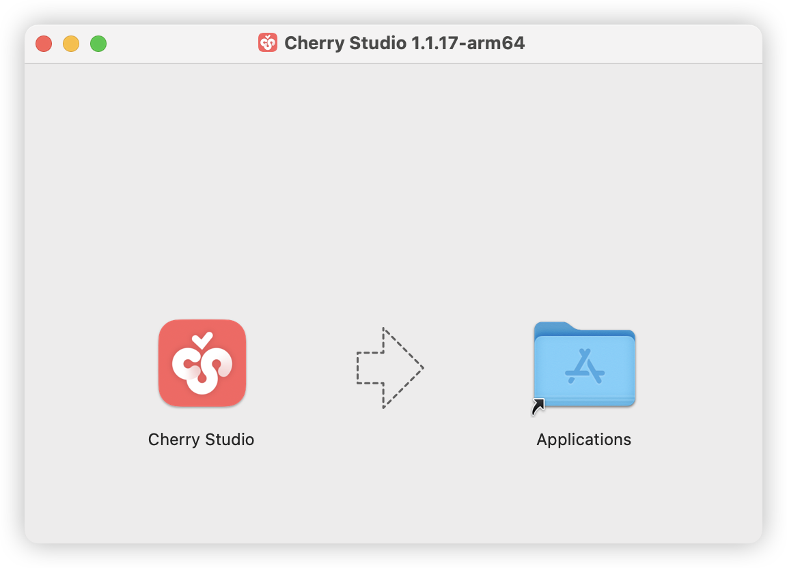


This document was translated from Chinese by AI and has not yet been reviewed.


# macOS

1. First, go to the official website's download page to download the Mac version, or click the direct link below.

Please make sure to download the **correct chip version for your Mac**.

If you don't know which chip version your Mac uses:

*   Click the  in the menu bar at the top-left corner of your Mac.
*   Click "About This Mac" in the dropdown menu.
*   Check the processor information in the pop-up window.

If it's an Intel chip, download the Intel version installer.

If it's an Apple M\* chip, download the Apple chip installer.




2. After the download is complete, click here.

<figure><figcaption></figcaption></figure>

3. Drag the icon to install.

<figure><figcaption></figcaption></figure>

Go to Launchpad, find the Cherry Studio icon, and click it. If the Cherry Studio main interface opens, the installation is successful.

<figure><figcaption></figcaption></figure>