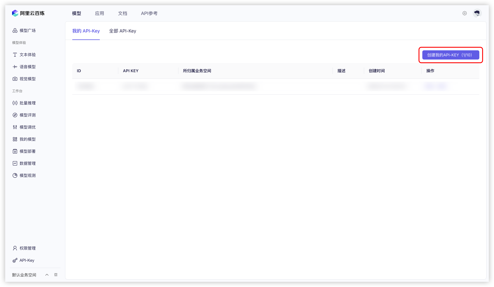


This document was translated from Chinese by AI and has not yet been reviewed.


# Alibaba Cloud Bailian

1. Log in to [Alibaba Cloud Bailian](https://bailian.console.aliyun.com/?tab=model#/api-key). If you don't have an Alibaba Cloud account, you'll need to register one.

2. Click the `创建我的 API-KEY` (Create My API-KEY) button in the upper right corner.
  <figure><figcaption>Create API Key in Alibaba Cloud Bailian</figcaption></figure>
  
3. In the pop-up window, select the default business space (or you can customize it), and you can enter a description if you want.
  <figure><figcaption>Alibaba Cloud Bailian Create API Key Pop-up</figcaption></figure>
  
4. Click the `确定` (Confirm) button in the lower right corner.

5. Afterward, you should see a new row added to the list. Click the `查看` (View) button on the right.
   <figure><figcaption>View API Key in Alibaba Cloud Bailian</figcaption></figure>
   
6. Click the `复制` (Copy) button.
    <figure><figcaption>Copy API Key in Alibaba Cloud Bailian</figcaption></figure>

7. Go to Cherry Studio, navigate to `Settings` → `Model Providers` → `Alibaba Cloud Bailian`, find `API Key`, and paste the copied API key here.
    <figure><figcaption>Enter API Key for Alibaba Cloud Bailian</figcaption></figure>
    
8. You can adjust the relevant settings as described in [Model Providers](../../cherrystudio/preview/settings/providers.md), and then you can start using it.

If you don't find any models from Alibaba Cloud Bailian in the model list, please ensure you have added the models and enabled this provider as described in [Model Providers](../../cherrystudio/preview/settings/providers.md).
