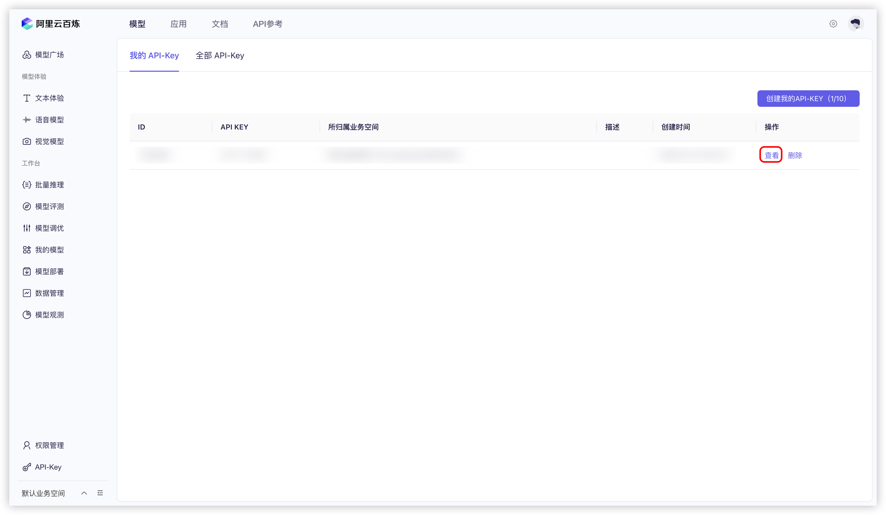


This document was translated from Chinese by AI and has not yet been reviewed.


# Alibaba Cloud Bailian

1. Log in to [Alibaba Cloud Bailian](https://bailian.console.aliyun.com/?tab=model#/api-key). If you don't have an Alibaba Cloud account, you'll need to register.
   
2. Click the `Create My API-KEY` button in the upper-right corner.
   <figure><figcaption>Create API Key in Alibaba Cloud Bailian</figcaption></figure>

3. In the popup window, select the default workspace (or customize it if desired). You can optionally add a description.
   <figure><figcaption>API Key Creation Popup in Alibaba Cloud Bailian</figcaption></figure>

4. Click the `Confirm` button in the lower-right corner.

5. You should now see a new entry in the list. Click the `View` button on the right.
   <figure><figcaption>View API Key in Alibaba Cloud Bailian</figcaption></figure>

6. Click the `Copy` button.
   <figure><figcaption>Copy API Key in Alibaba Cloud Bailian</figcaption></figure>

7. Go to Cherry Studio, navigate to `Settings` → `Model Services` → `Alibaba Cloud Bailian`, and paste the copied API key into the `API Key` field.
   <figure><figcaption>Paste API Key in Alibaba Cloud Bailian</figcaption></figure>

8. You can adjust related settings as described in [Model Services](../../cherrystudio/preview/settings/providers.md), then start using the service.


If Alibaba Cloud Bailian models don't appear in the model list, ensure you've added models according to the instructions in [Model Services](../../cherrystudio/preview/settings/providers.md) and enabled this provider.
