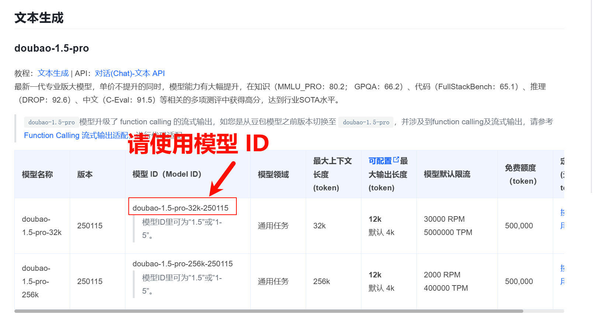


This document was translated from Chinese by AI and has not yet been reviewed.


# ByteDance (Doubao)

* Log in to [Volcano Engine](https://console.volcengine.com/)
* Or click [here to go directly](https://console.volcengine.com/ark/region:ark+cn-beijing/openManagement?LLM=%7B%7D)

<figure><figcaption></figcaption></figure>

### Obtaining the API Key

* Click [API Key Management](https://console.volcengine.com/ark/region:ark+cn-beijing/apiKey) in the sidebar
* Create an API Key

<figure><figcaption></figcaption></figure>

* After creation, click the eye icon next to the created API Key to reveal and copy it

<figure><figcaption></figcaption></figure>

* Paste the copied API Key into Cherry Studio and then toggle the provider switch to ON

<figure><figcaption></figcaption></figure>

### Enabling and Adding Models

* Enable the models you need at the bottom of the sidebar in the Ark console under [Enablement Management](https://console.volcengine.com/ark/region:ark+cn-beijing/openManagement?LLM=%7B%7D\&OpenTokenDrawer=false). You can enable the Doubao series, DeepSeek, and other models as required

<figure><figcaption></figcaption></figure>

* In the [Model List Documentation](https://www.volcengine.com/docs/82379/1330310#%E6%96%87%E6%9C%AC%E7%94%9F%E6%88%90), find the model ID corresponding to the desired model

<figure><figcaption></figcaption></figure>

* Open Cherry Studio's [Model Services](../../cherrystudio/preview/settings/providers.md) settings and locate Volcano Engine
* Click Add, then paste the previously obtained model ID into the model ID text field

<figure><figcaption></figcaption></figure>

* Follow this process to add models one by one

### API Address

There are two ways to write the API address:
* First, the default in the client: `https://ark.cn-beijing.volces.com/api/v3/`
* Second: `https://ark.cn-beijing.volces.com/api/v3/chat/completions#`


There is no significant difference between the two formats; you can keep the default and no modification is needed.

For the difference between ending with `/` and `#`, refer to the API Address section in the provider settings documentation. [Click to go there](../../cherrystudio/preview/settings/providers.md#api-di-zhi)


<figure><figcaption>
Official Documentation cURL Example
</figcaption></figure>