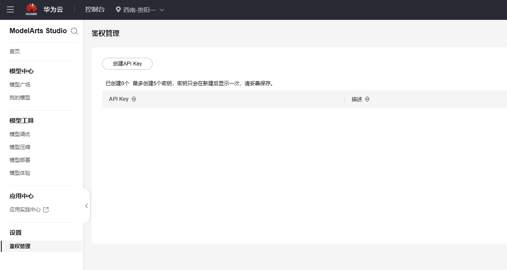


This document was translated from Chinese by AI and has not yet been reviewed.


# Huawei Cloud

1.  Go to [Huawei Cloud](https://auth.huaweicloud.com/authui/login) to create an account and log in.

2.  Click [this link](https://console.huaweicloud.com/modelarts/?region=cn-southwest-2#/model-studio/homepage) to enter the Maa S console.

3.  Authorization

Authorization Steps (skip if already authorized)

1.  After entering the link page from step (2), follow the prompts to go to the authorization page (Click IAM Sub-user → New Delegation → Normal User).

.png>)

2.  After clicking create, return to the link page from step (2).
3.  You will be prompted with 'Insufficient access permissions'. Click the "Click here" in the prompt.
4.  Append existing authorizations and confirm.

.png>)

&#x20;Note: This method is suitable for beginners. You don't need to read too much content, just click according to the prompts. If you can successfully authorize in one go using your own method, feel free to do so.

4.  Click on Authentication Management in the sidebar, create an API Key (secret key), and copy it.

<figure><figcaption></figcaption></figure>

Then, create a new provider in CherryStudio.

<figure><figcaption></figcaption></figure>

After creation, fill in the secret key.

5.  Click on Model Deployment in the sidebar and claim all models.

<figure><figcaption></figcaption></figure>

6.  Click on Invoke.

<figure><figcaption></figcaption></figure>

Copy the address from ① and paste it into the Provider Address field in CherryStudio, and add a "#" symbol at the end.

And add a "#" symbol at the end.

And add a "#" symbol at the end.

And add a "#" symbol at the end.

And add a "#" symbol at the end.

Why add a "#" symbol? [See here](https://docs.cherry-ai.com/cherrystudio/preview/settings/providers#api-di-zhi)

> Of course, you can also skip reading that and just follow the tutorial;
>
> You can also fill it in by deleting `v1/chat/completions`. As long as you know how to fill it in, any method works. If you don't know how, be sure to follow the tutorial.

<figure><figcaption></figcaption></figure>

Then, copy the model name from ②, and in CherryStudio, click the "+Add" button to create a new model.

<figure><figcaption></figcaption></figure>

Enter the model name. Do not add anything extra or include quotes. Copy it exactly as it is written in the example.

<figure><figcaption></figcaption></figure>

Click the Add Model button to finish adding.


In Huawei Cloud, since the address for each model is different, you need to create a new provider for each model. Just repeat the steps above.
