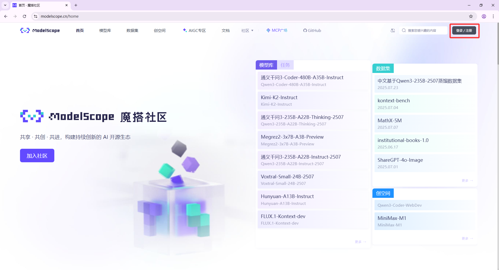
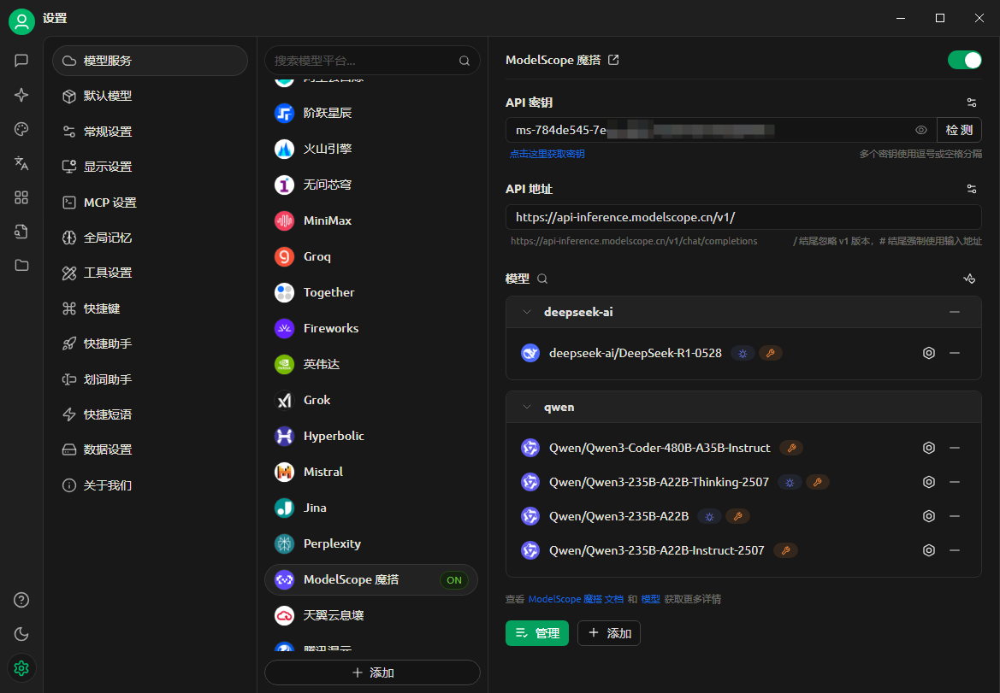

# ModelScope (Moda) Platform Access Guide


This document was translated from Chinese by AI and has not yet been reviewed.


## What is ModelScope?
> ModelScope is a new generation open-source Model-as-a-Service (MaaS) sharing platform, dedicated to providing **flexible, easy-to-use, and low-cost** one-stop model service solutions for general AI developers, making model application simpler!
>
> Through its **API-Inference as a Service capability**, the platform standardizes open-source models into callable API interfaces, allowing developers to easily and quickly integrate model capabilities into various AI applications, supporting innovative scenarios such as tool invocation and prototype development.

### Core Advantages
- ✅ **Free Quota**: Provides **2000 free API calls daily** ([Billing Rules](##计费与额度规则))
- ✅ **Rich Model Library**: Covers 1000+ open-source models including NLP, CV, Speech, Multimodal, etc.
- ✅ **Ready-to-Use**: No deployment needed, quick invocation via RESTful API

---

## Cherry Studio Access Process
### Step 1: Obtain ModelScope API Token
1. **Log In to the Platform**
   - Visit [ModelScope Official Website](https://modelscope.cn) → Click **Log In** at the top right → Select authentication method
   
2. **Create Access Token**
   - Go to **[Account Settings → Access Token](https://modelscope.cn/my/myaccesstoken)**
   - Click **`New Token`** → Fill in description → **Copy the generated token** (*Page example shown below*)
   
   > 🔑 **Important Tip**: Token leakage will affect account security!

### Step 2: Configure Cherry Studio
- Open **Cherry Studio** → **Settings → Model Service → ModelScope**
- Paste the copied token into the `API Key` field
  
- Click **`Save`** to complete authorization

### Step 3: Invoke Model API
1. **Find Models Supporting API**
   - Visit [ModelScope Model Library](https://modelscope.cn/models)
   - Filter: **Check `API-Inference`** (or look for the `API` icon on the model card)
   
   > The scope of models covered by API-Inference is primarily determined by their popularity within the Moda community (referencing data such as likes and downloads). Therefore, the list of supported models will continue to iterate after the release of more powerful and highly-regarded next-generation open-source models.
2. **Get Model ID**
   - Go to the target model's detail page → Copy **Model ID** (format like `damo/nlp_structbert_sentiment-classification_chinese-base`)
   
3. **Fill into Cherry Studio**
   - On the model service configuration page, enter the ID in the `Model ID` field → Select task type → Complete configuration
   

---

## Billing and Quota Rules
### Important Notes
- 🎫 **Free Quota**: **2000 API calls per user daily** (*Subject to the latest rules on the official website)
- 🔁 **Quota Reset**: Automatically resets daily at UTC+8 00:00, **does not support cross-day accumulation or upgrade**
- 💡 **Over-quota Handling**:
  - After reaching the daily limit, the API will return a `429 error`
  - Solution: Switch to a backup account / Use another platform / Optimize call frequency

### View Remaining Quota
- Log in to ModelScope → Click **`Username`** at the top right → **`API Usage`**
  

> ⚠️ Note: Inference API-Inference has a free daily quota of 2000 calls. For more calling needs, consider using cloud services like Alibaba Cloud Bailian.