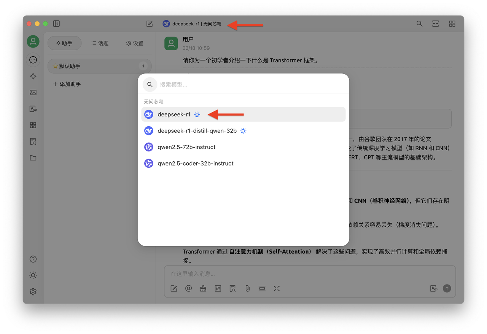

# Infini-AI


This document was translated from Chinese by AI and has not yet been reviewed.



This document was translated by AI from Chinese and has not yet been reviewed. I will try to check the document one by one to ensure the translation is reasonable.


<figure><figcaption></figcaption></figure>

Are you experiencing this: You've saved 26 insightful articles on WeChat but never opened them again, you have 10+ scattered files in your "study materials" folder on your computer, and you want to find a theory you read half a year ago but only remember a few keywords? When the daily information load exceeds the brain's processing limit, 90% of valuable knowledge will be forgotten within 72 hours.
Now, by building a personal knowledge base with the Infini-AI large model service platform API + Cherry Studio, you can transform WeChat articles collecting dust and fragmented course content into structured knowledge for precise retrieval.

### 1. Building a Personal Knowledge Base

#### 1. Infini-AI API Service: The "Thinking Core" of Your Knowledge Base, Easy to Use and Stable

As the "thinking core" of the knowledge base, the Infini-AI large model service platform provides model versions like DeepSeek R1 Full Version, offering stable API services. **Currently, after registration, it's free to use with no thresholds.** It supports mainstream embedding models such as bge and jina to build knowledge bases. **The platform also continuously updates the latest and strongest stable open-source model services**, including various modalities like images, videos, and audio.

<figure><figcaption></figcaption></figure>

#### 2. Cherry Studio: Building a Knowledge Base with Zero Code

Cherry Studio is an easy-to-use AI tool. Compared to the 1-2 month deployment cycle required for RAG knowledge base development, the advantage of this tool is that it supports **zero-code operations**. It allows one-click import of multiple formats such as Markdown/PDF/web pages, parses a 40MB file in 1 minute, and can also add local computer folders, WeChat favorites article URLs, and course notes.

### 2. 3 Steps to Build Your Exclusive Knowledge Butler

#### Step 1: Basic Preparation

1. Visit the Cherry Studio official website to download the compatible version (https://cherry-ai.com/)
2. Register an account: Log in to the Infini-AI large model service platform (https://cloud.infini-ai.com/genstudio/model?cherrystudio)

<figure><figcaption></figcaption></figure>

* Get API Key: In "Model Marketplace", select deepseek-r1, click to create and get the API KEY, then copy the model name.

<figure><figcaption></figcaption></figure>

#### Step 2: Open CherryStudio Settings, select Infini-AI in Model Services, fill in the API Key, and enable the Infini-AI model service.

<figure><figcaption></figcaption></figure>

After completing the above steps, you can use Infini-AI's API service in CherryStudio by selecting the required large model during interaction.
For convenience, you can also set a "Default Model" here.

<figure><figcaption></figcaption></figure>

Step 3: Add Knowledge Base

Select any version of the bge series or jina series embedding models from the Infini-AI large model service platform.

<figure><figcaption></figcaption></figure>

<figure><figcaption></figcaption></figure>

### 3. Real User Scenario Test

* After importing study materials, enter "Summarize the core formula derivation of Chapter 3 of 'Machine Learning'"

<figure><figcaption></figcaption></figure>

\
**Generated Result Image Attached**

<figure><figcaption></figcaption></figure>