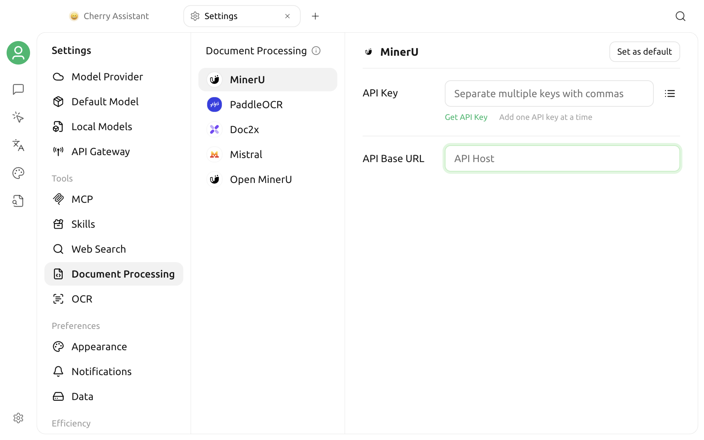

# Document Processing

Cherry Studio V2 uses two separate settings pages for file processing: **OCR** converts images to plain text, while **Document Processing** converts documents such as PDFs to Markdown for later retrieval, parsing, and knowledge base indexing.

Cherry Studio V2 separates processing into two capabilities:

| Capability | Input | Output | Common use |
| --- | --- | --- | --- |
| Image to Text (OCR) | Image file | Plain text | Extract text from screenshots and scanned images |
| Document to Markdown | Document file | Markdown and related resources | Preserve headings, paragraphs, tables, and other structures for further knowledge base processing |

Each entry has its own default processor. When one service supports both capabilities, it appears on both the **OCR** and **Document Processing** pages, with separate configuration and default states.

## Open OCR and Document Processing Settings

- For image-to-text processing, go to **Settings > OCR**.
- For document-to-Markdown processing, go to **Settings > Document Processing**.

On the **Document Processing** page, the current UI lists MinerU, PaddleOCR, Doc2x, Mistral, and Open MinerU in that order. The **OCR** page shows the image processors available on the current device.

OCR processors are filtered by platform and runtime environment. If your list differs from this guide, use the list currently displayed in the app.


V2 does not initially assign a default processor for images or documents. After configuration, click **Set as default** on the relevant capability. Entering an API key alone does not make a processor the default.


## Processor Capability Matrix

### Image to Text

| Processor | Runs on | Credential | Scope |
| --- | --- | --- | --- |
| System OCR | Local | None | macOS and Windows; calls the operating system's OCR directly |
| Tesseract OCR | Local | None | macOS, Windows, and Linux; language packs can be selected |
| PaddleOCR | API or self-hosted service | API Key | Image OCR; a PaddleOCR parsing model can be selected |
| Mistral | Mistral API | API Key | Image to text |
| Intel OV OCR | Local | None | Appears only on eligible Windows devices with Intel Core Ultra |

System OCR does not support Linux. Intel OV OCR also requires the app to detect its local runtime scripts, so it does not appear on every Intel device.

### Document to Markdown

| Processor | Default API URL | Credential | Description |
| --- | --- | --- | --- |
| MinerU | `https://mineru.net` | API Key | Submit a remote parsing job and poll for its result |
| PaddleOCR | `https://paddleocr.aistudio-app.com/` | API Key | Supports document parsing and can use a self-hosted URL |
| Doc2x | `https://v2.doc2x.noedgeai.com` | API Key | Submit remote parsing and export jobs |
| Mistral | `https://api.mistral.ai` | API Key | Parse documents with Mistral OCR |
| Open MinerU | `http://127.0.0.1:8000` | Optional | Connect to a self-hosted MinerU-compatible service |

The table shows the current built-in URLs. If a provider changes its interface, or you use a reverse proxy or private deployment, edit **API URL (Base URL)** in the interface.


Remote processors send the file to the corresponding service. Before processing contracts, customer data, or other sensitive files, review the provider's data handling, retention, and compliance policies. To keep files on your device, use an available local processor or a trusted self-hosted service.


## Configure Local OCR

### System OCR

System OCR appears only on macOS and Windows. After you select it, the page shows that system OCR is available. No API key or URL is required.

- macOS uses the system OCR capability and does not show a language selector.
- On Windows, choose the recognition language under **Language**. The operating system must still support the selected language.

System OCR becomes the default Image to Text processor only after you click **Set as default**.

### Tesseract OCR

Tesseract is available on all three desktop platforms and runs locally.

Under **Language**, select one or more recognition languages. If none is selected, the current version uses Simplified Chinese, Traditional Chinese, and English as the default combination.

Selecting more languages does not necessarily improve accuracy and can increase processing time. Selecting only languages that actually appear in the image is usually more effective.

### Intel OV OCR

Intel OV OCR appears only when all of these conditions are met:

- The operating system is Windows.
- The CPU model contains Intel and Ultra.
- The app installation contains the required OV OCR runtime scripts.

This is not a general option for “all Intel graphics.” If it does not appear in the list, the current environment did not pass the availability check.

## Configure API Processors

PaddleOCR, Mistral, MinerU, and Doc2x require an API key. A key is optional for Open MinerU and depends on your server.

### Enter API Keys

Enter one or more keys directly in the **API Key** input, separating multiple keys with commas. You can also click the list button on the right side of the input to add, edit, copy, or delete individual keys.

When saved, Cherry Studio automatically:

- Removes leading and trailing spaces.
- Ignores empty values.
- Merges duplicate keys.

With multiple keys configured, new jobs from the same processor rotate through them in order. The image and document capabilities share that processor's key list.

Do not expose complete keys in screenshots, issue reports, or shared configurations.

### Change the API URL

**API URL (Base URL)** is validated and saved when the input loses focus. If the URL is invalid, the page displays a warning and does not apply it.

When using a self-hosted or proxy URL:

1. Confirm that the service implements the interface required by the processor, not merely a standard OpenAI-compatible chat interface.
2. Keep the correct `http://` or `https://` scheme.
3. Confirm that the device running Cherry Studio can reach the URL.
4. If the URL points to a local network service, check its firewall, port, and certificate.

### Select a PaddleOCR Model

PaddleOCR shows a different model list for each entry:

- **OCR:** `PP-OCRv6` and `PP-OCRv5`; the built-in default is `PP-OCRv6`.
- **Document Processing:** `PaddleOCR-VL-1.5`, `PaddleOCR-VL-1.6`, `PaddleOCR-VL`, and `PP-StructureV3`; the built-in default is `PaddleOCR-VL-1.5`.

The target PaddleOCR service must support the selected model. Models available in a self-hosted deployment may differ from the cloud service.

The page links to the [PaddleOCR project](https://github.com/PaddlePaddle/PaddleOCR) as a self-hosting reference. Cherry Studio does not install or maintain the server for you.

## Set the Two Default Processors Separately

The defaults for Image to Text and Document to Markdown are independent:

1. On the left, select the processor for Image to Text.
2. Complete the local language or API configuration.
3. Click **Set as default**.
4. Select the processor for Document to Markdown.
5. Complete its API configuration and click **Set as default**.

After a processor becomes the default, both the item on the left and its detail page display a **Default** badge.

When one processor supports both capabilities, its API key is shared at the processor level, but its API URL and model value are saved separately for each capability. Changing the URL for one capability does not imply that the other changes as well.

## Relationship to Knowledge Bases

Knowledge base document files can be converted to Markdown before chunking, embedding, and indexing. For the full workflow, see [Knowledge Base Document Preprocessing](../../knowledge-base/zhi-shi-ku-wen-dang-yu-chu-li.md).


Each knowledge base saves its own file processor selection. The global default here does not automatically overwrite an existing knowledge base configuration. Also confirm **File Processing** in the knowledge base's RAG settings.


Switching processors does not automatically redo an existing index. To use a new processor for old documents, reprocess or reimport them using the options provided by the knowledge base.

Document Processing only converts content; it does not replace an embedding model. The converted Markdown still requires an [embedding model](../../knowledge-base/emb-models-info.md) to create a vector index.

## Verify the Configuration

The current Document Processing settings page has no separate connection test button. The most reliable verification is:

1. Set the default processor for the target capability.
2. For a knowledge base, select the same document processor in that knowledge base's RAG settings.
3. Run one real processing task with a small test image or document that contains no sensitive information.
4. Confirm that the job completes and that the output text, headings, tables, and paragraphs are as expected.

File size, page count, format, quota, and concurrency limits differ by processor and are controlled by the server. Follow the current rules for the corresponding service.

## FAQ

### System OCR is missing from the list

System OCR supports only macOS and Windows. On Linux, use Tesseract, PaddleOCR, or another available processor.

### Intel OV OCR is missing from the list

This processor appears only in a qualifying Windows Intel Core Ultra environment when the local component is present. You cannot make it appear by manually entering an API URL.

### I entered an API key, but processing still reports no default processor

The key and the default processor are separate settings. Return to the processor page for the relevant capability and click **Set as default**.

### How do I manage many API keys?

Click the list button on the right side of the key input to manage them individually. Duplicate keys are not saved more than once, and multiple valid keys rotate at the processor level.

### A self-hosted service cannot connect

Check the Base URL, port, firewall, HTTPS certificate, and server interface version. PaddleOCR and Open MinerU require their respective compatible interfaces; a standard chat model API URL cannot be used directly.

### Why didn't an existing knowledge base change after I changed the processor?

A knowledge base saves its own file processor selection, and a completed index is not rebuilt automatically. Update the knowledge base's RAG configuration and reprocess the relevant documents as needed.

If the issue persists, submit your operating system, processor name, file type, error message, and a screenshot of the redacted configuration through [Feedback and Suggestions](../../question-contact/suggestions.md).
