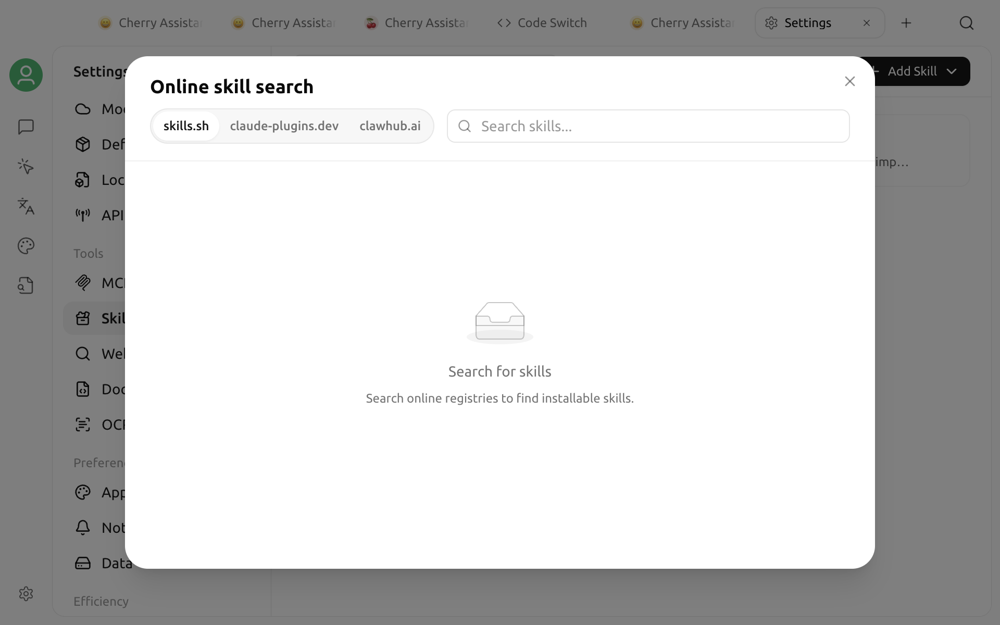

# Skills

A skill is a set of specialized instructions and supporting files that an agent can load when needed. It can define the steps, output format, and tool usage for a type of task, and it can include scripts, references, or assets. For example, a documentation-review skill can provide a consistent checklist and delivery format.

Skills do not change the underlying model, and they are not standalone applications. Cherry Studio V2 first installs a skill in the global skill library. You then choose which [agents](../../advanced-basic/agent.md) can use it. The same skill can be enabled for multiple agents, and each agent keeps its own enablement state.


In V2, skills are available only to agents, not regular assistants. Installing a skill in the global library does not automatically enable it for every agent.


## Installation and enablement

| Action | Scope | Result |
| :--- | :--- | :--- |
| Install | Global skill library | The skill appears in **Settings → Skills** and [Library](../../cherrystudio/preview/library.md) |
| Enable | One agent | The skill is linked into that agent's workspace and can be discovered and used at runtime |
| Disable | One agent | The skill is removed only from that agent; other agents and the global skill files are not affected |
| Uninstall | Global | The skill files are deleted, and the skill is removed from every agent that had it enabled |

Cherry Studio's built-in skills are enabled by default when you create a new agent. Any skills you later enable or disable for an individual agent remain selected that way. Updating a built-in skill does not reset those choices.

## Install from the online marketplace

1. Open **Settings → Skills**.
2. Enter a capability in the search box at the top right.
3. Switch between the `claude-plugins.dev`, `skills.sh`, and `clawhub.ai` tabs to review the results.
4. Select a result to preview its description, author, source, and statistics.
5. Click **Install**.

Online installation requires a network connection. Installing from `claude-plugins.dev` or `skills.sh` also requires Git because Cherry Studio clones the corresponding repository. Installing from `clawhub.ai` downloads and extracts a skill package instead.

A newly installed third-party skill is added only to the global skill library; it is not automatically enabled for every agent. Continue with the steps in “Enable a skill for an agent.”

## Install from local files

On the **Settings → Skills** page, you can:

* Click **Install from ZIP file** and select an archive;
* Click **Install from directory** and select the skill directory;
* Drag a ZIP file or directory into the installation area.

The local package must contain `SKILL.md`. This file provides the skill name, description, and main instructions. A skill can also include supporting directories such as `scripts/`, `references/`, and `assets/`.

You can also use the import button in the Skills category of [Library](../../cherrystudio/preview/library.md) to install from a ZIP file or directory. Library currently supports viewing installed skills and importing local packages only. To search the online marketplace, go to **Settings → Skills**.


Third-party skills may contain commands, scripts, or instructions that ask the agent to access external services. Check the source before installation. After installing, review `SKILL.md` and any scripts in the file tree, and enable the skill only in trusted workspaces.


## Ask an agent to install or create a skill

Every agent has access to built-in skill-management tools. You can ask an agent directly:

> Find a skill for reviewing product documentation. Explain its source and purpose, then wait for my confirmation before installing it.

When you install through a conversation, the agent searches the marketplace and installs the skill in the global skill library, but enables it only for the current agent. It does not enable the skill for other agents.

You can also ask an agent to create a new skill. It initializes a skill directory, writes `SKILL.md` and any supporting files, registers the skill in the global library, and enables it for the current agent. After creation, review the files in **Settings → Skills**, then validate the behavior with a small task.

## Enable a skill for an agent

1. Open [Library](../../cherrystudio/preview/library.md) and select **Agent**.
2. Open a saved agent for editing.
3. Select the **Skills** tab under **Capabilities**.
4. Click **Add**, then select a skill from the global skill library.
5. Save the settings and start a new task to verify the skill.

Skill enablement is stored separately for each agent. To disable a skill for one agent, remove it from the same location.

At runtime, Cherry Studio links enabled skills into `.claude/skills/` under the agent's first workspace directory. The agent therefore needs an accessible workspace directory. Enablement fails if a regular directory with the same name already exists where Cherry Studio needs to create its managed link.


Enabling a skill does not force the agent to use it for every message. The agent decides whether to load a skill based on its name, description, and the current task. If a task must use a particular skill, specify the skill name in your prompt.


## View and uninstall skills

Select an installed skill in **Settings → Skills** to view its complete file tree. Markdown files are rendered directly, while scripts and other text files are displayed as code.

You can uninstall third-party skills from the context menu, the delete button on the details page, or multi-select mode. Built-in skills cannot be uninstalled here, but you can disable them for an individual agent.

Uninstalling is a global operation: the skill files, corresponding links in every agent workspace, and all enablement records are removed. If you only want to prevent one agent from using a skill, disable it instead of uninstalling it.

## Skills and MCP

| Capability | Skills | [MCP](../../advanced-basic/mcp/) |
| :--- | :--- | :--- |
| Main content | Workflows, prompt instructions, scripts, and references | Callable tools or data exposed by an MCP Server |
| Requires a continuously running service | Usually no | Depends on the MCP Server |
| Typical uses | Standardizing writing workflows, checklists, and output specifications | Querying databases, calling external APIs, or controlling other systems |

A skill can tell an agent when and how to call MCP tools. You can enable both at the same time.

## If a skill does not take effect

Check the following in order:

1. Does the skill appear in the global skill library?
2. Is it enabled for the current agent, rather than only installed?
3. Does the current agent have a valid workspace directory?
4. Is there a regular directory with the same name under `.claude/skills/`, causing a link conflict?
5. Are the name and description in `SKILL.md` clear enough for the agent to recognize the current task?

If you have just changed the skill files, start a new conversation and test again. Skill files created or modified with an agent's management tools take effect directly; you do not need to apply a separate patch or reinstall the skill.
